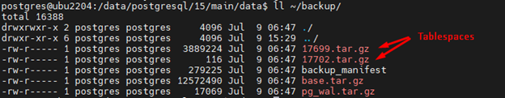
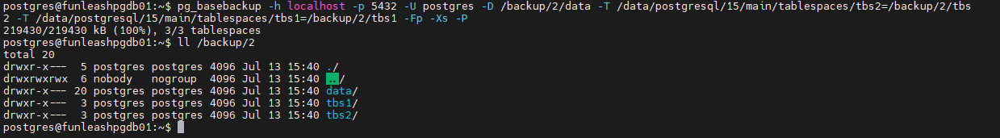
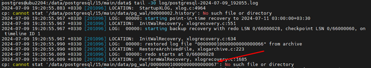

# Manual Backup & Restore

### Physical Backup/Restore

Official documentation:

[https://www.postgresql.org/docs/current/app-pgbasebackup.html](https://www.postgresql.org/docs/current/app-pgbasebackup.html)

Note:

•  This backup method is also used in our systemd backing up method.

•  You need to be able to establish a replication connection with the target server using the backup user.

1. Tar and Compressed Format

```shell
pg_basebackup -h localhost -p 5432 -U postgres -D /backupdir/latest_backup -Ft -z -Xs -P
```

3. Plain Format (Uncompressed data and tablespace directories
 
As will be noted later in this document (restore part), this command can be the backup and restore process in one place.

```shell
pg_basebackup -h localhost -p 5432 -U postgres -D /backupdir/latest_backup -Fp -T olddir=newdir -Xs -P
```

Here's a breakdown of the options used in your command:

`•  -h localhost:`
Connects to the PostgreSQL server on the local machine.

`•  -p 5432: Specifies`
the port where the PostgreSQL server is listening.

`•  -U postgres:`
Connects to the database as the "postgres" user.

`•  -D /backupdir/latest_backup: Defines the directory where the backup will be stored.`

`•  -Ft (also -F tar): `
Indicates that the backup format should be a tar archive.

`•  -Fp (also -F plain):`
Use the plain format for the backup, which is suitable
if the cluster has no additional tablespaces and WAL streaming is not used.

`•  -T tbs1_olddir=tbs1_newdir -T tbs2_olddir=tbs2_olddir ...:`

Defines the tablespace mapping from the source cluster's path to the new cluster's path. (only applicable to plain backup format, has no effect on the tar format)

`•  -z (also --gzip): `
Enables gzip compression for the backup.

`•  -Xs (also -X stream):`
Includes only the required WAL files in the backup using the "stream" method.

`•  -P (also --progress): `
Displays a progress meter during the backup process.


Approach 1 creates 3 + # of tablespaces files in the target backup directory:



Approach 2, because of its plain format, creates 1 + # of tablespaces directories for the pg data directory and tablespaces respectively. Note that all the noted directories must be empty in advance and do not need to be created. If they do not exist, pg_basebackup creates them automatically. Multiple tablespaces must be handled with multiple -T flags. Example:



**Important note!!!**

According to the pg_basebackup documentation, “ **As long as the client can keep up with the write-ahead log data** , using this method (stream method with -Xs flag) requires no extra write-ahead logs to be saved on the source server”. This means that the whole WAL segments might not be saved to the pg_wal.tar.gz archive. If they are actually not, the WAL files within this archive will not be enough and you will face the following error while trying to recover from the backup.



Therefore, the DBA should not suffice with the WALs that are being archived inside pg_wal.tar.gz. There may be the need to use later WALs manually.

•  Backup using the following command for all databases and objects in tar format (production environments):

```shell
pg_basebackup -h localhost -p 5432 -U postgres -D /backup/test1 -Ft -z -Xs -P
```

Note: This type of backup includes all database objects including tablespaces.

1. In this example, we have two tablespaces, and we can verify the backup integrity with the following command:

```shell
ls -l /data/postgresql/15/main/tablespaces
```

`total 0`

`lrwxrwxrw+x 1 postgres postgres 25 Jun 23 03:24 16400 -> /data/postgresql/15/main/tbs_test`

`lrwxrwxrwx 1 postgres postgres 35 Jun 23 15:12 16409 -> /data/postgresql/15/main/tbs_test/tbs_test2`

2. We check the integrity of the backup operation with the following command. A Tar file has been created for each tablespace:

tablespaces:

`-rw------- 1 root root 1027743 Jun 23 15:22 16400.tar.gz`

`-rw------- 1 root root 1027499 Jun 23 15:22 16409.tar.gz`

manifest:

`-rw------- 1 root root 278651 Jun 23 15:22 backup_manifest`

base:

`-rw------- 1 root root 4115789 Jun 23 15:22 base.tar.gz`

WALs:

`-rw------- 1 root root 17075 Jun 23 15:22 pg_wal.tar.gz`

### Restore

**Important Note!**

There are two scenarios for restoring:

1. When the production service has crashed,
2. When the infrastructure team delivers raw machines, and also for the raw cloud VMs. In such case, we will set up the PostgreSQL service and the HA/DR solution (like pgpool) with all of the initial user settings, a raw database, schema creation, and tablespaces.

Afterwards, the restore steps are as follows:

#### 1. Plain backup format:

Restoring the plain format is much easier. In fact, the backup and restore operations are usually done all in one place and with one command as follows.
 You can also take the backup to a different location and then copy it to a later target for bringing up the database cluster anyway. As just noted,
 the separation of backup and restore operations is usually done for using the backups at a later time, but on the occasion that we want to use the
 taken backup right away, we specify the target through the `-D` flag:
 
```shell
pg_basebackup -h localhost -p 5432 -U postgres -D /path/to/the/target/database/cluster/data/directory -Fp -T olddir=newdir -Xs -P
``` 
 
`•  -R (also --progress): `
Use this flag to restore the data directory in the **recovery** mode. This means that this cluster will be read_only when started to receive data updates from
 a primary in a replication cluster. In such case, a standby.signal file will be created, and also the primary connection details will be created
 automatically to instruct the secondary node (that is being restored) to be able to find its primary. These instructions' directives are written to the
 postgresql.auto.conf file. You can manually write the same directives in a file named myrecovery.conf too. A sample of automatically created
 postgresql.auto.conf file contents can be the following:
 
```conf
# Do not edit this file manually!
# It will be overwritten by the ALTER SYSTEM command.
primary_conninfo = 'user=postgres passfile=''/var/lib/postgresql/.pgpass'' channel_binding=prefer connect_timeout=2 host=localhost port=5432 sslmode=prefer sslcompression=0 sslcertmode=allow sslsni=1 ssl_min_protocol_version=TLSv1.2 gssencmode=prefer krbsrvname=postgres gssdelegation=0 target_session_attrs=any load_balance_hosts=disable'
``` 

#### 2. Archived backup format (tar+compression)

Restoring this type of backups is done according to the following procedure:

a) First, the **base.tar.gz** file: Before starting, the /data folder is unequivocally changed to /data_old, a new folder is created, and the service is stopped.

/backup/test2/ is the backup path - /data/postgresql/15/main/data/ is the PostgreSQL data directory path.

```
tar xvf /backup/test2/base.tar.gz -C /data/postgresql/15/main/data/
```

b) After restoring, two files named backup_label and tablespace_map are created in the data directory path. When we open backup_label, it shows the location of the WAL file:

```shell
cat backup_label
```

`START WAL LOCATION: 0/66000028 (file 000000010000000000000066)`

`CHECKPOINT LOCATION: 0/66000060`

`BACKUP METHOD: streamed`

`BACKUP FROM: primary`

`START TIME: 2024-07-09 10:02:15 +0330`

`LABEL: pg_basebackup base backup`

`START TIMELINE: 1`

c) And the tablespace_map file shows the locations of the tablespaces:

```shell
cat tablespace_map
```

`16400 -> /data/postgresql/15/main/tbs_test`

`16409 -> /data/postgresql/15/main/tbs_test/tbs_test2`

d) After the base, the tablespaces files are restored: (Note: Before restoring, make sure to create the folders and tablespaces.)

```shell
tar xzf 16400.tar.gz -C /data/postgresql/15/main/tbs_test
```

(Original tablespace location)

```shell
tar xzf 16409.tar.gz -C /data/postgresql/15/main/tbs_test/tbs_test2
```

(Original tablespace location)

•  At this stage, there are some points to consider:

If we want to restore in the same path as the existing tablespace, we must first delete the contents of these folders and then perform the restore. otherwise, if we want to restore in a different path, we must edit the tablespace_map file and give it the new path:

```shell
tar xzf 16400.tar.gz -C /new path 
```

(Different location for tablespace than original)

```shell
tar xzf 16409.tar.gz -C /new path 
```

(Different location for tablespace than original)

```shell
vi tablespace_map
```

`16400 /new path`

`16409 /new path`

e) Finally, the **pg_wal.tar.gz** file is restored:

```shell
tar xzf pg_wal.tar.gz -C /pgdata/pg_wal
```

In short,

```shell
rm -rf /data/postgresql/15/main/data/*
rm -rf /data/postgresql/15/main/tablespaces/tbs1/*
rm -rf /data/postgresql/15/main/tablespaces/tbs2/*cd
```

and

```shell
tar xvf base.tar.gz -C /data/postgresql/15/main/data/ && \
tar xzvf ~/backup/17699.tar.gz -C $PGDATA/../tablespaces/tbs1/ && \
tar xzvf ~/backup/17702.tar.gz -C $PGDATA/../tablespaces/tbs2 && \
tar xzvf ~/backup/pg_wal.tar.gz -C $PGDATA/pg_wal && \
[ $? -eq 0 ] && printf '\nSuccessful\041\n' || printf '\nFailed\041\n'chmod -R 750 /data/postgresql
```

•  At this stage, there is an important point:

It depends on the time of the backup being restored. For example, suppose that the full backup was at 11 PM of the night before and the
server crashed at 3 PM. According to the backup routine, the WAL files of production services are archived every hour, so we restore the latest available WAL file in order from 11 PM. (Meaning, first copy from the tar state to the Archive path)

After restoring the backup and copying the archives, the following steps are performed:

1. mknod (create empty file) recovery.signal which indicates you are in the recovery process. Upon completion of the recovery, this file will be deleted
   automatically.

```shell
touch recovery.signal
```

2. edit postgresql.auto.conf file or create a myrecovery.conf file. The former is better. If you choose to do the latter, mknod the myrecovery.conf file

```shell
touch myrecovery.conf
```

3. Inside the myrecovery.conf or postgresql.auto.conf file, the two lines below are added (the first one is mandatory. Also, have care for directive precedence and overriding in these files. To prevent that, use them mutually excluded):

```shell
restore_command='cp /data/postgresql/15/main/data/pg_wal/%f %p'recovery_target_time='2024-07-10 23:30:00 UTC' #(timestamp for PITR purposes, For the latest state that can be replayed through the WAL segment files made available, simply omit this directive)recovery_target_action = 'promote' #(to end the recovery and make the cluster an autonomous cluster)
```

read more at:

[https://www.postgresql.org/docs/current/runtime-config-wal.html](https://www.postgresql.org/docs/current/runtime-config-wal.html)

The more WAL files are given to the cluster, the further they will be replayed, and thus the more the cluster will move forward in time.

recovery.signal file is an indicator that we are in the recovery state of the database cluster.

4. For the data, tablespace, and archive paths, the command chmod 700 or 750 is executed.
5. Finally, the PostgreSQL service is started, and the cluster will be fully recovered
6. After completing the above steps, the backup_label and tablespace_map files are no longer needed.

---

### Logical Backup/Restore

The process of restoring a backup on production services from a logical backup. Using this approach, we can also backup/restore a specific database or table (logical backup and restore or dump)

• Backup/Restore the entire database cluster:

```
pg_dumpall -U postgres -h localhost -p 5432 > all_databases.sql	#On the source server

psql -U postgres -h localhost -p 5432 -f all_databases.sql #On the target server

```

• Backup/Restore a specific object

1. First, the latest backup is taken, and the restore process is performed according to step 3. (The three steps of the third stage should be done in the given order.) For that matter, first we take a dump of the database requested by the customer. For example, testdb:

```shell
pg_dump –U postgres –d testdb > testdb.sql	#(-t for a specific table)
```

Then we log in to the desired server machine and perform the following steps:

```shell
drop database testdb 	# if exists;
```

```
create database testdb owner database_user;
```

```
ALTER DATABASE testdb SET TABLESPACE tbs_test;
```

5. The final step is to restore the dump:

```shell
psql –U postgres testdb < testdb.sql
```

To check whether the database dump has been correctly restored, the following commands are executed:

```shell
su – postgres
psql\l+   # show databases with tablespaces
\c testdb testuser # connect to db
\dt # show tables or relations
\dn # show schema
```

### Verify the integrity of the full backups

The built-in tool to verify the integrity of the backups for PostgreSQL is **pg_verifybackup**. pg_verifybackup is only intended for plain backup format. For the archive format, you must extract the contents first and then pass them to pg_verifybackup. pg_verifybackup needs the **backup_manifest** file generated by pg_basebackup to examine the backup. This file is in json format. You can reformat or query the contained json using the **jq** tool.

If pg_verfiybackup is not in the path, this is usually the location where it can be found:

* on Ubuntu:

/usr/lib/postgresql/&lt;pg maj version&gt;/bin/pg_verifybackup

* on RHEL:

/usr/pgsql-&lt;pg maj version&gt;/bin/pg_verifybackup


An example is below:

```
pg_basebackup -h mydbserver -D /usr/local/pgsql/data
pg_verifybackup /usr/local/pgsql/data
```


Read more at:

[https://www.postgresql.org/docs/current/app-pgverifybackup.html](https://www.postgresql.org/docs/current/app-pgverifybackup.html)


Finish ■