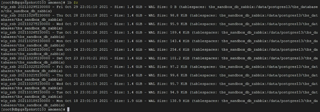
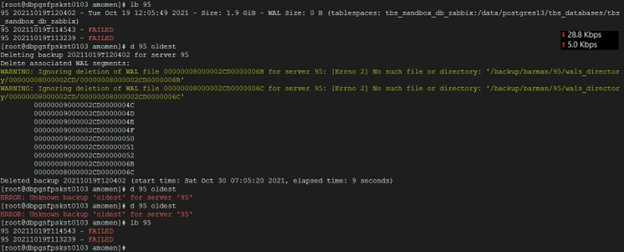
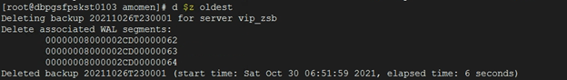

**Hello everybody!**

At this time, October 9th, 2021, the latest Barman version for PostgreSQL is 2.14. Barman
is great if you master it!!! The following are step-by-step instructions to
install and utilize Barman on CentOS8. I am inciting you to use these instructions
for other Linux distributions, as well. Because most
of the materials are concerning Barman itself rather than the Linux
distribution.

There is more to this document than a setup manual, though.
It's concise and, to my belief, comprehensive, informative, and time-saving:

If you republish the materials on this blog, please also cite the reference.

---
### Barman documentation online:

Relating to this document:

[http://docs.pgbarman.org/release/2.13/](http://docs.pgbarman.org/release/2.13/)

Lastest:

[http://docs.pgbarman.org/](http://docs.pgbarman.org/)

---

## Barman 2.14 installation on CentOS 8 with PostgreSQL 8.3+:

* This manual is written for CentOS, but it is really recommended for other Linux
distributions, too, because the major difference between diverse Linux
distributions in the eyes of Barman and PostgreSQL are the package managers and
repositories.
 
* This
manual focuses on streaming Barman method, for it is noted in Barman online
documentation that RPO for this method is near to zero. It can also be utilized
for rsync/ssh mode though
 
* We want
to setup Barman on primary read-write servers, not standby or read-only servers
 
* The
maintenance backup task is also included.
 
* In
setting up Barman, you need to specify multiple various directories. For
several reasons, placing everything for a single server under a common parent
is recommended.
 
* below, we
use the following notations and assumptions (I am not case sensitive, but the
commands may be :D):
a. PG or pg
stands for PostgreSQL server to be backed up
b. Barman
denotes Barman database role on PGs
c. backup
denotes Barman server (Barman highly advises for Barman to be installed on a
different dedicated machine, not pg servers)
d. This
manual works with a single read-write server on all replication topologies or
single node PGs but not read-only PGs such as:
 
   
   
-) single node
   
| 192.16.241.129 |
|:-:|
   
   
-)a streaming replication of two nodes with the following IP addresses:
   
|192.168.241.129 : primary<br/>192.168.241.130 : standby|
|:-:|
   
   
-) a pgpool cluster with 3 nodes and a VIP
   
|Nodes: | 192.168.241.171<br/>192.168.241.172<br/>192.168.241.173 |
|-|-|
|VIP: | 192.168.241.210 |
 
   
e. 192.168.241.151 is the backup server

f. We are going to set up 1)streaming Barman connection here and 2) ssh/rsync both, which
are the two offered services by Barman. In streaming connection for topologies
with VIP, the streaming connection should be connected to the VIP
 
 
* If you
opt to run Barman with root user in its config file, you must run its
executable with the root user, but if you choose Barman user, you can both run it
with Barman user and root
 
 
1) on every
server: Only for RHEL 8+: 

EPEL (Extra Packages for Enterprise Linux) packages
assume that the 'powertools' repository is enabled
   
You must enable the powertools (changed to CRB in the new versions) repo if it does not exist by:
   
a.
   
(install the config-manager plugin for dnf in advance if it is not already
installed
   
```shell   
yum -y install dnf-plugins-coe
```
   
):
 
```shell   
dnf config-manager --set-enabled powertools
```
 
 
2) You can
install EPEL by running: (The package is included in the CentOS Extras
repository)

```shell   
yum -y install epel-release
``` 
   
important note! Barman and Barman-cli are also available in pgdg-common repo.
The version in this repo may be newer than that of the EPEL (Extra Packages for Enterprise Linux) repo. Choose according
to your preference.
 
 
3) on
backup, install Barman and other packages:
```shell   
yum -y install Barman
yum -y install Barman-cli
yum -y install python3-argcomplete
```

On RHEL7 you may need to install python2-argcomplete

```shell   
yum -y install python3-argh
yum -y install python3-psycopg2
yum -y install python3-dateutil
yum -y install python3-setuptools
```   
in one	line:
```shell   
yum -y install Barman Barman-cli python3-argcomplete python3-argh python3-psycopg2
python3-dateutil python3-setuptools python36
``` 
 
* Note!
If you use
NFS share for storing your WAL files and PG servers archive the WALs directly
to NFS share, you may need to specify 'postgres' user for Barman everywhere not
Barman, or make other plans for the files and directories to be fully
accessible to both Barman and postgres users. However, if you change Barman
user to postgres, some unprecedented errors might occur, for example, when the
Barman log (default path: /var/log/Barman/) rotates, the new log file may be
granted ownership to Barman, and that way Barman logger will be denied from
writing to its log file.
 
4) Install PostgreSQL>8.3 on backup server

```shell
sudo dnf install -y https://download.PostgreSQL.org/pub/repos/yum/reporpms/EL-8-x86_64/pgdg-redhat-repo-latest.noarch.rpm
sudo dnf -qy module disable PostgreSQL
sudo dnf install -y PostgreSQL13-server
sudo dnf install -y PostgreSQL13-client
``` 
 
5) on
backup, do either of the following, the first one is recommended:
   
a. add parameter 'path_prefix' with the following value to Barman.conf (which
is explained in details in step 19)
```shell
path_prefix=/usr/pgsql-13/bin
```   
   
b. issue the following commands for the Barman to work
   
I.
```shell
ln -s /usr/pgsql-13/bin/pg_receivewal /usr/pgsql-13/bin/pg_receivexlog
export PATH=$PATH:/usr/pgsql-13/bin/
```   
   
II. add this line to /etc/profile to make it persistent, just issue the
following command:
```shell
echo export "PATH=\$PATH:/usr/pgsql-13/bin/" >> /etc/profile
source /etc/profile
```
 
6) Please note that Barman executable is placed to /bin/ directory
 
 
7) add
servers' hostnames to hosts file on all servers to avoid DNS problems, do so
even if you have a DNS server (PGs on backup and backup on PGs)


```shell
vi /etc/hosts

192.168.241.129	cos8pg129
192.168.241.130	cos8pg130
192.168.241.200	cos8share
192.168.241.210	vip
``` 
 
8) On every
server, stop firewalld or add exceptions. Barman does not require any
additional specific incoming or outgoing port number, only ssh.
```shell
systemctl stop firewalld
systemctl disable firewalld
``` 
 
9) Disable
selinux if necessary or add exceptions
 
 
10) Setup
passwordless ssh both on backup and pg servers using the following commands,
(if you don't assert default id file, refer to the end of these steps and do
that step instead of this which I don't recommend, and if you do so working
with some Barman or Barman-cli commands such as Barman-wal-archive may become
problematic, I do not recommend and thus have not tested it):
   
-) on backup:
```shell
su - Barman
mkdir ~Barman/.ssh
cd ~Barman/.ssh
# press enter for every upcoming query (leave unanswered):
ssh-keygen
ssh-copy-id postgres@pg
```
 
   
-) on pg:
```shell
passwd postgres    #change password for postgres' user
su - postgres
mkdir ~postgres/.ssh
cd ~postgres/.ssh
# press enter for every upcoming query (leave unanswered):
ssh-keygen
ssh-copy-id Barman@backup 
```
 
11) on
backup, root user, add Barman and streaming role of previous step's password to
```shell
~Barman/.pgpass
vi ~Barman/.pgpass
#(hostname:port:database:username:password)
192.168.241.129:5432:postgres:Barman:1
192.168.241.129:5432:postgres:streaming_barman:1
chmod 0600 ~Barman/.pgpass # or chmod u=rw ~Barman/.pgpass
chown -R Barman:Barman /var/lib/Barman
```
 
   
set the environment variable PGPASSFILE in postgres service drop-in :
```shell
Environment=PGPASSFILE=~Barman/.pgpass
``` 
 
12) on every
pg,
   
a.
```shell   
su - postgres
```
   
b. create Barman role: (Here I create superuser role)
```shell
# in shell
createuser -s -P Barman
# Or in psql
create user Barman with superuser encrypted password '1';
```
   
c. create streaming replication account:
```shell
createuser -P --replication streaming_barman
```   
d. add the following line to pg_hba.conf file if necessary
```shell
# in pg_hba.conf:
host replication    streaming_barman    `<backup_ip>/32`      scram-sha-256
# in shell:
psql -c "select pg_reload_conf()"
``` 
 
13) on backup, only for streaming method, perform either of the following two actions:
   
a. create a service with systemd by taking the following steps:
   
I.
```shell
vi /etc/systemd/system/barmanrw@.service
``` 
   
II. write necessary configuration inside service file.
   
```shell
##############################################
# barmanrw.service
# /etc/systemd/system/brw@.service
# It's not recommended to modify this file in-place, It is recommended to use systemd
# "dropin" feature;  i.e. create file with suffix .conf under
# /etc/systemd/system/brw@.service.d directory overriding the
# unit's defaults. You can also use "systemctl edit pgb"
# Look at systemd.unit(5) manual page for more info.
 
[Unit]
Description=Barman
receive-wal service for server %I
# Documentation='No documentation for now'
After=syslog.target
After=network.target
After=multi-user.target

[Service]
Type=notify

User=Barman
Group=Barman

# Where to send early-startup messages from the server
# This is normally controlled by the global default set by systemd
# StandardOutput=syslog

# Disable OOM kill on the scripts
OOMScoreAdjust=-1000
Environment=PGB_OOM_ADJUST_FILE=/proc/self/oom_score_adj
Environment=PGB_OOM_ADJUST_VALUE=0

ExecStart=/usr/bin/Barman receive-wal %i
TimeoutStartSec=infinity

Restart=always
RestartSec=3

[Install]
WantedBy=multi-user.target

##############################################
```

III. start & enable service by issuing the following command:
   
```shell
systemctl enable --now barmanrw@<servername in Barman config>
```
   
b. create a background task and make sure it is always up and running with the
following command:

```shell
Barman receive-wal <pg>
``` 
 
14) on every
pg, install Barman-cli and the following package:
```shell
yum -y install Barman-cli
yum -y install python36
``` 
 
15) On
backup, create a replication slot if necessary using the following command, if
you have set the config file for the Barman to create replication slot
automatically from Barman 2.10, this is unnecessary:
```shell
Barman receive-wal --create-slot `<pg>`
``` 
 
16) On
backup, check pg status:
```shell
Barman check `<pg>`
``` 
 
17) On
backup, if there is log shipping error, run the following command once. It
shall be executed successfully. (rotate the last WAL on every pg to commence
the log shipping):
```shell
Barman switch-xlog --force --archive <servername in Barman conf file>
```
example:
```shell
Barman switch-xlog --force --archive c1
``` 
 
18) On
backup, Barman user, check your connection and authorization to PGs using the
following commands:
```shell
# psql -c 'SELECT version()' -U Barman -h pg postgres
psql -c 'SELECT version()' -U Barman -h 192.168.241.129 postgres
# psql -U streaming_barman -h pg -c "IDENTIFY_SYSTEM" replication=1
psql -U streaming_barman -h 192.168.241.129 -c "IDENTIFY_SYSTEM" replication=1
``` 
 
19) On
backup, create and configure Barman configuration file, the Barman
configuration files have ini format:
   
a.
```shell
cp /etc/Barman.conf /etc/Barman.d/Barman.conf
vi /etc/Barman.d/Barman.conf
```
   
b. uncomment 'compression = gzip'
 
```shell
#sample Barman configuration file
;;;;;;;;;;;;
[Barman]

barman_home	= /var/lib/Barman
barman_user	= Barman
configuration_files_directory = /etc/Barman.d
path_prefix=/usr/pgsql-13/bin
log_file = /var/log/Barman/Barman.log
log_level = INFO
compression = gzip
;reuse_backup = link
immediate_checkpoint = true
basebackup_retry_times = 2
basebackup_retry_sleep = 1
last_backup_maximum_age = 2 DAYS

recovery_options = 'get-wal'
;network_compression option is not supported with 'postgres' backup_method

;;;;;;;;;;;
``` 
 
20) On
backup, create configuration files for PGs. In my opinion, by having this
example you do not need a template, because it is too busy and may be
confusing, then fill it up. If you want to use the template anyway:

```shell
cp -p /etc/Barman.d/streaming-server.conf-template /etc/Barman.d/c1.conf
``` 
```shell
; sample PG streaming configuration:
;;;;;;;;;;;;;;;;;;;;;;;;;;
[<arbitrary	server name>]

description =  "Zabbix Sandbox (Streaming-Only)"
conninfo= host=vip user=Barman dbname=postgres password='P@$$VV0RD'
streaming_conninfo = host=vip user=pgpool password='P@$$VV0RD'
backup_method = postgres
backup_directory = /backup/Barman/vip_zsb/basebackup
;incoming_wals_directory = /archive/archive_zabbix
streaming_wals_directory = /var/lib/Barman/vip_zsb/streaming_wals_directory
wals_directory = /backup/Barman/vip_zsb/wals_directory
immediate_checkpoint = true
streaming_archiver = on
slot_name =	Barman
create_slot = auto
parallel_jobs = 2
disabled=false
errors_directory = /var/lib/Barman/vip_zsb/errors

;;;;;;;;;;;;;;;;;;;;;;;;;;
```	
```shell
; sample PG	rsync/ssh configuration:
;;;;;;;;;;;;;;;;;;;;;;;;;;
[<arbitrary	server name>]

description =  "c1 ssh"
conninfo = hostaddr=192.168.241.129 user=Barman dbname=test password=1
ssh_command = ssh postgres@c1cos8pgsr129
backup_method = rsync
backup_directory = /var/lib/Barman/bd/c1s
incoming_wals_directory = /var/lib/Barman/bd/c1s/incoming_wals_directory

wals_directory = /var/lib/Barman/bd/c1s/wals_directory
archiver = on
backup_options = concurrent_backup
reuse_backup = link
slot_name = barmans
create_slot = auto
parallel_jobs = 2
disabled=false
errors_directory = /var/lib/Barman/bd/c1s/errors
network_compression = true
;;;;;;;;;;;;;;;;;;;;;;;;;;
``` 
   
-Note: The reuse_backup option can't be used with the postgres backup method at
this time.
 
21) The
'all' keyword means all PGs registered on Barman server everywhere, Including
[all] label in the Barman.conf configuration file
 
 
22) On
backup, edit the server configuration file created in the last step, save and
take a copy of it to add other PGs, then commit the changes for other PG
configurations:
```shell
cp /etc/Barman.d/c1.conf /etc/Barman.d/c2.conf
```
  
23-a) On
PGs, if you want the streaming method with Barman, in PostgreSQL.conf
(Because Barman streaming does not rely on PostgreSQL’s built-in archiving
capability, but the streaming replication capability):
   
I. turn off the archive_mode
```shell
archive_mode = off
``` 
   
II. leave the archive_command commented out.
 
 
23-b) Only
if you want rsync/ssh method with Barman, modify PostgreSQL.conf archive
command like the following:
```shell
#If you want to use Barman-cli (highly recommended):
archive_command='test ! -f /archive/archive_zabbix/%f && cp %p /archive/archive_zabbix/%f'
 
#If you want to use scp (-i is unnecessary for default ssh id file)
archive_command='scp -i ~/.ssh/barman_pg "%p" "Barman@cos8cbarman151:/var/lib/Barman/bd/c1/incoming_wals_directory/%f"'
``` 
 
24) On pg, modify PostgreSQL.conf restore command like the following:
```shell
restore_command = 'Barman-wal-restore -P -U Barman cos8share c1 %f %p'
``` 
 
25) On pg,
reload configuration:
```shell
sudo -u postgres psql -x -c "select pg_reload_conf()"
``` 
 
26) On
backup, to check if the server configuration is valid you can use the `Barman check` command
```shell
Barman check <server name>
```
   
resolve any issues in result returned.
  
### Maintenance:

27) create a
systemd service named backup@.service in /etc/systemd/system/ with the
following contents
   
for Barman's backup task:
```shell
vi /etc/systemd/system/backup@.service
``` 
```shell
#######################################################################
#/etc/systemd/system/backup@.service
# It's not recommended to modify this file in-place, It is recommended to use systemd
# "dropin" feature;  i.e. create file with suffix .conf under
# /etc/systemd/system/backup@.service.d directory overriding the
# unit's defaults. You can also use "systemctl edit backup@"
# Look at systemd.unit(5) manual page for more info.
 
[Unit]
Description= backup service for PostgreSQL triggered by timer server %I
#Documentation='No documentation for now'
After=syslog.target
After=network.target
After=multi-user.target
Wants=pgbt_for_template.timer

[Service]
Type=oneshot

User=postgres
Group=postgres
 
 
# Where tosend early-startup messages from the server
# This isnormally controlled by the global default set by systemd
StandardOutput=syslog

# Disable OOM kill on the scripts
OOMScoreAdjust=-1000
Environment=PGB_OOM_ADJUST_FILE=/proc/self/oom_score_adj
Environment=PGB_OOM_ADJUST_VALUE=0

ExecStart=/bin/Barman backup %i


[Install]
WantedBy=multi-user.target

#######################################################################
```	
 
28) pass
your server name in Barman configuration file to the following command:
systemctl enable backup@<server name>.service
 
 
29) create a
timer to trigger the backup@<server name>.service. Modify 'OnCalendar'
according to your prefered
schedule:
```shell
/etc/systemd/system/PostgreSQL_basebackup_timer.timer
``` 
```shell
#######################################################################
# Timer to start PostgreSQL base backup at 23:00:00
# a.momen@gmail.com

[Unit]
Description=timer
for PostgreSQL base backup at 23:00:00
Requires=backup@vip_zsb.service

[Timer]
Unit=backup@vip_zsb.service
OnCalendar=*-*-* 23:00:00


[Install]
WantedBy=timers.target

#######################################################################
```

A sample base backup list taken by schedule:

 

**Figure 1**

In the above
screen capture, ‘lb’ is an alias
for ‘Barman list-backup’ that I created myself, and $z contains the name of a
PG server.
 
30) enable&start timer:

```shell
systemctl enable --now backup.timer
``` 
 
31) There is
no task needed for WALs backup, as they are collected by Barman server live.
 
 
* Setup
passwordless ssh for log shipping from pg to backup and vice versa with id
file, remember to enter no passphrase (empty) when prompted
   
a. on pg with root login, assign a password to postgres account and enter in
step c
```shell
passwd postgres
``` 
   
b. on pg,
```shell
su - postgres
mkdir ~/.ssh
cd ~/.ssh
ssh-keygen -t rsa -f barman_pg
ssh-copy-id -f -i barman_pg.pub Barman@cos8share  
# Barman server hostname
ssh-copy-id -f -i barman_pg.pub root@cos8share   #Barman server hostname
``` 
   
c. on backup,
```shell
su - Barman
mkdir ~/.ssh
cd ~/.ssh
ssh-keygen -t rsa -f barman_b
ssh-copy-id -f -i barman_b.pub postgres@c1cos8pgsr129
    #PG 1 hostname
ssh-copy-id	-f -i barman_b.pub postgres@c2cos8pgsr130
    #PG 2 hostname 
ssh-copy-id -f -i barman_b.pub postgres@<PG3>  
    #PG 3 hostname
# add one line for every PG
``` 
* test passwordless ssh:

on pg:
```shell
ssh Barman@cos8cbarman151 -i ~/.ssh/barman_pg
``` 

on backup:
```shell
ssh postgres@c1cos8pgsr129 -i ~/.ssh/barman_b
#PG 1 hostname
```   
```shell
ssh postgres@<PG2> -i ~/.ssh/barman_pg
#PG 2 hostname
```  
 
End of setup steps

### Most practical commands:
* Barman backup `<pg>`
* Barman list-backup `<pg>`
* Barman sync-info `<pg>`
* Barman diagnose
* Barman sync-wals `<pg>`

for passive

* Barman check `<pg>`
* Barman check-backup `<backup id>`
* Barman sync-backup `<pg>` `<backup id>`
* Barman replication-status `<pg>`
* Barman show-server `<pg>`
* Barman get-wal `<pg>` `<wal-name>`
* Barman put-wal `<pg>`
* Barman delete `<pg>` <backup_id>
### Some keywords:
1) **all:**
 Refers to all servers except for the backup server itself
2) **latest:**
 Refers to the latest backup
3) **oldest:**
 Refers to the oldest existing backup
4) **first:**
 Refers to the first backup
5) **last:**
Same as latest

---

### Important points
1) It is
   possible to use get-wal during a recovery operation, transforming the Barman
   server into a WAL hub for your servers.

2) Barman
   can reduce the Recovery Point Objective (RPO) by allowing users to add
   continuous WAL streaming from a PostgreSQL server, on top of the standard
   archive_command strategy.

3) From an
   architectural point of view, PostgreSQL must be configured to archive WAL files
   directly to the Barman server. Barman, thanks to the get-wal framework, can
   also be used as a WAL hub. For this purpose, you can use the Barman-wal-restore
   script, part of the Barman-cli package, with all your standby servers.

4) As of
   Barman 2.10, the get-wal command is able to return the content of the current
   .partial WAL file through the --partial/-P option. This is particularly useful
   in the case of recovery, both full or to a point in time.

5) Using
   Barman-wal-archive instead of rsync/SSH reduces the risk of data corruption of
   the shipped WAL file on the Barman server. When using rsync/SSH as
   archive_command a WAL file, there is no mechanism that guarantees that the
   content of the file is flushed and fsync-ed to disk on destination.

6) Barman backup `<pg>` message:

WARNING:

IMPORTANT: this backup is classified as WAITING_FOR_WALS, meaning that Barman
has not received yet all the required WAL files for the backup consistency.
This is a
common behavior in concurrent backup scenarios, and Barman automatically sets
the backup as DONE once all the required WAL files have been archived.
Barman hints
to execute the backup command with '--wait' but this seems to be unnecessary
because if the backup is not completed consistently yet, it will be marked with
the label WAITING_FOR_WALS in the backup list shown by the ‘Barman list-backup
`<pg>`/all’ command and you don’t want to use the taken backup instantly.

7) Remote
   recovery is definitely the most common way to restore a PostgreSQL server with
   Barman

8) In any
   modes (rsync/ssh or streaming if the error 'WAL archive: FAILED (please make
   sure WAL shipping is setup)' is occurred, switch-wal first

9) If after
   recovery, the receive-wal command won't start up, the problem may be due to a
   mismatch in WAL version. So empty the streaming-wal-directory and try Barman
   receive-wal `<ServerName>` again.

10) Barman
    doesn't include a long-running daemon or service file (there's nothing to
    systemctl start, service start, etc.). Instead, the Barman cron subcommand is
    provided to perform Barman's background "steady-state" backup
    operations.

11) After
    any type of recovery in the streaming method, Barman sets the archive command
    of PGs to 'false' automatically if you falsely have set an archive_command and
    archive_mode to on. The recovery steps are clarified in a separate section for
    streaming. If this item is unclear to you, refer to the recovery steps section.

12) If your
    backup server falls out of sync, it is mandatory that you relaunch Barman
    replication, otherwise, Barman will not work. That means emptying the
    wals_directory and streaming-wal-directory and recreating the replication slot.
    This is synonymous with item 9)

13) If you
    turn both of the archiver and streaming_archiver parameters off you will get
    the following warning from Barman:
WARNING: No
archiver enabled for server 'backup'. Please turn on 'archiver',
'streaming_archiver' or both
WARNING:
Forcing 'archiver = on'

14) If you
    change Barman user, remember to change necessary owners and also the cron entry
    in /etc/cron.d/Barman

15) If you
    see the backup process is stuck, one of the most probable situations is that it
    is stuck on "Asking PostgreSQL server to finalize the backup". This
    means that the WAL shipping process is not working properly, in which case
    there is something wrong with the PostgreSQL's archiving. In Barman streaming
    method, you do not need PostgreSQL's archiving. So make sure the 'archive_mode'
    parameter is set to off and remove the archive_command.

16) Warning!!! Barman does not acknowledge failed backups and only
    lists them using ‘Barman list-backup `<pg>`’ command, so if you delete your
    backups using oldest or first or latest and so on keywords, it will skip the
    failed backups. So you may end up unwantedly delete your successful backups. An
    example:
	
 

**Figure 2**

 In the
above screen capture, ‘d’ is an alias for ‘Barman delete’, and ‘lb’ is an alias
for ‘Barman list-backup’ that I created myself, and 95 is the name of a PG
server. As you see the only successful backup is deleted instead of the failed
ones, so it’s highly recommended to delete backups using their IDs instead of such
keywords.

17) You can
    also delete base backups by going to the following directory and issuing ‘rm -rf
    `<backup id>`’ command, consequently, the backup will also be deleted from
    ‘Barman list-backup’ backup list as well:

`<pg>`/basebackup/base/

 

**Figure 3**

18) If you
    create a backup set for a PG using symbolic link that I demonstrated earlier,
    and delete the original backup set, you will encounter such an error when you
    issue ‘Barman list-backup’ command:

 

**Figure 4**

Generally
the file backup.info is mandatory for every backup set. You can overcome this
error and make ‘Barman list-backup’ work again buy manually deleting the
corresponding backup
directory as described in the last item. If there is a single erroneous backup
set among PGs, the command Barman ‘list-backup all’ will also not work.
18) While
    deleting a base backup, the associated WAL segments will also be deleted:

 

**Figure 5**

$z is a PG server.

---

* Sample background pg_basebackup commands: (You won't need this, it's just a personal note for myself)

These
commands are executed by Barman in the background on issuing 'Barman backup'
command with 'postgres' backup method:

with tablespace:

```shell
/usr/bin/pg_basebackup --dbname=dbname=replication hostaddr=192.168.241.129 options=-cdatestyle=iso password=1 replication=true user=streaming_barman application_name=barman_streaming_backup -v --no-password --pgdata=/var/lib/Barman/bd/c1/base/30211001T113101/data --no-slot --wal-method=none --tablespace-mapping=/data/postgres13/tbs_database=/var/lib/Barman/bd/c1/base/30211001T113101/40974 --checkpoint=fast
```

without tablespace:

```shell
/usr/bin/pg_basebackup --dbname=dbname=replication host=c7 options=-cdatestyle=iso password=1 replication=true user=streaming_barman application_name=barman_streaming_backup -v --no-password --pgdata=/var/lib/Barman/bd/c7/base/20211001T224927/data --no-slot --wal-method=none --checkpoint=fast
```

---

### Recovery:

Requirements for the target server:
 
* Identical
hardware architecture
* Identical
major version of PostgreSQL
* In
general, it is highly recommended to create recovery environments that are as
similar as possible, if not identical, to the original server, because they are
easier to maintain. For example, we suggest that you use the same operating
system, the same PostgreSQL version, the same disk layouts, and so on.
* Both
local and remote recovery is supported. (Remote recovery is not supported for
Windows servers)
 
* For PITR,
these are the available flags:
 
--target-name:
target name created previously with pg_create_restore_point() function call
--target-immediate:
end recovery as soon as a consistent state is reached
--target-lsn
--target-xid
--target-tli:
target timeline


 
### Recovery Scenarios (streaming):
 
I. Recover PostgreSQL server on its own (The simplest scenario):
 
         
-) The data and tablespaces directories will be deleted on issuing the Barman
recovery command, so take a backup beforehand if you wish.
         
         
1) On backup, issue one of the following commands according to your need, make
sure to preserve the formatting of values.
                     
* for PITR:
```shell
Barman recover <pg> <full backup id> <PG's data directory> --target-time='<timestamp>' --remote-ssh-command='ssh postgres@<pg>'
```                     
sample:
```shell
Barman recover c1 20211006T114906 /data/postgres13/data --target-time='2021-10-06 13:44:29.000000000 +0330' --remote-ssh-command='ssh postgres@192.168.241.129'                      
```
-) The
command below gives the timestamp at the moment in the above format:
```shell
date "+%Y-%m-%d %T.%N %z"
```                                 
                     
* to recover to the latest/first/oldest backup:
```shell
Barman recover <pg> latest <PG's data directory> --remote-ssh-command='ssh postgres@<pg>'
```
                     
sample:

```shell
Barman recover c1 latest /data/postgres13/data/ --remote-ssh-command='ssh postgres@192.168.241.129'
``` 
         
2) On backup, when the command is finished executing, it must show the
following message:
Your
PostgreSQL server has been successfully prepared for recovery!
 
         
3) On pg, Your pg service is not active, so you must start it
 
         
4) The file 'recovery.signal' should be removed automatically but if it is not,
manually remove it and if the database cluster is read-only, restart the
service
 
 
II. Recover
PostgreSQL server on a new isolated server:
Here, by
isolated server, we mean a server which does not partake in any replication
topologies. This is particularly useful for testing your backups purposes or
cloning a server for a specific purpose at its initial state and launching new
Highly Available clusters, for example cloning Zabbix at its initial state for
monitoring a new group of servers.
         
         
1) clone the server's Barman configuration file inside /etc/Barman.d/
```shell
cp /etc/Barman.d/PG1.conf /etc/Barman.d/PGnew.conf
``` 
         
         
2) Edit the PGnew's configuration file and replace new values like IP or
hostname, and specify directories separate from PG1's directories.
         
         
         
3) Notice that you cannot ever assign the source directory to the destination
server, so copy the contents of these directories from PG1 to PGnew, if the
source folder is accessible by the one using the destination folder, creating
symbolic links suffices to preserve disk space. Both of the situations are
provided here. If all of these directories share a common parent, you can do
this by a single copy command, so placing everything for a single server under
a common parent is recommended as noted at the beginning of this document.
                     
-) for duplicating the data issue cp command(s) like the following
```shell
\cp -r /backup/Barman/vip_zsb/* /backup/Barman/backup/
``` 
                     
-) for creating symbolic links issue the cp command(s) like the following:
```shell
\cp -rs /backup/Barman/vip_zsb/* /backup/Barman/backup/
``` 
         
         
4) Now that you have duplicated the data, the situation is like the one that
you have two independent servers.
         
         
         
5) Do the required steps of the Barman setup instructions on the target server,
i.e. install Barman-cli and dependencies, setup passwordless ssh back and forth
between the backup server and the target server, also any packages that were
installed on the source server and cause PostgreSQL to fail to start if do not
exist on the target server.
 

I have not tested this, but you may want to do so. It may interfere with other Barman
 functionalities. I would be glad if you test it and let me know the result.
 From my own point of view, instead of setting up passwordless ssh in production
 environments, it's much more beneficial if a common shared mount point is
 created on all servers which all servers have access to, so if the PGs put
 their files on that storage, the backup server will also have access to those
 files. This way the archive and restore commands in rsync/ssh mode, and restore
 command in streaming mode will be affected and you can also use ordinary cp
 command instead of scp and rsync or Barman-wal-restore and Barman-wal-archive.

Important PostgreSQL commands:

```shell
#/data/postgres13/data is the PGDATA directory
/usr/pgsql-13/bin/pg_ctl start -D /data/postgres13/data
/usr/pgsql-13/bin/pg_ctl -D /data/postgres13/data -m immediate restart
/usr/pgsql-13/bin/pg_ctl -D /data/postgres13/data -m immediate stop
/usr/pgsql-13/bin/pg_ctl -D /data/postgres13/data -m immediate reload
```
