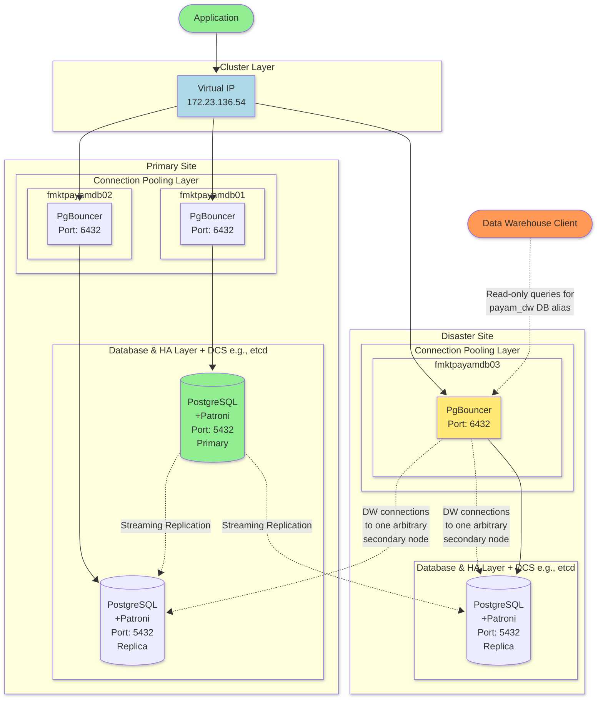

## Sample planned configuration of PGBouncer as a proxy

Because `PGBouncer` is a proxy, it can offer some other minor functionalities. For example, by using customized connection
 string directives in the PGBouncer file, it can flexibly be used for distributing different incoming connections to
 different servers, databases, users, etc with different intentions. This can be used via database aliases in the `[databases]` section. Here you can
 use multiple aliases for the same database. An example for such directives can be below:

```ini
; pgbouncer.ini:

[databases]
; The following 2 will actually point to the same database:
; The connection string will point to the same database as alias if the database is not mentioned in the connection string
payam_db = host=127.0.0.1 port=5432 user=payam password=<pass> client_encoding=UNICODE datestyle=ISO
payam_dw = host=127.0.0.1 port=5432 user=dataplatform_ro dbname=payam_db password=<pass> application_name=readonly_client options='-c default_transaction_read_only=on' client_encoding=UNICODE datestyle=ISO

.
.
.

```
 
Another advantage of this, is that you can easily manage different services with less importance and less sensitive interruption
 in different maintenance windows, especially because we do not have to take the PostgreSQL service down, and we can just take
 down the PGBouncer service. This way also WAL movement will not be interrupted. The following use-case can clear things up a bit.

* Example:

This example uses pgbouncer.ini entries given above. We want to give the Data Warehouse team readonly access to the `payam_db`, with the database
 alias name `payam_dw` instead of `payam_db`. We also use the exclusive user `dataplatform_ro` to further control data permissions for this team.
 For the load-balancing purposes, the solution would be using a load balancer which acts dynamically,
 but here, we use this example approach with the directives noted. The Data Warehouse service is not as sensitive as
 the OLTP services and populates their databases incrementally. This way, we can easily change the connection of its service to other nodes 
 more conveniently by altering the connection string of pgbouncer.ini on the 3rd node and give the pgbouncer service a restart instead of
 restarting PostgreSQL or Patroni services. The diagram below can also help with understanding the topic better:
 


 
