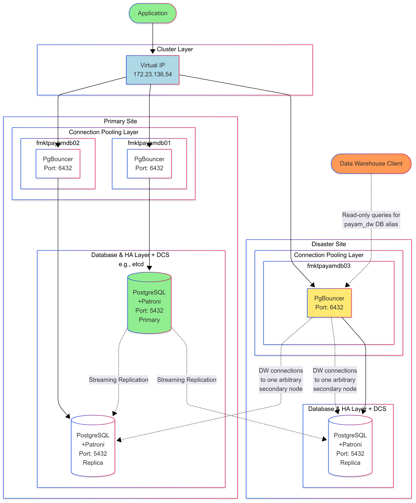

# Add pgbouncer connection pooler for PostgreSQL

`PGBouncer` is a proxy between client connections and PostgreSQL service. It gets connection requests and
 redirects them to it. The value that PGBouncer adds, is to pool connections and maintain the connection
 with PostgreSQL so that PostgreSQL would not have to pay for creating connections time and again. The 
 PostgreSQL service in question can be on the same host or somewhere else. If it is on the same host,
 the port for PGBouncer shall obviously be different. It is conventionally chosen to be `6432`. 

1. Install pgbouncer

```shell
sudo apt-get update
sudo apt-get install pgbouncer -y
```

2. Modify pgbouncer conf and add a sample configuration like below
 for every node
 
```shell
truncate -s 0 /etc/pgbouncer/pgbouncer.ini 
```
```shell
vi /etc/pgbouncer/pgbouncer.ini 
```

```ini
; pgbouncer.ini:

[databases]
<db1> = host=127.0.0.1 port=5432 user=payam password=<pass> client_encoding=UNICODE datestyle=ISO
<db2> = host=127.0.0.1 port=5432 user=postgres password=<pass> client_encoding=UNICODE datestyle=ISO
<db3> = host=127.0.0.1 port=5432 user=postgres password=<pass> client_encoding=UNICODE datestyle=ISO

[pgbouncer]
listen_addr = *
listen_port = 6432
auth_type = md5
auth_file = /etc/pgbouncer/userlist.txt
pool_mode = transaction
max_client_conn = 100
default_pool_size = 20

```

**Sample**

```ini
[databases]
postgres = host=127.0.0.1 port=5432 user=postgres password=postgrespass client_encoding=UNICODE datestyle=ISO

[pgbouncer]
listen_addr = *
listen_port = 6432
auth_type = md5
auth_file = /etc/pgbouncer/userlist.txt
pool_mode = transaction
max_client_conn = 3000
default_pool_size = 20
unix_socket_dir = /var/run/postgresql
```


3. Populate `/etc/pgbouncer/userlist.txt` file

```shell
vi /etc/pgbouncer/userlist.txt
```
```text
"user1" "pass"
"user2" "pass"
```

The pass can be in any format. It does not need to be database cluster user/password, it is
 for pgbouncer authentication, but the hashing algorithm is the same. If you need it to be
 the same as the database cluster, for the hashed password, you can query `pg_authid` catalog
 table.

```sql
SELECT rolpassword FROM pg_authid WHERE rolname='Your User'
```
 
4. restart pgbouncer service

```bash
systemctl enable pgbouncer.service
systemctl restart pgbouncer.service
```

5. Connect to postgres database cluster using `<server>`, `<pgbouncer port>`, `<pgbouncer user>`
 , and `<pgbouncer user's pass>`

```shell
root@feasypgdb01:~# psql -h 172.23.124.74 -Upayam -p6432 payam_db -c "SELECT CURRENT_USER, CURRENT_DATABASE()"
Password for user payam:
 current_user | current_database
--------------+------------------
 payam        | payam_db
(1 row)

``` 

---
 
**Note!**
If you plan to install `prometheus-pgbouncer-exporter` too for pgbouncer monitoring, you will need to adjust the
 location for pgbouncer Unix domain socket file. The default location is /tmp. However, `prometheus-pgbouncer-exporter`
 expects it to be /var/run/postgresql beside PostgreSQL main socket file.
 
You can do this by adding the following line to the pgbouncer configuration:

```ini
[pgbouncer]
unix_socket_dir = /var/run/postgresql
```


---

## Sample planned configuration of PGBouncer as a proxy

Because `PGBouncer` is a proxy, it can offer some other minor functionalities. For example, by using customized connection
 string directives in the PGBouncer file, it can flexibly be used for distributing different incoming connections to
 different servers, databases, users, etc with different intentions. This can be used via database aliases in the `[databases]` section. Here you can
 use multiple aliases for the same database. An example for such directives can be below:

```ini
; pgbouncer.ini:

[databases]
; The following 2 will actually point to the same database:
payam_db = host=127.0.0.1 port=5432 user=payam password=<pass> client_encoding=UNICODE datestyle=ISO
payam_dw = host=127.0.0.1 port=5432 user=dataplatform_ro dbname=payam_db password=<pass> application_name=readonly_client options='-c default_transaction_read_only=on' client_encoding=UNICODE datestyle=ISO

.
.
.

```
 
Another advantage of this, is that you can easily manage different services with less importance and less sensitive interruption
 in different maintenance windows, especially because we do not have to take the PostgreSQL service down, and we can just take
 down the PGBouncer service. This way also WAL movement will not be interrupted. The following use-case can clear things up a bit.

* Example:

This example uses pgbouncer.ini entries given above. We want to give the Data Warehouse team readonly access to the `payam_db`, with the database
 alias name `payam_dw` instead of `payam_db`. We also use the exclusive user `dataplatform_ro` to further control data permissions for this team.
 For the load-balancing purposes, the solution would be using a load balancer which acts dynamically,
 but here, we use this example approach with the directives noted. The Data Warehouse service is not as sensitive as
 the OLTP services and populates their databases incrementally. This way, we can easily change the connection of its service to other nodes 
 more conveniently by altering the connection string of pgbouncer.ini on the 3rd node and give the pgbouncer service a restart instead of
 restarting PostgreSQL or Patroni services. The diagram below can also help with understanding the topic better:
 
 

 
