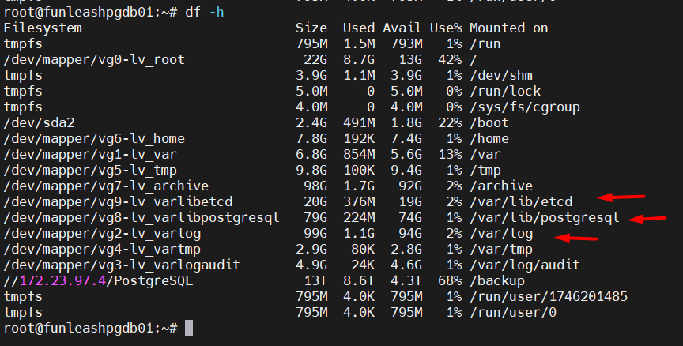
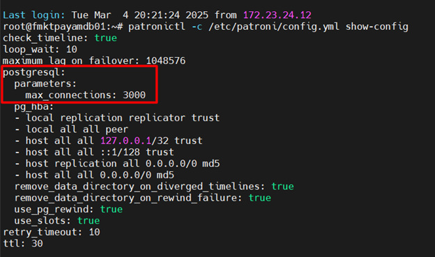
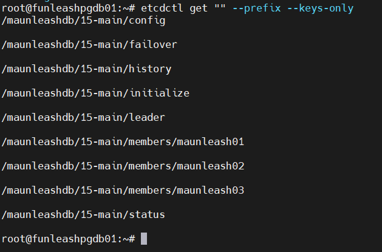
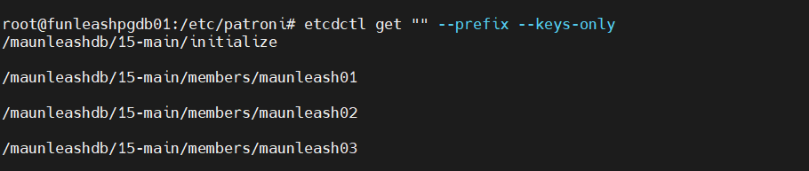
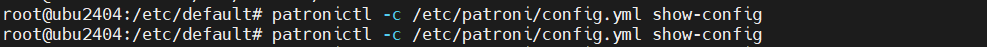

&nbsp; Doc parts:

* [Part I: Setup PostgreSQL, Patroni, and Watchdog ](./Part%20I%20Setup%20PostgreSQL%2C%20Patroni%2C%20and%20Watchdog.md)
* [Part II: Logs Purge &amp; Retention ](./Part%20II%20Logs%20Purge%20%26%20Retention.md)
* [Part III: Evict/Add node from/to the cluster ](./Part%20II%20Logs%20Purge%20%26%20Retention.md)
* [Part IV: PGBouncer](../PGBouncer/Setup%20PGBouncer.md)

# Part I: Setup PostgreSQL, Patroni, and Watchdog

To begin with, I propose using some aliases and variables that will be pretty handy later. You can see how much they shorten the commands. Run the following to append them to the global profile. 

When executing `source /etc/profile` at the end, watch for any parameters that have been possibly overridden in your current shell config:

```shell
cat <<EOF >> /etc/profile

# Manually added aliases and variables for PostgreSQL, Patroni, etcd, pgbouncer, etc.
alias patctl='sudo patronictl -c /etc/patroni/config.yml'
alias sysstt='sudo systemctl start'
alias sysstp='sudo systemctl stop'
alias sysrst='sudo systemctl restart'
alias sysrld='sudo systemctl reload'
alias etcdget='etcdctl get --prefix'
export PATCONF=/etc/patroni/config.yml
export PGBCONF=/etc/pgbouncer/pgbouncer.ini
export PGVERSION=\$([ -d /lib/postgresql ] && ls -1 /lib/postgresql | grep -E "^(9\.[0-6]|[1-9][0-9]*)\$" | sort -V | tail -1 || echo "")
export PGDATA=/var/lib/postgresql/\$PGVERSION/main
export PGCONF=/etc/postgresql/\$PGVERSION/main
EOF

source /etc/profile
```

**Install and Configure PostgreSQL**

**Note:**

1. PostgreSQL major version specified here is 18. However, this manual also complies with most of the pg versions in use, including 12, 13, 14, 15, 16, 17, 18, and most likely later versions, as well.
2. Like many of the watchdog solutions for DBMS HA solutions, the watchdog can be installed on a highly available set of servers, even a separate one. Here we set up the watchdog on all the backend (pg) nodes themselves.
3. The scripts and configuration files are both embedded in this doc and included in the git repository.
4. Most of the steps in this document are sequential, and the later steps depend on the earlier steps. So, follow the steps in order.
5. Not mentioning the non-mandatory command-line arguments means their default values.
6. The PostgreSQL database cluster can also initially be created from a backup rather than a raw database cluster.
7. The following are the node details used in this documentation:

---

<br/>
The replication topology is composed of:
<br/>
<br/>

| row | Node hostname | IP Add        | Description            |
| --- | :------------: | ------------- | ---------------------- |
| 1   | funleashpgdb01 | 172.23.124.71 | Node 1 (synchronous)   |
| 2   | funleashpgdb02 | 172.23.124.72 | Node 2 (synchronous)  |
| 3   | funleashpgdb03 | 172.23.124.73 | Node 3 (asynchronous) |
| 4   |      VIP      | 172.23.124.74 | floating Virtual IP    |

One of the standby nodes is synchronous, and the other one is asynchronous in quorum mode (the
 word "ANY 1" is used in the "synchronous_standby_names" directive of the postgresql.conf file)

0. **Disk layouts (Every Node):**

For the database clusters with a large amount of data, I used to move the data directory to somewhere else.
 For example, /data/postgresql/13/main or whatever. However, later on, I came to the conclusion that the best
 way is, at least regarding PostgreSQL, to keep everything in its default location and instead define mount
 points in the default locations and attach separate disks to those mount points. For example, prior to the
 installation of PostgreSQL, we can consider the following mount points. We actually do the first 3 of the following
 4 in this document:

- `/var/lib/postgresql/`
- `/var/log/`
- `/var/lib/etcd`
- `/var/lib/postgresql/18/main/pg_tblspc/`

Here is a sample figure of the disk layout:



If we actually set exclusive mount point for PostgreSQL or other services specific directories,
 such directories have to exist prior to these services installation. Upon installation of these
 services, their particular users will also be created. For PostgreSQL, it is postgres, and for
 etcd, it is etcd. Point is, right after the installtion which estabilishes these users, we change
 the ownership of `/var/lib/postgresql` and `/var/lib/etcd` to postgres and etcd respectively.


1. set hostnames and IP addresses if necessary (Every Node):

* 1. set hostnames:

```shell
sudo hostnamectl set-hostname <hostname>
```

* 2. Make sure that the nodes' IP Addresses and the VIP IP Address is static in the network without any IP conflict.
* 3. Add hostnames and IPs to the `/etc/hosts` file for local hostname resolution. If you need the node name to be
different in the patroni config files, those names must be added here too, for that name resolution is also
required for the cluster to work (Every Node):

```hosts
172.23.124.71 funleashpgdb01 funleashpgdb01.l.domain.com maunleash01
172.23.124.72 funleashpgdb02 funleashpgdb02.l.domain.com maunleash02
172.23.124.73 funleashpgdb03 funleashpgdb03.l.domain.com maunleash03
172.23.124.74 vip

```

#### 2. Firewall (Every Node)

Either disable the firewall or allow the needed incoming TCP ports for it.
The needed TCP ports (If you are using the defaults) are:
PostgreSQL:
5432/tcp
etcd:
2380/tcp, 2379/tcp

These ports must be open in both local machine and infrastructure/cloud firewall for the required sources.

To disable firewall entirely:

```shell
# Disable service
sudo systemctl disable --now ufw
# Mask it so that it will start again
sudo systemctl mask ufw
```

#### 3. Install PostgreSQL (Every Node):

First install the PostgreSQL's repository from its official website, [https://postgresql.org](https://postgresql.org).

Install PostgreSQL and mask its service

```shell
sudo apt update
sudo apt install -y postgresql-18 postgresql-18-repack postgresql-18-plpgsql-check \
postgresql-18-cron postgresql-18-pgaudit postgresql-18-show-plans postgresql-doc-18 \
postgresql-contrib-18 postgresql-18-plprofiler plprofiler postgresql-18-preprepare iputils-arping


# postgresql-18: This is the main PostgreSQL 18 database server package, which includes the core database server software.
# postgresql-18-repack: A utility to reorganize tables and indexes without significant downtime, helping to optimize the database by reducing bloat.
# postgresql-18-plpgsql-check: A package that provides a plpgsql_lint function to check the syntax and structure of PL/pgSQL functions.
# postgresql-18-cron: Adds cron-like scheduling capabilities to PostgreSQL, allowing jobs to be scheduled and run inside the database.
# postgresql-18-pgaudit: An extension that provides detailed session and object audit logging via the standard logging facility provided by PostgreSQL.
# postgresql-18-show-plans: Captures execution plans of SQL statements automatically for monitoring purposes.
# postgresql-doc-18: Documentation for PostgreSQL 18, including guides and manuals.
# postgresql-contrib-18: A collection of additional extensions and tools contributed by the PostgreSQL community, enhancing the database's functionality.
# postgresql-18-plprofiler: Provides profiling tools to analyze the performance of PL/pgSQL functions within PostgreSQL.
# plprofiler: A related tool to postgresql-18-plprofiler, used to visualize and analyze PL/pgSQL profiling data.
# postgresql-18-preprepare: An extension for pre-parsing SQL statements to improve performance by reducing the parsing overhead.
# iputils-arping: A network utility for sending ARP requests to discover or ping a host on the same network.


sudo systemctl disable --now postgresql.service postgresql@18-main.service
sudo systemctl mask postgresql.service postgresql@18-main.service
```

Now, as said in the section `0`, we change the ownership of `/var/lib/postgresql`
 to postgres.

```shell
sudo chown -R postgres:postgres /var/lib/postgresql
```

* Optional:

Install system stats from `EnterpriseDB`, as well. It can be compiled from source from

[https://github.com/EnterpriseDB/system_stats](https://github.com/EnterpriseDB/system_stats)

or be installed from `EnterpriseDB` repositories.

```shell
sudo apt update
sudo apt install ./edb-pg18-system-stats-3_3.0-3.jammy_amd64.deb
```

#### 4. Create required directories (Every Node):

Directories to create:

```shell
sudo mkdir -p /var/log/patroni
sudo chown -R postgres:postgres /var/log/patroni

# For local WAL archiving (using archive_command):
sudo mkdir -p /archive/postgresql/pg-wal-archive/
# For local full backups:
sudo mkdir -p /archive/postgresql/pg-local-full-backup/systemd/
sudo chown -R postgres:postgres /archive/postgresql
```

#### 5. Install Patroni (Every Node):

Install Patroni and Stop and disable it if it's running

```shell
sudo apt install -y patroni
sudo systemctl disable --now patroni
```

#### 6. Put patroni config files in place (config.yml disable dcs.yml) (Every Node)

```shell
# We are not needing dcs.yml in our implementation
sudo mv /etc/patroni/dcs.yml /etc/patroni/dcs.yml.bak
sudo chown -R postgres:postgres /etc/patroni

```

#### 7. Modify the patroni's configuration file (Every Node):

Reference:

[YAML Configuration Settings, Patroni Documentation](https://patroni.readthedocs.io/en/latest/yaml_configuration.html)

```shell
sudo vi /etc/patroni/config.yml
```

The patroni's `.yml` configuration file should be something like the following on every node. Just note the <ins>node-specific
 configurations</ins> in this file
 
A `##### SHOULD BE CHANGED #####` line has been added before every line that should conventionally be changed for every cluster,
 more or less for your case.

**Best practice:**
Set the node name (`name:` directive) the same as its hostname that can be resolved by all the nodes.

<details>
<summary>(click to expand) The complete <b>patroni configuration file (config.yml)</b>:</summary>

```YAML
##### SHOULD BE CHANGED ##### PG Cluster Name&Version
scope: "18-main"
##### SHOULD BE CHANGED ##### Cluster Name
namespace: "maunleashdb"
##### SHOULD BE CHANGED ##### Node Name
## Best practice: Set the node name the same as its hostname that can be resolved by all the nodes.
name: maunleash01

log:
  traceback_level: INFO
  level: INFO
  dir: /var/log/patroni/
  file_num: 6
  file_size: 25165824
  mode: 0644


# @DCS_CONFIG@

restapi:
##### SHOULD BE CHANGED ##### This Node Listen [IP] Address
  listen: 172.23.124.71:8008
##### SHOULD BE CHANGED ##### This Node Connect [IP] Address 
  connect_address: 172.23.124.71:8008
#  certfile: /etc/ssl/certs/ssl-cert-snakeoil.pem
#  keyfile: /etc/ssl/private/ssl-cert-snakeoil.key
#  authentication:
#    username: username
#    password: password

# ctl:
#   insecure: false # Allow connections to SSL sites without certs
#   certfile: /etc/ssl/certs/ssl-cert-snakeoil.pem
#   cacert: /etc/ssl/certs/ssl-cacert-snakeoil.pem

etcd3:
  protocol: http
##### SHOULD BE CHANGED ##### ETCD Nodes [IP] Addresses
  hosts: 172.23.124.71:2379,172.23.124.72:2379,172.23.124.73:2379


bootstrap:

  # Custom bootstrap method
  # The options --scope= and --datadir= are passed to the custom script by
  # patroni and passed on to pg_createcluster by pg_createcluster_patroni
  method: pg_createcluster
  pg_createcluster:
    command: /usr/share/patroni/pg_createcluster_patroni

  # This section will be written into /<namespace>/<scope>/config after
  # initializing a new cluster and all other cluster members will use it as a
  # `global configuration`
  dcs:
    ttl: 30
    loop_wait: 10
    retry_timeout: 10
    maximum_lag_on_failover: 1048576
    check_timeline: true
#    master_start_timeout: 300
#    synchronous_mode: false
#    standby_cluster:
#      host: 127.0.0.1
#      port: 1111
#      primary_slot_name: patroni
    postgresql:
      use_pg_rewind: true
      remove_data_directory_on_rewind_failure: true
      remove_data_directory_on_diverged_timelines: true
      use_slots: true
      # The following parameters are given as command line options
      # overriding the settings in postgresql.conf.
#      parameters:
##        wal_level: hot_standby
##        hot_standby: "on"
##        wal_keep_segments: 8
##        max_wal_senders: 10
##        max_replication_slots: 10
##        max_worker_processes = 8
##        wal_log_hints: "on"
##        track_commit_timestamp = "off"
##      recovery_conf:
##        restore_command: cp ../wal_archive/%f %p
      # Set pg_hba.conf to the following values after bootstrapping or cloning.
      # If you want to allow regular connections from the local network, or
      # want to use pg_rewind, you need to uncomment the fourth entry.
      pg_hba:
#      - local   all             all                                     peer
#      - host    all             all             127.0.0.1/32            md5
#      - host    all             all             ::1/128                 md5
##      - host    all             all             @NETWORK@               md5
#      - local   replication     all                                     peer
#      - host    replication     all             127.0.0.1/32            md5
#      - host    replication     all             ::1/128                 md5
#      - host    replication     all             @NETWORK@               md5
      - local replication replicator trust
      - local all all peer
      - host all all 127.0.0.1/32 trust
      - host all all ::1/128 trust
      - host replication all 0.0.0.0/0 md5
      - host all all 0.0.0.0/0 md5
  

#  # Some possibly desired options for 'initdb'. Note: It needs to be a list
#  # (some options need values, others are # switches)
#  initdb:
#  - encoding: UTF8
#  - data-checksums

#  # Additional script to be launched after initial cluster creation (will be
#  # passed the connection URL as parameter)
#  post_init: /usr/local/bin/setup_cluster.sh

#  # Additional users to be created after initializing the cluster
#  users:
#    foo:
#      password: bar
#      options:
#        - createrole
#        - createdb

postgresql:
  # Custom clone method
  # The options --scope= and --datadir= are passed to the custom script by
  # patroni and passed on to pg_createcluster by pg_clonecluster_patroni
  create_replica_method:
    - pg_clonecluster
  pg_clonecluster:
    command: /usr/share/patroni/pg_clonecluster_patroni

  # Listen to all interfaces by default, this makes vip-manager work
  # out-of-the-box without having to set net.ipv4.ip_nonlocal_bind or similar.
  # If you prefer to only listen on some interfaces, edit the below:
#  listen: "@HOSTIP@@LISTEN_VIP@,127.0.0.1:@PORT@"
  listen: "*:5432"
##### SHOULD BE CHANGED ##### This Node Connect [IP] Address 
  connect_address: 172.23.124.71:5432
  use_unix_socket: true
  ## Default Debian/Ubuntu directory layout
  # data_dir: @DATADIR_BASE@/@VERSION@/@CLUSTER@
  # bin_dir: /usr/lib/postgresql/@VERSION@/bin
  # config_dir: /etc/postgresql/@VERSION@/@CLUSTER@
  # pgpass: /var/lib/postgresql/@VERSION@-@CLUSTER@.pgpass
  # Modified directory layout:
##### SHOULD BE CHANGED ##### This Node data_dir 
  data_dir: /var/lib/postgresql/18/main/
##### SHOULD BE CHANGED ##### This Node bin_dir 
  bin_dir: /usr/lib/postgresql/18/bin
##### SHOULD BE CHANGED ##### This Node config_dir 
  config_dir: /etc/postgresql/18/main
  pgpass: /var/lib/postgresql/.pgpass
  
  authentication:
    replication:
##### SHOULD BE CHANGED ##### replicator user 
      username: "replicator"
##### SHOULD BE CHANGED ##### replicator user password
      password: "p@ssvv0rcl"
    # A superuser role is required in order for Patroni to manage the local
    # Postgres instance.  If the option `use_unix_socket' is set to `true',
    # then specifying an empty password results in no md5 password for the
    # superuser being set and sockets being used for authentication. The
    # `password:' line is nevertheless required.  Note that pg_rewind will not
    # work if no md5 password is set unless a rewind user is configured, see
    # below.
    superuser:
      username: "postgres"
##### SHOULD BE CHANGED ##### superuser user password
      password: "p@ssvv0rcl"
    # A rewind role can be specified in order for Patroni to use on PostgreSQL
    # 11 or later for pg_rewind, i.e. rewinding a former primary after failover
    # without having to re-clone it. Patroni will assign this user the
    # necessary permissions (that only exist from PostgreSQL)
#    rewind:
#      username: "rewind"
#      password: "rewind-pass"

  parameters:
    # data dir location
##### SHOULD BE CHANGED ##### This Node data_directory 
    data_directory: '/var/lib/postgresql/18/main/'
    # network params:
    listen_addresses: "*"
    unix_socket_directories: '/var/run/postgresql/'
    # Emulate default Debian/Ubuntu logging
    logging_collector: 'on'
    log_directory: '/var/log/postgresql/'
##### SHOULD BE CHANGED ##### This Node Log File Name 
    log_filename: 'postgresql-18-main-%A.log'
    #log_file_mode: 0600
    log_rotation_age: 1d
    #log_rotation_size: 1024MB
    log_truncate_on_rotation: on
    #transaction log params
    synchronous_commit: "on"
    archive_mode: "on"
    archive_command: "test ! -f /archive/postgresql/pg-wal-archive/%f && cp %p /archive/postgresql/pg-wal-archive/%f"
    wal_keep_segments: 8
    max_wal_senders: 10
    max_replication_slots: 10
    max_worker_processes: 8
    wal_log_hints: "off"
    track_commit_timestamp: "on"
    # synchornization or cluster params:
    synchronous_standby_names: "ANY 1 (maunleash01,maunleash02,maunleash03)"
    # perf params:
    max_connections: 300
    #
    # RedgateMonitor associated params:
    #
    #########################################################################################
    #                       Redgate Monitor Parameters                                      #
    #########################################################################################
    #
    log_destination: 'stderr,csvlog'
    shared_preload_libraries: 'pg_stat_statements, auto_explain' # (change requires restart)
    track_io_timing: on  # We recommend setting `track_io_timing` to 'on' to give more a more detailed view of queries' IO performance.
    #
    auto_explain.log_format: json             # this must be set to json as shown
    auto_explain.log_level: LOG               # this must be set to LOG as shown
    auto_explain.log_verbose: true            # records more detailed query plan information
    auto_explain.log_analyze: true            # causes timing for each node to be recorded
    auto_explain.log_buffers: true            # record buffer usage statistics
    auto_explain.log_wal: true                # record WAL performance statistics (PostgreSQL >= 13 only)
    auto_explain.log_timing: true             # record per-node timing
    auto_explain.log_triggers: true           # record trigger statistics
    auto_explain.sample_rate: 0.01            # record plans for only 1% of queries
    auto_explain.log_min_duration: 30000      # 30000 ms: 30 seconds
    auto_explain.log_nested_statements: true  # records the plan for any nested statement invoked by a function call
    log_file_mode: 0640
    #
    ####################### End RedgateMonitor associated params ############################
    #
    # Other Parameteres


```

</details>

As it is arranged for the Patroni service to run with the root user in this document, there is no need to change ownerships for this file.

##### <b>Very important note!!!</b>

Some parameters, listed below, are critical for Patroni to be set identically across all replicas, such as `max_connections`. Since the Patroni YAML configuration files might differ across replicas, if these parameters are set in these files, Patroni will silently ignore them (at least in the current version) without any errors or warnings. Instead, it requires these settings to be stored in the DCS (Distributed Configuration Store), which is consistent across all replicas.

Since this document is written in order of actions that shall be taken to setup the cluster, these details will be skipped to their suitable step.

To add these configurations, Patroni provides the following command:
```bash
patronictl -c <path to the yml config file> edit-config <cluster name>
```

Here, `<cluster name>` is `scope` in the yml configuration. The format of these configurations is also YAML, and they must be defined under the following structure:
```yaml
postgresql:
  parameters:
    <config parameters>
```

Now you can run the following to confirm that:

```bash
patronictl -c <path to the yml config file> show-config <cluster name>
```

Example:



List of such configuration parameters:
```YAML
max_connections: 100
max_locks_per_transaction: 64
max_worker_processes: 8
max_prepared_transactions: 0
wal_level: hot_standby
wal_log_hints: on
track_commit_timestamp: off
```

#### 8. Install etcd (Every Node)

Latest version of etcd can be installed through its own website, and they strongly recommend
 that you do so and say that etcd version from pre-installed repositories is outdated. 

[https://etcd.io/docs/v3.5/install/](https://etcd.io/docs/v3.5/install/)

**However,** I have used Ubuntu's native repositories <ins>below</ins> to install etcd.

Install `etcd` and stop and disable it if it's running.

* On Ubuntu 22.04 and before:

```shell
sudo apt install -y etcd
sudo systemctl disable --now etcd
```

* On Ubuntu 24.04:

```shell
sudo apt install -y etcd-client etcd-discovery etcd-server
sudo systemctl disable --now etcd
```

Now, as said in the section `0`, we change the ownership of `/var/lib/etcd`
 to etcd.

```shell
sudo chown -R etcd:etcd /var/lib/etcd
```

#### 9. Make the etcd API version 3 global (Every Node)

Make it global by putting it inside /etc/profile, then make it effective for the current session too:

```shell
sudo echo >> /etc/profile
sudo echo export ETCDCTL_API=3 >> /etc/profile
# make it effective for the current session too
source /etc/profile
```


#### 10. Edit the /etc/default/etcd file (Nodes 1st and 2nd only)

Reference:

[https://etcd.io/docs/v3.4/op-guide/configuration/](https://etcd.io/docs/v3.4/op-guide/configuration/)

```shell
sudo cp -a /etc/default/etcd /etc/default/etcd.default
sudo truncate -s 0 /etc/default/etcd
sudo vi /etc/default/etcd
```

Edit it like below:

```shell
ETCD_NAME=n1
ETCD_DATA_DIR="/var/lib/etcd/default"
ETCD_LISTEN_PEER_URLS="http://172.23.124.71:2380"
ETCD_LISTEN_CLIENT_URLS="http://172.23.124.71:2379,http://127.0.0.1:2379"
ETCD_INITIAL_ADVERTISE_PEER_URLS="http://172.23.124.71:2380"
ETCD_ADVERTISE_CLIENT_URLS="http://172.23.124.71:2379"
ETCD_INITIAL_CLUSTER="n1=http://172.23.124.71:2380,n2=http://172.23.124.72:2380,n3=http://172.23.124.73:2380"
ETCD_INITIAL_CLUSTER_STATE="new"
ETCD_INITIAL_CLUSTER_TOKEN="etcd-cluster-pg"
ETCD_AUTO_COMPACTION_RETENTION=168
# 7 days
ETCD_AUTO_COMPACTION_MODE=periodic
ETCD_MAX_SNAPSHOTS=5
ETCD_MAX_WALS=5

```

#### 10. Edit the /etc/default/etcd file (Node(s) 3rd and ... only)

Reference:

[https://etcd.io/docs/v3.4/op-guide/configuration/](https://etcd.io/docs/v3.4/op-guide/configuration/)

The `etcd` cluster must be brought up with at least 2 nodes as "new", because more than 1 node in the
etcd configuration file has been specified.


```shell
sudo cp -a /etc/default/etcd /etc/default/etcd.default
sudo truncate -s 0 /etc/default/etcd
sudo vi /etc/default/etcd
```

Edit it like below:

```shell
ETCD_NAME=n2
ETCD_DATA_DIR="/var/lib/etcd/default"
ETCD_LISTEN_PEER_URLS="http://172.23.124.72:2380"
ETCD_LISTEN_CLIENT_URLS="http://172.23.124.72:2379,http://127.0.0.1:2379"
ETCD_INITIAL_ADVERTISE_PEER_URLS="http://172.23.124.72:2380"
ETCD_ADVERTISE_CLIENT_URLS="http://172.23.124.72:2379"
ETCD_INITIAL_CLUSTER="n1=http://172.23.124.71:2380,n2=http://172.23.124.72:2380,n3=http://172.23.124.73:2380"
# The following parameter will be different on the 2nd ... nth nodes on initial ETCD startup
ETCD_INITIAL_CLUSTER_STATE="existing"
ETCD_INITIAL_CLUSTER_TOKEN="etcd-cluster-pg"
ETCD_AUTO_COMPACTION_RETENTION=168
# 7 days
ETCD_AUTO_COMPACTION_MODE=periodic
ETCD_MAX_SNAPSHOTS=5
ETCD_MAX_WALS=5

```

#### 11. Create the necessary PostgreSQL users (First Node Only)

Make sure the postgresql database cluster is functional on the first node, we disabled it
 upon installation, thus we need to start it manually. Then connect to it and alter or
 create necessary users and their permissions. Then check the changes:

```shell
pg_ctlcluster 18 main --skip-systemctl-redirect start
# Enter psql PostgreSQL CLI client
sudo -iu postgres psql
```

```PL/PGSQL
alter user postgres password 'p@ssvv0rcl';
create user replicator replication password 'p@ssvv0rcl';
select * from pg_user;
```

#### *. Stop running pg executable (First Node Only)

```shell
pg_ctlcluster 18 main --skip-systemctl-redirect stop -m immediate
```


#### 12. Delete data directory contents (2nd and 3rd Nodes only)

Delete data directory contents on the 2nd and 3rd nodes only

```shell
sudo rm -rf /var/lib/postgresql/18/main/*
```

#### 13. Enable and start etcd service (Every Node)

Start `<ins>`from the first node `</ins>`, then go on with other nodes, as well. We want
 the first node to be the watchdog leader, thus we start from the first node.

```shell
sudo systemctl enable --now etcd
```

#### 14. Enable and start patroni service (First Node Only)

We want to start patroni for the first time. Thus, we want to make sure that postgresql is
 not running. PostgreSQL should be running because we manually started it to set the
 postgres user's password and create the other initial users.

We do these by executing the following commands:

```shell
pg_ctlcluster 18 main --skip-systemctl-redirect stop -m immediate
sudo systemctl enable --now patroni
```

#### 15. Enable and start patroni service (2nd and 3rd Nodes Only)

Now that the first node is taken care of, we go over to the 2nd and 3rd to enable and start the patroni
 service. The PGDATA directory and its contents will be created automatically using the patroni's
 built-in functionality:

```shell
sudo systemctl enable --now patroni
```

After running this, the key-value pairs will be created inside etcd and if you run the following command,
 a result like below should show up:

```shell
etcdctl get "" --prefix --keys-only
```



* NOTE!

If after starting patroni service, the required key-value pairs are not created in etcd database like the figure
 below, there is bound to be something wrong with the patroni configurations, or the configurations do not
 match with postgresql or etcd.

For example, if you have not granted the replication privilege to the replicator
 user. Simple as that.

In such case, the empty command result like the latter figure might be shown:






## Setup VIP handling mechanism:

This can be done using some scripts and timers. However, for ease of use and setup we use `vip-manager`.

#### 16. Install vip-manager

Install and setup vip-manager (version 2). Then stop it if it's running:

```shell
sudo apt install -y vip-manager2
sudo systemctl stop vip-manager
```

#### 17. Edit vip-manager service:

We want to create a configuration file. Therefore, we need to modify the vip-manager service file to read
 from that configuration file upon start:

```shell
sudo systemctl edit vip-manager
```

Write the following inside the drop-in

```shell
[Service]

ExecStart=
ExecStart=/usr/bin/vip-manager --config=/etc/default/vip-manager.yml

```
Save and exit.

Reload deamon:

```shell
sudo systemctl daemon-reload
```

#### 18. Create the vip-manager configuration file:

Create it with the address that we specified in the vip-manager service file:

```shell
sudo touch /etc/default/vip-manager.yml
```

#### 19. Config VIP Manager.

Set the configurations inside the vip-manager.yml file.

```shell
sudo vi /etc/default/vip-manager.yml
```

* This is typically different between different clusters (Ex: your new cluster and the sample configuration here)
```YAML
trigger-key: "/maunleashdb/18-main/leader"
trigger-value: "maunleash01"
ip: 172.23.124.74
interface: ens160
dcs-type: etcd
dcs-endpoints:
  - http://127.0.0.1:2379
  - http://172.23.124.71:2379
  - http://172.23.124.72:2379
  - http://172.23.124.73:2379

``` 

* This is typically the only directive that differs across different nodes of the same cluster.

```YAML
trigger-value: "maunleash01"

```

**Sample**:

<details>
<summary>(click to expand) Sample <b>vip-manager configuration file (vip-manager.yml)</b>:</summary>

```YAML
# config for vip-manager by Cybertec Schönig & Schönig GmbH

# time (in milliseconds) after which vip-manager wakes up and checks if it needs to register or release ip addresses.
interval: 1000

# the etcd or consul key which vip-manager will regularly poll.
trigger-key: "/maunleashdb/18-main/leader"
# if the value of the above key matches the trigger-value (often the hostname of this host), vip-manager will try to add the virtual ip address to the interface specified in Iface
trigger-value: "maunleash01"

ip: 172.23.124.74 # the virtual ip address to manage
netmask: 24 # netmask for the virtual ip
interface: ens160 #interface to which the virtual ip will be added

# how the virtual ip should be managed. we currently support "ip addr add/remove" through shell commands or the Hetzner api
hosting-type: basic # possible values: basic, or hetzner.

dcs-type: etcd # etcd or consul
# a list that contains all DCS endpoints to which vip-manager could talk.
dcs-endpoints:
  - http://127.0.0.1:2379
  - http://172.23.124.71:2379
  - http://172.23.124.72:2379
  - http://172.23.124.73:2379
  # A single list-item is also fine.
  # consul will always only use the first entry from this list.
  # For consul, you'll obviously need to change the port to 8500. Unless you're using a different one. Maybe you're a rebel and are running consul on port 2379? Just to confuse people? Why would you do that? Oh, I get it.

## etcd-user: "patroni"
## etcd-password: "Julian's secret password"
# when etcd-ca-file is specified, TLS connections to the etcd endpoints will be used.
## etcd-ca-file: "/path/to/etcd/trusted/ca/file"
# when etcd-cert-file and etcd-key-file are specified, we will authenticate at the etcd endpoints using this certificate and key.
## etcd-cert-file: "/path/to/etcd/client/cert/file"
## etcd-key-file: "/path/to/etcd/client/key/file"

# don't worry about parameter with a prefix that doesn't match the endpoint_type. You can write anything there, I won't even look at it.
## consul-token: "Julian's secret token"

# how often things should be retried and how long to wait between retries. (currently only affects arpClient)
retry-num: 2
retry-after: 250  #in milliseconds

# verbose logs (currently only supported for hetzner)
verbose: false

```

</details>


#### 20. Start+enable vip-manager service:

```shell
sudo systemctl enable --now vip-manager
```

#### 21. See status of VIP Manager service:

```shell
sudo systemctl status vip-manager
```


# [Next: Part II: Logs Purge &amp; Retention ](./Part%20II%20Logs%20Purge%20%26%20Retention.md)
