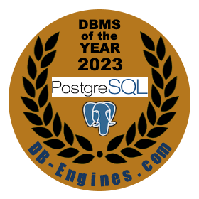
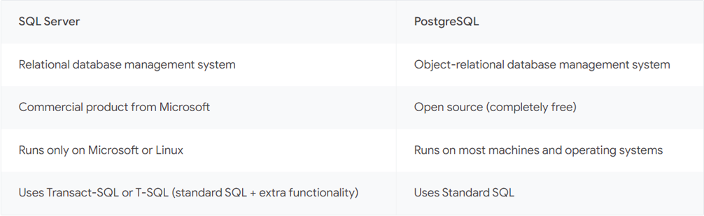
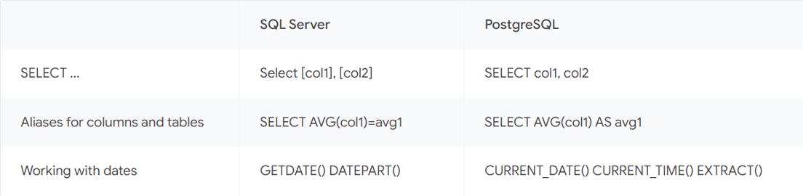
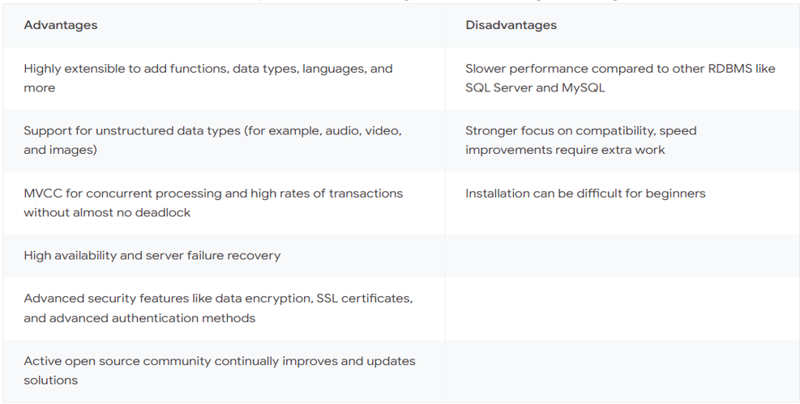
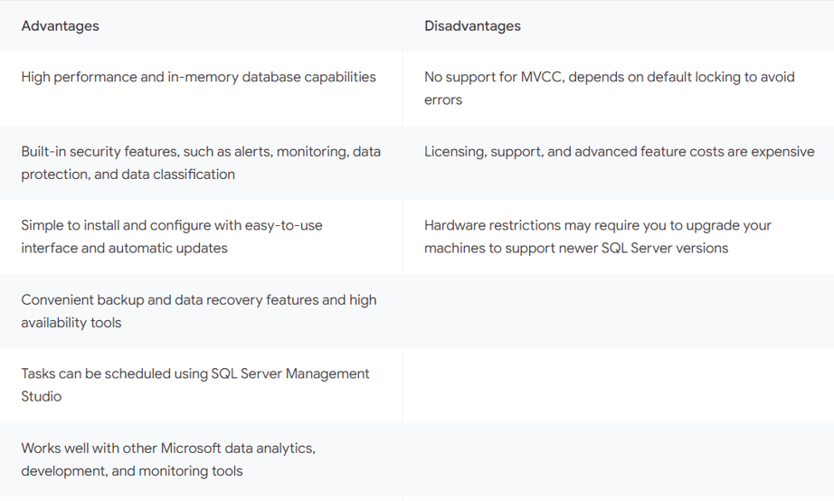

# Introduction to PostgreSQL (With practical approach)

## Foreword:

### A WORD FOR THE DATABASE ADMINISTRATORS

#### Why should I learn PostgreSQL?

##### 1. PostgreSQL was named the first DBMS of the year according to [PostgreSQL is the DBMS of the Year 2023](https://db-engines.com/en/blog_post/106). 
 It is also a bridge to some other technologies like CockroachDB. More info about PostgreSQL is in the item No. 4.
 
The ranking there is listed as follows:
 
	1. First Place: PostgreSQL
	2. Runner-up: Databricks
	3. Third place: Google BigQuery

Previous winners of the DB-Engines DBMS of the Year Award:

|PostgreSQL|	2023|
|-|-|
|Snowflake|	2022|
|Snowflake|	2021|
|PostgreSQL|	2020|
|MySQL|	2019|
|PostgreSQL|	2018|
|PostgreSQL|	2017|
|Microsoft SQL Server|	2016|
|Oracle|	2015|
|MongoDB|	2014|
|MongoDB|	2013|

 

##### 2. Necessity

• Redgate recently launched their State of the Database Landscape 2024 survey results, from almost 4,000 database professionals from around the globe. A clear picture emerged from the results, suggesting that 2024 is the year that skill diversification among database professionals is imperative. There’s the need to manage multiple databases, to migrate to the cloud, to introduce continuous delivery with DevOps, and even incorporating Generative AI into the mix.

• The key finding? That the pace of change in our industry is faster than ever. This is causing a recurring challenge to emerge: the rapid need for skill diversification from data professionals everywhere.

• 79% of businesses use two or more database platforms; introducing a new level of complexity for those responsible for database and data management.

• Read more at the link given below.

<ins> RedGate Survey about skill diversification: </ins>

Navigating the database landscape in 2024: Shifting skills to match constant demands - Redgate events (red-gate.com)

[https://www.red-gate.com/hub/events/navigating-the-database-landscape-in-2024](https://www.red-gate.com/hub/events/navigating-the-database-landscape-in-2024)

##### 3. Ease of learning

In my opinion, with the fundamentals and theories of RDBMSs being all the same, a specialist in one other RDBMS,
 can insanely easily learn a new RDBMS, namely PostgreSQL, and also relative to other people who have no prior knowledge.
 Therefore, you need to invest dramatically less and yet be called a multi-skilled specialist. So, it is also a shame not to
 do so.

##### 4. More General Info About PostgreSQL

• The Object-Relational Database Management System (ORDBMS) PostgreSQL is a powerful, stable, open-source, and free transactional 
database management system with a wide variety of features. It supports development in multiple procedural languages such as PL/PGSQL,
 PL/Python, PL/Tcl, and PL/Perl, making PostgreSQL accessible to a wide range of developers.

 Its object-oriented features simplify the work of programmers in using object-oriented programming capabilities.
 For example, features like diverse data types and operator overloading allow developers to define indexes more broadly, custom, and complexly.

• This RDBMS is specifically designed for free and open-source Unix-based operating systems, including Linux, but it can also be
 installed and used on all major operating systems, including Windows, Unix, macOS, Solaris, BSD operating systems, and more,
 natively and in containers. Additionally, this ORDBMS is used on numerous devices.

• PostgreSQL, like its main host Linux, is highly customizable and manageable with numerous peripheral features and modules. Users
 can install their desired features to enhance this RDBMS as needed. However, this feature also makes its management more complex,
 similar to Linux. PostgreSQL modules include both commercial and free ones, with most being open-source and free.

• This RDBMS is very popular and has a vast community of experts who contribute to the enhancement of PostgreSQL and its modules
 and assist other experts in troubleshooting. PostgreSQL is free for enterprise-level use, and its main host, Linux, is also free.
 For this reason, many companies use it as their primary data storage system or one of their main data storage systems. This RDBMS
 is currently very popular and has established a powerful position for itself. PostgreSQL also serves as a bridge to access the advanced
 and distributed RDBMS CockroachDB, which has numerous capabilities.

• Finally, based on statistical reviews by various companies and obtained information, most companies today use hybrid data management
 systems, one of the most important of which is PostgreSQL. According to a recent Redgate survey, most data management professionals
 believe that modern specialists can no longer settle for learning a single data management solution and must master multiple DBMSs.

 

### Robustness

• In the context of PostgreSQL, robustness refers to the database system's ability to provide reliable performance,
 maintain data integrity, and handle errors gracefully under various conditions. PostgreSQL is known for its robust 
 feature set, which includes comprehensive support for different data types, advanced indexing, full ACID (Atomicity,
 Consistency, Isolation, Durability) compliance for transactions, and extensive capabilities for data integrity and
 disaster recovery.
 
• Robustness in PostgreSQL ensures that the system can manage large volumes of data and complex queries without
 compromising on performance. It also means that PostgreSQL can recover from failures and continue to operate
 effectively, which is crucial for maintaining the availability and reliability of applications that depend on the database

---
 

### References:

Refer to the following link for references:

[Some Postgresql References](some%20postgresql%20references.md)

---
 
 

 

### Notation:

• `pg` stands for postgresql

• `repo` stands for repository

• `distro` stands for distribution

• `*` sometimes is used to replace version number (major and minor). Sometimes however, the version number is directly noted which is mostly 16 for this document.

• `Deb` stands for Debian

• `RHEL` stands for Red Hat Enterprise Linux.

 
 
 
 

### Comparing PostgreSQL with SQL Server

For this, I have also included this article from Google Cloud:

[PostgreSQL vs SQL Server: What are the key differences?](https://cloud.google.com/learn/postgresql-vs-sql)

Here are the key points and summary:

**Major Differences:**

* **General big picture of differences:**

---

* **Licensing:**

**PostgreSQL**: Open-source and free. PostgreSQL is released under the PostgreSQL License,
 which is a liberal open-source license similar to the BSD or MIT licenses. This license
 allows you to freely use, copy, modify, and distribute the software and its documentation
 for any purpose, without any fees or written agreements.

**SQL Server**: Closed-source and commercial.

---

* For the sessions, PostgreSQL uses processes, but SQL Server uses threads. This makes SQL Server generally
 able to handle more connections as it does not wrap every session into one process and do some processing
 and operations more efficiently like a more powerful control over parallelism with a smaller granularity
 in process control. SQL Server also uses SQL OS to orchestrate many processes in a sub-virtual environment
 separated from the Operating System. PostgreSQL, in contrast, uses one process for every session. The control
 and orchestration of these processes is carried out by PostgreSQL's main postmaster process.
 
    For this reason, there is a prevailing opinion among some people that PostgreSQL may exhibit certain
 limitations when compared to SQL Server for data warehousing applications and it might be more suited.
 for OLTP and application serving intentions. The correct judgment, however, obviously depends on the perspective
 and is also a bit subjective. You will get a better opinion when you get acquainted enough with this <ins>ORDBMS
 </ins>.

--- 

* **RDBMS vs. ORDBMS:**

**SQL Server:** traditional application tasks for data processing
**PostgreSQL:** applications that contain complex objects (Ex: new data types like video, audio, and image files)
 Spatial Data Types

---

* **Inclusiveness and diversity:**

**PostgreSQL:** Is like many other open-source applications incredibly customizable, meaning that you can take different
 parts of it and manually compile them for your own specific purposes. The main package is also not pretty much feature-rich
 and all-inclusive relative to SQL Server, but different modules and extensions can be manually installed and added to add
 feature and functionality to PostgreSQL. This gives you more freedom to install what you want and not install what you do
 not selectively, keeping it as light as possible. For SQL Server, the freedom is much less here. You have to install some
 features that you might never use, or the alternatives are much less diverse. The open-source trait has resulted 
 in many solutions to be developed and released for a single specific PostgreSQL's functionality, as opposed to the
 SQL Server for which such solutions are mostly offered by Microsoft. For instance, there
 are many solutions that offer automation, HA/DR, etc. Most of them are free and open-source.
 
**SQL Server:** Unlike PostgreSQL.

---

* **Terminology:**

Some of the major differences between MSSQL-Windows and PG-Linux with respect to the terminology

|PG|MSSQL|
|-|-|
|Replication|AlwaysOn|
|MVCC|Snapshot Isolation (SI)|
|Bash Scripting|PowerShell Scripting, Batch Scripting|
|Database Cluster|SQL Server Instance|
|Virtual IP (VIP)|Listener|
|...|...|

More terminology comparison on:

[SQL Server PostgreSQL terminology](https://wiki.postgresql.org/wiki/SQL_Server_PostgreSQL_terminology)

[PostgreSQL Terminology for MySQL DBAs](https://wiki.postgresql.org/wiki/MySQL_PostgreSQL_terminology)

---

* **Programming language support:**

**SQL Server:** Java, JavaScript (Node.js), C#, C++, PHP, Python, and Ruby. 
execute_external_script (OpenR, OpenPython)

**PostgreSQL:** Python, PHP, Perl, Tcl, Net, C, C++, Delphi, Java, JavaScript (Node.js), and more.

---

* **SQL Syntax:**

---

* **Advantages and Disadvantages (comparatively):**

**PostgreSQL:**

**SQL Server:**

 
 

#### Next: [Index](index.md)