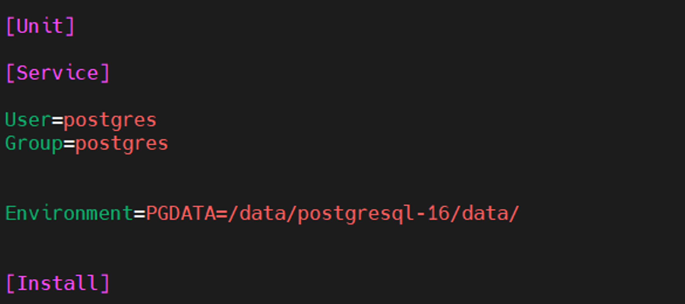
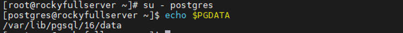

#### Previous: [Introducing PostgreSQL Files and Directories](introducing_postgresql_files_and_directories.md)
<br/>

## 1. move pg data directory (RHEL, Ubuntu is not a big deal after you learn this)

We also clarify one approach of moving the data directory (`$PGDATA`) to some place else for educational purposes (Only RHEL, other distributions
 are very self-explanatory after you learn this). There are many approaches to do so
 that as you get more familiar with PostgreSQL, you get to know how to do each of them. I do not personally recommend moving the data directory in
 general, as noted before. For the approach noted here, you can follow the following steps:

1. Do not start the service. If it is started, stop it and remove the contents of the default installation directory only if you have not written any
 important data there. They can be removed later as well. In RHEL the service file will not start normally after the installation of the package
 (unlike Ubuntu). It also depends on the repo from which the package comes from.

2. It is highly recommended to use a drop-in for the modification of pg’s service file configurations. To do so, write the following command:

```shell
sudo systemctl edit postgresql-17.service
```

this will automatically create a drop-in. You cannot override some major parameters such as 

<pre>
ExecStartPre
ExecStart
ExecReload
</pre>

 as they cannot be redundant (sysetmd concatenates the service file and it drop-ins) unless you void the previous value first.
 you can do this like below:
 
 Main service file:
 
 ```shell
 ExecStart=<some default value>
 ```
 
 drop-in:
 ```shell
 # void the previous value of the main service file in the drop-in first:
 ExecStart=
 # now assign the new value:
 ExecStart=<new custom value>
 ```
  
 A sample of the modifications that can be made comes next. The parameter `$PGDATA` should be overridden. You can also
 use an environment file and place all start-up environemt variables there and only include `EnvironmentFile=-/etc/service/ENV`
 directive in the service file.


<br/>


* Sample full path of the drop-in file:

`/etc/systemd/system/postgresql-17.service.d/override.conf`

* `Environment=PGDATA=/data/postgresql/data/`
 
* `EnvironmentFile=-/etc/service/ENV`

<br/>
<br/>

 
* The default user for running PostgreSQL is `postgres`. It is created automatically by the postgres’s installation with no password. This user is
 locked for direct logins for security measures. Do not try to activate it using passwd command to log in directly as it poses security risks. Instead, you can
 impersonate this user. The corresponding user/role in pg DBMS is also `postgres`


* You can connect to pg by using `postgres` user and peer authentication method. For that you can impersonate postgres linux user. You can get the default postgres’s
 home directory with the following command which is `/var/lib/pgsql` (RHEL) by default
```shell 
 echo ~postgres
``` 
* postgres has superadmin rights on the pg DBMS. You should use its rights at the beginning to create initial users/roles and grant rights
* The next slide has a sample drop-in we talked about
* It is advisable that you choose the data and log directories without including pg’s version number, as we might perform a major upgrade later 

<br/>
<br/>
<br/>


* Now, sample drop-in for the PostgreSQL service (RHEL):




* The database cluster data initialization (creating an instance of the data directory on which every data modification can be written and many other functionalities,
 we will get to this later) will occur in `PGDATA` directory which you can override in the service file. This directory must be empty for you to be able
 to initialize the database cluster (a single instance of pg is called pg database cluster). Note that this is by default the value returned
 when you write the following command in the user shell as the postgres user, but if you override it, they will no more be the same
 


This is the value returned on the RHEL systems by default. On the Debian systems this variable in not typically set by default.


* Do not forget to grant ownership to `postgres` user or any other user that you assign to pg in PostgreSQL service file, and 0755/0750 permission (rwxr-xr-x).
 This must be done recursively on `$PGDATA`, otherwise the DBMS will not start up. `$PGLOG` can be 0600 or more, but such strict permission for `$PGLOG` Is
 typically not mandatory.


* Now it’s time to initialize the database cluster. Before that, I say some default paths. First, you may run the which or whereis commands
 as I am about to explain to track some binaries for PostgreSQL. Here we assume that the installation files are all in the default directories
 (Those can also of course be changed, but are not within our learning scope)


<br/>
<br/>

## 2. Do it yourself!

Install several instances of PostgreSQL Database cluster on a single Linux server. Choose two of them with the same major version
 and one with a different major version. For example, PostgreSQL 17,17,16. Use systemd to manage all of them and make all start
 on boot.


#### Next: []()

