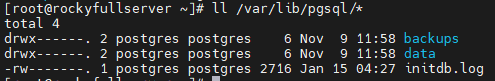
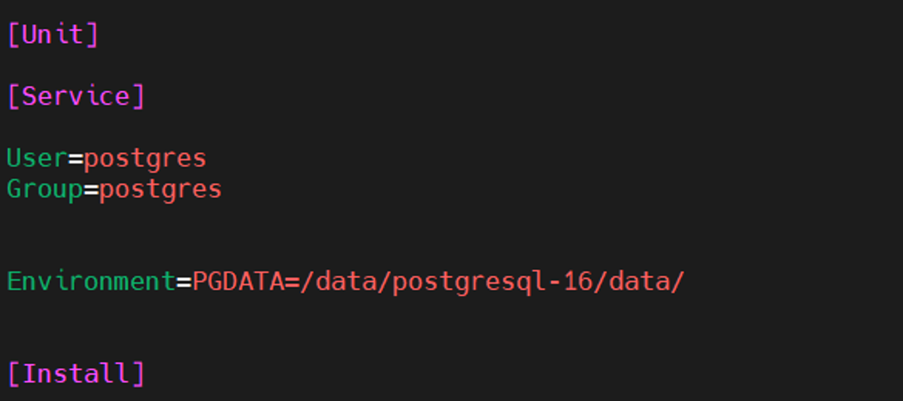
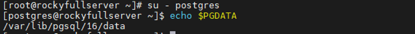

### Installation:

#### Notes:

* Here we do not discuss moving pg’s main installation directory.

* a postgresql instance is called postgresql database cluster or postgresql cluster in short.

* The instructions are mostly for RHEL and Debian linux distros. For other distros, it shall not be any more difficult anyway. Please note that if you have only worked with pg on RHEL, you should do some study on pg administration tasks on Ubuntu before being able to start the work on it.

* Ubuntu appeared relatively much easier to me (easier also depends on your use case, for you may not need the things that ubuntu does automatically), mostly in the sense that it automatically separates data and configuration directories and also different clusters and versions of pg and their service files through service templates (Read more about service templates if you need), and offering some extra functionalities to make some pg operations easier. You will find out more about these subsequently. It also initializes (creates cluster’s initial data) the default cluster and starts its service up as well by merely installing the package.

* Its packages are also sometimes more bundled. For example, for RHEL the packages for pg server and pg client are separated. But for Ubuntu they are not. However, on ubuntu the service files are handled differently. i.e. one main `postgresql.service` service and a service template with one service created for every pg database cluster. The name of the default-initiated cluster is “main” and its instantiated service from `postgresql@.service` is `postgresql@*-main.service`. The service naming in general is `postgresql@*-clustername.service`. The default-initiated cluster is called "main".

* As noted in the [Patroni documentation](../patroni/Part%20I%20Setup%20PostgreSQL%2C%20Patroni%2C%20and%20Watchdog.md), For the database clusters with large amount of data, I used to move the data directory to somewhere else.
 For example, /data/postgresql/13/main or whatever. However, later on I came to the conclusion that the best
 way is, at least regarding PostgreSQL, to keep everything in its default location and instead define mount
 points in the default locations and attach separate disks to those mount points. For example, prior to the
 installation of PostgreSQL, we can consider the following mount points:

- `/var/lib/postgresql/`
- `/var/log/`
- `/var/lib/etcd`
- `/var/lib/postgresql/17/main/pg_tblspc/`

Here is a sample figure of the disk layout:


However, here we discuss moving the data directory for learning purposes. This might also be used somewhere by some of you if complies your taste and needs.

---

<br/>
<br/>
<br/>

#### PostgreSQL Installation Methods


* There are several ways to install PostgreSQL. The most recommended one is installing from package repositories, as they are widely used
 and can resolve the requirements and prevent mismatches much more safely. Plus, you can upgrade the packages installed at no turmoil,
 and other requirements like service files, service users, symbolic links, default directories and standard locations are created automatically.
 
* Installation methods:
1. Compile from source, install dependencies first and compile from the source
2. Manually upload the binaries and other files to the server
3. Manually download bundled packages, meaning rpm, deb, or other bundled packages and install them with the native package installers
4. Use package managers (recommended)

As said before, the approaches 1 and 2 need extra work like moving the files, creating users and directories, configuration files, and service files.
 A small error in this operation could lead to big and unexpected troubles, but it may be a good exercise for learning purposes. It is advised that
 you do it once if you want to become a good expert at PostgreSQL, both at compiling any application from the source in general, and setting
 PostgreSQL compile-time configuration variables, like defining the size of index and heap files (Which is **1GB** by default).
 
* We explain installing from the package managers here.

---


<br/>
<br/>
<br/>
<br/>


#### Start with PostgreSQL native installation on Linux:

The installation instructions are for RHEL And Ubuntu. RHEL explanations come first, the Ubuntu.
 The primary steps to install PostgreSQL on Alpine Linux are also noted very briefly. However, if you
 learn them and complete reading this document, you should have no problem installing pg on other distributions.

Obtain PostgreSQL repository from the official website, Enterprise DB, OS’s default repositories (OS repositories are nearly always outdated) etc.
 The best place to obtain the repositories is `postgresql.org` itself:

[PostgreSQL Downloads](https://www.postgresql.org/download/) 

Use the package managers to install PostgreSQL and PostgreSQL Contrib and cli (if not bundled with the main package) packages for the start.
 Later versions of PostgreSQL > 9.6 include contrib package in the main server package bundle:

##### RHEL

```shell
# RHEL
sudo yum install postgresql17 postgresql17-contrib postgresql17-server
```

The database cluster will not be initialized and the service will not be started automatically. You manually have to do so.

##### Ubuntu

```shell
# Debian
sudo apt install postgresql-17 postgresql-contrib 
```

The database cluster will be initialized and the service started automatically.


##### Alpine Linux

First, add the required repositories to `/etc/apk/repositories`. Be careful to replace the Alpine major version with your Alpine version.


```shell
printf "
https://dl-cdn.alpinelinux.org/alpine/v<Alpine Version>/main
https://dl-cdn.alpinelinux.org/alpine/v<Alpine Version>/community
https://dl-cdn.alpinelinux.org/alpine/edge/testing
https://dl-cdn.alpinelinux.org/alpine/edge/main
https://dl-cdn.alpinelinux.org/alpine/edge/community
http://mirror.yandex.ru/mirrors/alpine/v<Alpine Version>/main/x86_64/APKINDEX.tar.gz /etc/apk/repositories
" >> /etc/apk/repositories
```

Then:

```shell
# Alpine Linux:
#(edge/main repository contains the latest PostgreSQL installation
sudo apk update
sudo apk add postgresql17 postgresql17-contrib
sudo pg_ctl initdb -D /var/lib/postgresql/data
sudo rc-update add postgresql boot
sudo rc-service postgresql start
sudo -u postgres psql
sudo rc-status postgresql
```

---

##### Initialize the database cluster (RHEL)


As noted before, the data directory must be empty. Now we run the following binary

```shell
/usr/pgsql-*/bin/postgresql-*-setup initdb
```
or
```shell
/usr/bin/postgresql-*-setup initdb
```

This will initialize the database cluster in the PGDATA directory. If you wish to initialize the database cluster
 somewhere custom, read `postgresql-*-setup` manual, or simply execute the initdb binary alone like below:
 
```shell
/usr/pgsql-*/bin/initdb -D <Custome Data Directory Location>
```


The output can be as simple as the first above figure or the next one. Note that you have to see “OK” to make sure
 that everything has actually gone ok. If not,
 investigate initdb.log for problems as noted if you do not see enough info in the initidb command output.
 
 
Start and enable service:
```shell
sudo systemctl enable --now postgresql-*.service
```


Also take a look at the following


---

##### Some Important Paths (RHEL)


Use “which” to track binaries that exist in the path. Example:


Use `readlink` with `-f` to view the origin of a symbolic link

Some other important paths:

`/usr/pgsql-*/bin/			# Containing main binaries of PostgreSQL`

Example:

`/usr/pgsql-*/bin/pg_ctl		# Control for pg (Search web for more info)`


`/var/lib/pgsql/*/`




This is where the database cluster is initialized by default, which we change to another directory. You can use “initdb.log”
 to track errors which are encountered by your incorrect configurations during the database cluster initialization process.


<br/>

---

##### Introducing PostgreSQL Files and Directories


---

##### move pg data directory (RHEL, Ubuntu is not a big deal after you learn this)

We also clarify one approach of moving the data directory (`$PGDATA`) to some place else for educational purposes (Only RHEL, other distributions
 are very self-explanatory after you learn this). There are many approaches to do so
 that as you get more familiar with PostgreSQL, you get to know how to do each of them. I do not personally recommend moving the data directory in
 general, as noted before. For the approach noted here, you can follow the following steps:

1. Do not start the service. If it is started, stop it and remove the contents of the default installation directory only if you have not written any
 important data there. They can be removed later as well. In RHEL the service file will not start normally after the installation of the package
 (unlike Ubuntu). It also depends on the repo from which the package comes from.

2. It is highly recommended to use a drop-in for the modification of pg’s service file configurations. To do so, write the following command:

```shell
sudo systemctl edit postgresql-17.service
```

this will automatically create a drop-in. You cannot override some major parameters such as 

<pre>
ExecStartPre
ExecStart
ExecReload
</pre>

 as they cannot be redundant (sysetmd concatenates the service file and it drop-ins) unless you void the previous value first.
 you can do this like below:
 
 Main service file:
 
 ```shell
 ExecStart=<some default value>
 ```
 
 drop-in:
 ```shell
 # void the previous value of the main service file in the drop-in first:
 ExecStart=
 # now assign the new value:
 ExecStart=<new custom value>
 ```
  
 A sample of the modifications that can be made comes next. The parameter `$PGDATA` should be overridden. You can also
 use an environment file and place all start-up environemt variables there and only include `EnvironmentFile=-/etc/service/ENV`
 directive in the service file.


<br/>


* Sample full path of the drop-in file:

`/etc/systemd/system/postgresql-17.service.d/override.conf`

* `Environment=PGDATA=/data/postgresql/data/`
 
* `EnvironmentFile=-/etc/service/ENV`

<br/>
<br/>

 
* The default user for running PostgreSQL is `postgres`. It is created automatically by the postgres’s installation with no password. This user is
 locked for direct logins for security measures. Do not try to activate it using passwd command to log in directly as it poses security risks. Instead, you can
 impersonate this user. The corresponding user/role in pg DBMS is also `postgres`


* You can connect to pg by using `postgres` user and peer authentication method. For that you can impersonate postgres linux user. You can get the default postgres’s
 home directory with the following command which is `/var/lib/pgsql` (RHEL) by default
```shell 
 echo ~postgres
``` 
* postgres has superadmin rights on the pg DBMS. You should use its rights at the beginning to create initial users/roles and grant rights
* The next slide has a sample drop-in we talked about
* It is advisable that you choose the data and log directories without including pg’s version number, as we might perform a major upgrade later 

<br/>
<br/>
<br/>


* Now, sample drop-in for the PostgreSQL service (RHEL):




* The database cluster data initialization (creating an instance of the data directory on which every data modification can be written and many other functionalities,
 we will get to this later) will occur in `PGDATA` directory which you can override in the service file. This directory must be empty for you to be able
 to initialize the database cluster (a single instance of pg is called pg database cluster). Note that this is by default the value returned
 when you write the following command in the user shell as the postgres user, but if you override it, they will no more be the same
 


This is the value returned on the RHEL systems by default. On the Debian systems this variable in not typically set by default.


* Do not forget to grant ownership to `postgres` user or any other user that you assign to pg in PostgreSQL service file, and 0755/0750 permission (rwxr-xr-x).
 This must be done recursively on `$PGDATA`, otherwise the DBMS will not start up. `$PGLOG` can be 0600 or more, but such strict permission for `$PGLOG` Is
 typically not mandatory.


* Now it’s time to initialize the database cluster. Before that, I say some default paths. First, you may run the which or whereis commands
 as I am about to explain to track some binaries for PostgreSQL. Here we assume that the installation files are all in the default directories
 (Those can also of course be changed, but are not within our learning scope)


<br/>
<br/>

---

