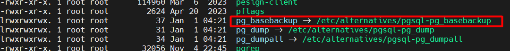
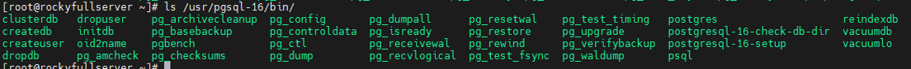
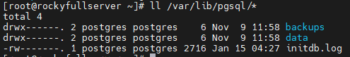

# Introducing PostgreSQL Files and Directories

## Some Important Paths (RHEL)

Use “which” to track binaries that exist in the path. Example:

Use `readlink` with `-f` to view the origin of a symbolic link

Some other important paths:

`/usr/pgsql-*/bin/			# Containing main binaries of PostgreSQL`

Example:

`/usr/pgsql-*/bin/pg_ctl		# Control for pg (Search web for more info)`

`/var/lib/pgsql/*/`

This is where the database cluster is initialized by default, which we change to another directory. You can use “initdb.log”
 to track errors which are encountered by your incorrect configurations during the database cluster initialization process.

 

---

