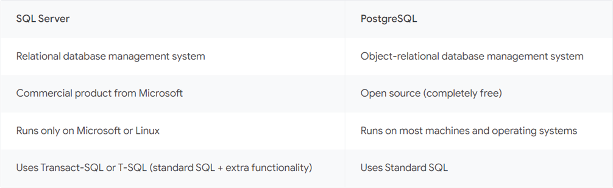
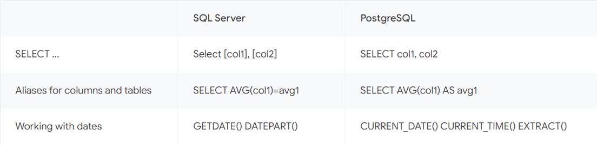
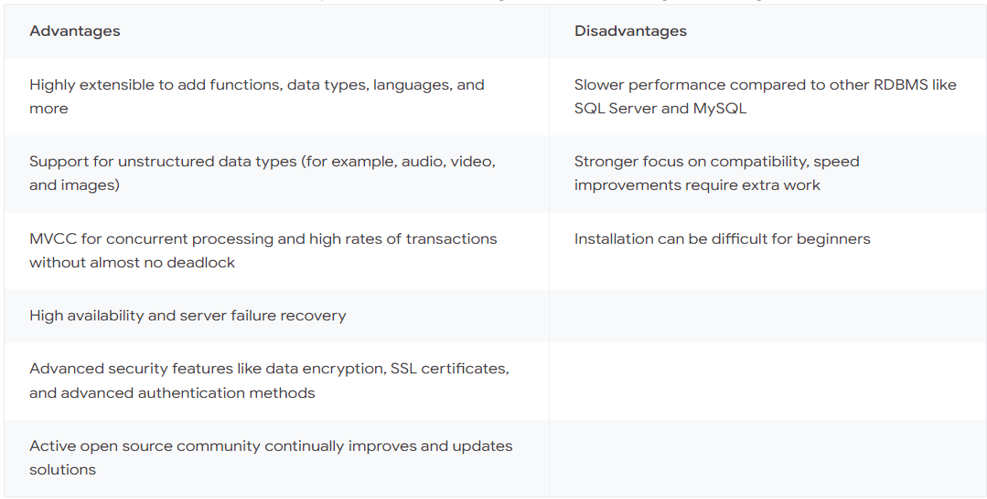
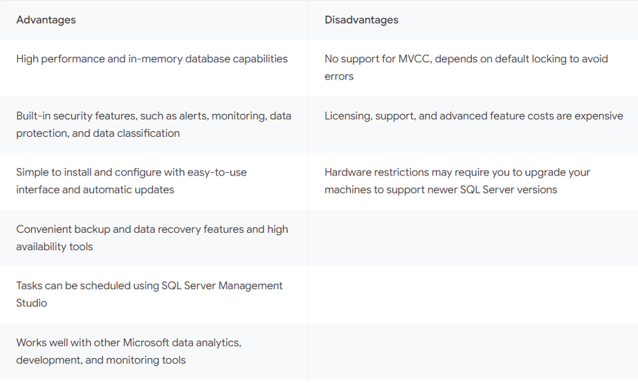

# Introduction to PostgreSQL


### A WORD FOR THE DATABASE ADMINISTRATORS

#### Why should I learn PostgreSQL?

##### 1. Necessity

• Redgate recently launched theirState of the Database Landscape 2024 survey results, from almost 4,000 database professionals from around the globe. A clear picture emerged from the results, suggesting that 2024 is the year that skill diversification among database professionals is imperative. There’s the need to manage multiple databases, to migrate to the cloud, to introduce continuous delivery with DevOps, and even incorporating Generative AI into the mix.


• The key finding? That the pace of change in our industry is faster than ever. This is causing a recurring challenge to emerge: the rapid need for skill diversification from data professionals everywhere.


• 79% of businesses use two or more database platforms; introducing a new level of complexity for those responsible for database and data management.


• Read more at the link given below.


<ins> RedGate Survey about skill diversification: </ins>


Navigating the database landscape in 2024: Shifting skills to match constant demands - Redgate events (red-gate.com)


[https://www.red-gate.com/hub/events/navigating-the-database-landscape-in-2024](https://www.red-gate.com/hub/events/navigating-the-database-landscape-in-2024)


##### 2. Ease of learning

In my opinion, with the fundamentals and theories of RDBMSs being all the same, as a specialist in one other RDBMS,
 you can insanely easily learn a new RDBMS, namely PostgreSQL, relative to other people who have no prior knowledge.
 Therefore, you need to invest dramatically less and yet be called a multi-skilled specialist.

---


### MORE GENERAL INFO ABOUT POSTGRESQL

• The PostgreSQL Object-relational Database Management System (ORDBMS) is a powerful, stable, open-source, free,
 and transactional database management system with diverse, powerful, abundant features, and the ability to
 be developed with various procedural languages. These languages include PL/PGSQL, PL/Python, PL/Tcl, and PL/Perl.
 This makes PostgreSQL accessible to a wide range of developers. Its object-oriented features simplify the work
 for programmers using object-oriented programming capabilities. Other features include diverse data types and
 operator overloading, allows developers to define indexes in a broader and more complex manner. This RDBMS is
 specifically designed for free and open-source Unix-based operating systems, including Linux, but it can be
 installed and used on all major operating systems, including Windows, Unix, macOS, Solaris, BSD systems, and
 more, both natively and in containers. Additionally, this ORDBMS is used on numerous devices. PostgreSQL
 belongs to and is maintained by EnterpriseDB (EDB). The main Linux distribution that EDB uses is RHEL (for example,
 RHEL itself, RockyLinux, OracleLinux, CEntOS, Fedora, Alma Linux, etc.), but PostgreSQL as noted is highly flexible
 with the hosting platform because it is widely used on numerous platforms. But some of the peripheral modules
 maintained by EDB are known to have some issues with some other platforms for example Ubuntu.

• Like its main host, Linux, PostgreSQL is highly customizable and can be managed with numerous peripheral extensions
 and modules, allowing users to add desired features to enhance this RDBMS as needed. Some of these extensions are
 exclusive for PostgreSQL, while some others are intended for many other applications, as well. However, this feature
 also makes its management more complex like Linux. PostgreSQL modules include both commercial and free ones, but they
 are mostly open-source and free.


• This RDBMS is very popular and has a large community of experts who contribute to the enhancement of PostgreSQL and
 its modules and help solve other experts' problems. PostgreSQL can be used for free at the enterprise level, and its
 main host, Linux, is also free, which is why many companies use it as their primary data storage system or one of their
 data storage systems. This RDBMS is currently very popular and has established a strong base for itself.


### Robustness

• In the context of PostgreSQL, robustness refers to the database system's ability to provide reliable performance,
 maintain data integrity, and handle errors gracefully under various conditions. PostgreSQL is known for its robust 
 feature set, which includes comprehensive support for different data types, advanced indexing, full ACID (Atomicity,
 Consistency, Isolation, Durability) compliance for transactions, and extensive capabilities for data integrity and
 disaster recovery.
 
• Robustness in PostgreSQL ensures that the system can manage large volumes of data and complex queries without
 compromising on performance. It also means that PostgreSQL can recover from failures and continue to operate
 effectively, which is crucial for maintaining the availability and reliability of applications that depend on the database
 
### References:

Refer to the following link for references:

[Some Postgresql References](some%20postgresql%20references.md)

### Notation:

• `pg` stands for postgresql

• `repo` stands for repository

• `distro` stands for distribution

• `*` sometimes is used to replace version number (major and minor). Sometimes however, the version number is directly noted which is mostly 16 for this document.

• `Deb` stands for Debian

• `RHEL` stands for Red Hat Enterprise Linux.

### Comparing PostgreSQL with SQL Server

For this, I have also included this article from Google Cloud:

[PostgreSQL vs SQL Server: What are the key differences?](https://cloud.google.com/learn/postgresql-vs-sql)

Here are the key points and summary:

**Major Differences:**

* **General big picture of differences:**



---

* **Licensing:**

**PostgreSQL**: Open-source and free. PostgreSQL is released under the PostgreSQL License,
 which is a liberal open-source license similar to the BSD or MIT licenses. This license
 allows you to freely use, copy, modify, and distribute the software and its documentation
 for any purpose, without any fees or written agreements.

**SQL Server**: Closed-source and commercial.

---

* For the sessions, PostgreSQL uses processes, but SQL Server uses threads. This makes SQL Server generally
 able to handle more connections as it does not wrap every session into one process and do some processing
 and operations more efficiently like a more powerful control over parallelism with a smaller granularity
 in process control. SQL Server also uses SQL OS to orchestrate many processes in a sub-virtual environment
 separated from the Operating System. PostgreSQL, in contrast, uses one process for every session. The control
 and orchestration of these processes is carried out by PostgreSQL's main postmaster process.
 
    For this reason, there is a prevailing opinion among some people that PostgreSQL may exhibit certain
 limitations when compared to SQL Server for data warehousing applications and it might be more suited.
 for OLTP and application serving intentions. The correct judgment, however, obviously depends on the perspective
 and is also a bit subjective. You will get a better opinion when you get acquainted enough with this <ins>ORDBMS
 </ins>.

--- 

* **RDBMS vs. ORDBMS:**

**SQL Server:** traditional application tasks for data processing
**PostgreSQL:** applications that contain complex objects (Ex: new data types like video, audio, and image files)
 Spatial Data Types

---

* **Inclusiveness and diversity:**

**PostgreSQL:** Is like many other open-source applications incredibly customizable, meaning that you can take different
 parts of it and manually compile them for your own specific purposes. The main package is also not pretty much feature-rich
 and all-inclusive relative to SQL Server, but different modules and extensions can be manually installed and added to add
 feature and functionality to PostgreSQL. This gives you more freedom to install what you want and not install what you do
 not selectively, keeping it as light as possible. For SQL Server, the freedom is much less here. You have to install some
 features that you might never use, or the alternatives are much less diverse. The open-source trait has resulted 
 in many solutions to be developed and released for a single specific PostgreSQL's functionality, as opposed to the
 SQL Server for which such solutions are mostly offered by Microsoft. For instance, there
 are many solutions that offer automation, HA/DR, etc. Most of them are free and open-source.
 
**SQL Server:** Unlike PostgreSQL.

---

* **Terminology:**

Some of the major differences between MSSQL-Windows and PG-Linux with respect to the terminology

|PG|MSSQL|
|-|-|
|Replication|AlwaysOn|
|MVCC|Snapshot Isolation (SI)|
|Bash Scripting|PowerShell Scripting, Batch Scripting|
|Database Cluster|SQL Server Instance|
|Virtual IP (VIP)|Listener|
|...|...|

---

* **Programming language support:**

**SQL Server:** Java, JavaScript (Node.js), C#, C++, PHP, Python, and Ruby. 
execute_external_script (OpenR, OpenPython)

**PostgreSQL:** Python, PHP, Perl, Tcl, Net, C, C++, Delphi, Java, JavaScript (Node.js), and more.

---

* **SQL Syntax:**



---

* **Advantages and Disadvantages (comparatively):**

**PostgreSQL:**



**SQL Server:**



### Installation:

#### Notes:

* Here we do not discuss moving pg’s main installation directory.

* a postgresql instance is called postgresql database cluster or postgresql cluster in short.

* The instructions are mostly for RHEL and Debian linux distros. For other distros, it shall not be any more difficult anyway. Please note that if you have only worked with pg on RHEL, you should do some study on pg administration tasks on Ubuntu before being able to start the work on it.

* Ubuntu appeared relatively much easier to me (easier also depends on your use case, for you may not need the things that ubuntu does automatically), mostly in the sense that it automatically separates data and configuration directories and also different clusters and versions of pg and their service files through service templates (Read more about service templates if you need), and offering some extra functionalities to make some pg operations easier. You will find out more about these subsequently. It also initializes (creates cluster’s initial data) the default cluster and starts its service up as well by merely installing the package.

* Its packages are also sometimes more bundled. For example, for RHEL the packages for pg server and pg client are separated. But for Ubuntu they are not. However, on ubuntu the service files are handled differently. i.e. one main `postgresql.service` service and a service template with one service created for every pg database cluster. The name of the default-initiated cluster is “main” and its instantiated service from `postgresql@.service` is `postgresql@*-main.service`. The service naming in general is `postgresql@*-clustername.service`. The default-initiated cluster is called "main".

* As noted in the [Patroni documentation](../patroni/Part%20I%20Setup%20PostgreSQL%2C%20Patroni%2C%20and%20Watchdog.md), For the database clusters with large amount of data, I used to move the data directory to somewhere else.
 For example, /data/postgresql/13/main or whatever. However, later on I came to the conclusion that the best
 way is, at least regarding PostgreSQL, to keep everything in its default location and instead define mount
 points in the default locations and attach separate disks to those mount points. For example, prior to the
 installation of PostgreSQL, we can consider the following mount points:

- `/var/lib/postgresql/`
- `/var/log/`
- `/var/lib/etcd`
- `/var/lib/postgresql/17/main/pg_tblspc/`

Here is a sample figure of the disk layout:


However, here we discuss moving the data directory for learning purposes. This might also be used somewhere by some of you if complies your taste and needs.

#### Start with PostgreSQL native installation on Linux:

The installation instructions are for RHEL And Ubuntu. However, if you learn them and complete reading this document, you should have no problem installing pg on other distributions.

Obtain PostgreSQL repository from the official website, Enterprise DB, OS’s default repositories etc.

Use the package managers to install PostgreSQL and PostgreSQL Contrib and cli (if not bundled with the main package) packages for the start

```shell
sudo apt install postgresql-17 postgresql-contrib 
sudo yum install postgresql17 postgresql17-contrib postgresql17-server
```

We plan to move the data directory ($PGDATA in pg’s service file) to some place else as we do so in the production environments. For that you can either modify the service file (explained here) or modify the data_directory parameter in postgresql.conf. For the former option, follow the next steps:

