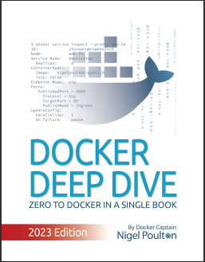

# Some Linux Reference text-books

The Linux references are incredibly numerous. Some of them are the following though:

### • Docker Official

[docker.com](https://www.docker.com/)

---

### • Docker Docs

[Docker Documentation](https://docs.docker.com/)

---

### • Docker Hub

Docker Official/Default Registry, source for Docker images

[Docker Hub](https://www.docker.com/products/docker-hub/)

---

### • Docker Deep Dive (book)

A book by Nigel Poulton, containing Docker, Docker Network, Docker Orchestration with Docker Swarm, etc.

* Docker Deep Dive

---

