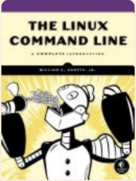
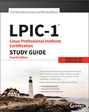
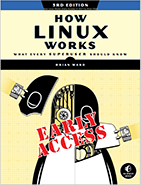

# Some Linux Reference text-books

The Linux references are incredibly numerous. Some of them are the following though:

### • The Linux Command Line:

* The Linux Command Line

---

### • LPIC-1 Study Guide:

* LPIC-1 Study Guide Exam 101-400 and Exam 102-400

---

### • How Linux Works:

* How Linux Works What Every Superuser Should Know by Brian Ward

---

Apart from these books, there are many websites offering quality articles about Linux, such as:

[https://www.freedesktop.org/wiki/](https://www.freedesktop.org/wiki/)

[https://linuxize.com/](https://linuxize.com/)

[https://www.tecmint.com/](https://www.tecmint.com/)

[https://www.geeksforgeeks.org/](https://www.geeksforgeeks.org/)

and many more.

The best way to get command syntax and inquire about how to carry out some specific tasks are to use good AI Chat Bots.

---

