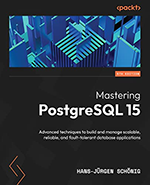

# Some PostgreSQL References

### • postgresql.org:

It is the home of the PostgreSQL project

[www.postgresql.org](https://www.postgresql.org)

---

### • PostgreSQL latest DOCs:

Official PostgreSQL Documentation on postgresql.org for the latest stable release:

[https://www.postgresql.org/docs/current/index.html](https://www.postgresql.org/docs/current/index.html)

### • Internals of PostgreSQL:

This website is a substantial DBA-Oriented learning source, which actively gets updated by the author.

[https://www.interdb.jp/pg/index.html](https://www.interdb.jp/pg/index.html)

### • Mastering PostgreSQL 15:

Mastering PostgreSQL 15 book, by Hans-Jürgen Schönig

For more, follow [this link](./pgpool%20references.md).

In any document, if you see commands such as below (or the document explicitly says), they are related to compiling the program from the source, and therefore, skip over them if you are not interested (unless it is required for a specific topic):

•  Make

•  Make install

•  meson

•  ninja

•  etc.

#### • Our main reference:

This document is our main reference for installing and configuring the Pgpool-II + Watchdog Setup Example. It is lengthy, but all parts are essential.

[https://www.pgpool.net/docs/latest/en/html/example-cluster.html](https://www.pgpool.net/docs/latest/en/html/example-cluster.html)

---

#### • EDB:

[https://www.enterprisedb.com/docs/pgpool/latest/](https://www.enterprisedb.com/docs/pgpool/latest/)

---

#### • pgPoolAdmin

This document provides good explanations and screen clips for pgpoolAdmin.

[https://www.pgpool.net/docs/pgpoolAdmin/index_en.html](https://www.pgpool.net/docs/pgpoolAdmin/index_en.html)

---

#### • Mere installation

* This method is for creating a repo and installing pgpool specifically for Ubuntu.

[https://www.pgpool.net/mediawiki/index.php/Apt_Repository](https://www.pgpool.net/mediawiki/index.php/Apt_Repository)

---

#### • Mere installation and basic configuration

* This document only explains the installation and configuration of pgpool & pgAdmin. You can just pay attention to the commands.

[https://www.heatware.net/postgresql/postgres-pgpool-ubuntu-setup-install](https://www.heatware.net/postgresql/postgres-pgpool-ubuntu-setup-install/#:~:text=To%20install%20Pgpool-II%20on%20Ubuntu%2C%20follow%20these%20steps%3A,install%20the%20Pgpool-II%20package%20along%20with%20its%20dependencies)

---

#### • Supplementary Documents.

* pgPool release notes:

[https://www.pgpool.net/docs/latest/en/html/release.html](https://www.pgpool.net/docs/latest/en/html/release.html)

* The document below specifically provides information about Parallel Query but is a bit outdated.

[https://www.pgpool.net/docs/pgpool-II-2.3/tutorial-en.html](https://www.pgpool.net/docs/pgpool-II-2.3/tutorial-en.html)

* The document below provides interesting information.

[https://www.enterprisedb.com/blog/postgresql-pgpool-connection-pool-database-load](https://www.enterprisedb.com/blog/postgresql-pgpool-connection-pool-database-load)

* The document below is the main documentation on the pgpool website, which naturally has more content and is for in-depth and topical study.

[https://www.pgpool.net/docs/latest/en/html/](https://www.pgpool.net/docs/latest/en/html/)

* pgpool GitHub repository:

[pgpool/pgpool2: the official mirror of git://git.postgresql.org/git/pgpool2.git.](https://github.com/pgpool/pgpool2)
