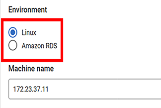

# Add a PostgreSQL Database Cluster to the Redgate SQL Monitor for Monitoring

* External references and further details:

1. [Summary of firewall requirements](https://documentation.red-gate.com/monitor14/summary-of-firewall-requirements-239667770.html)
2. [Connecting to a Linux Machine](https://documentation.red-gate.com/monitor14/connecting-to-a-linux-machine-239667808.html)
3. [Preparing PostgreSQL for monitoring](https://documentation.red-gate.com/monitor14/preparing-postgresql-for-monitoring-239667737.html)
4. [Enabling query plan monitoring](https://documentation.red-gate.com/monitor14/enabling-query-plan-monitoring-239667738.html)

<br/>

---

<br/>

### Preface

#### Version Requirements:

Redgate launched PostgreSQL monitoring feature in its monitoring solution since Redgate monitor `13`.

In addition, to this date, Sep. 2024, Redgate does not yet support PostgreSQL monitoring for pg containers that are not provided by Amazon cloud services.
 Particularly, the following are the detailed services that RedgateMonitor can offer:

**RedgateMonitor Version 13:**

<div width="60"></div>

**RedgateMonitor Version 14:**

<div width="60"></div>

### Preparing PostgreSQL for monitoring

#### 1. Firewall Requirements

The PostgreSQL and SSH ports on the target machine must be visible. Thus the firewall requirements would be as follows:

|         <div align="center">Required Ports</div>         |
| :--------------------------------------------------------------: |
|     <div align="left">SSH (TCP 22 by default)</div>     |
| <div align="left">PostgreSQL (TCP 5432 by default)</div> |

#### 2. Perform the necessary modifications in PostgreSQL configurations

We need the following configurations in the `postgresql.conf` to be in effect:

```conf
shared_preload_libraries = 'pg_stat_statements, auto_explain' # (change requires restart)
log_destination = 'csvlog'
logging_collector = on
track_io_timing = on  # We recommend setting `track_io_timing` to 'on' to give more a more detailed view of queries' IO performance.
```

Also add the following for configuration options for `auto_explain`:

```conf
auto_explain.log_format = json             # this must be set to json as shown
auto_explain.log_level = LOG               # this must be set to LOG as shown
auto_explain.log_verbose = true            # records more detailed query plan information
auto_explain.log_analyze = true            # causes timing for each node to be recorded
auto_explain.log_buffers = true            # record buffer usage statistics
auto_explain.log_wal = true                # record WAL performance statistics (PostgreSQL >= 13 only)
auto_explain.log_timing = true             # record per-node timing
auto_explain.log_triggers = true           # record trigger statistics
auto_explain.sample_rate = 0.01            # record plans for only 1% of queries
auto_explain.log_min_duration = 30000      # 30000 ms = 30 seconds  
auto_explain.log_nested_statements = true  # records the plan for any nested statement invoked by a function call
```

The auto_explain preload library is to enable **query plan monitoring** feature.

**Important Note!**

For Patroni cluster nodes, we apply the configuration modifications to either the `postgresql.base.conf` file
 in the pg data directory or Patroni Yaml configuration file in the following section.:


However, the first approach is preferable.

The `shared_preload_libraries` directive forces us to perform a pg service restart. We do it with the corresponding necessary
 considerations. For instance, on a cluster with Patroni, we execute the following and do
 nothing to PostgreSQL service itself directly:

* Patroni

```shell
systemctl restart patroni.service
```

* Other clusters:

You should decide how to restart PostgreSQL service specific to every cluster type's need. It might
 be using pg_ctlcluster or systemctl commands

#### 3. Configure Base Monitor PostgreSQL user permissions

* Create and grant required privileges to the base monitor user. (Using the user postgres is not a best practice)

```pgsql
CREATE USER redgatemonitor WITH PASSWORD 'somepassword';
GRANT pg_monitor TO redgatemonitor;
GRANT ALL ON SCHEMA public TO redgatemonitor; /* PostgreSQL v15 and higher only */
```

This user has to be able to authenticate to the database cluster. In the PostgreSQL database cluster, an initial catalog is required
 for authentication. By default if not specified, it is considered to be the same database name as the user. However, it must exist
 for the authentication to succeed. Such database is needed if the user won't be granted access to another login database, such as postgres:

```pgsql
CREATE DATABASE redgatemonitor;
GRANT ALL PRIVILEGES ON DATABASE redgatemonitor TO redgatemonitor;
```

* Enable optional autovacuum monitoring, for all host types:

Choose either of these options according to the preference. We have chosen option 4 and commented out the rest.

```pgsql
-- GRANT pg_read_all_data TO redgatemonitor; /* option 1 - PostgreSQL v14 and higher only */
-- GRANT SELECT ON ALL TABLES IN SCHEMA myschema TO redgatemonitor; /* option 2 */
-- GRANT SELECT on myschema.mytable to redgatemonitor; /* option 3 */
ALTER USER redgatemonitor WITH SUPERUSER; /* option 4 */
```

* Create the pg_stat_statements extension

```pgsql
CREATE EXTENSION pg_stat_statements;
```

#### 4. PostgreSQL running on a Linux machine: log file collection

Collecting pg service error log requires some additional settings as follows including creating foreign data wrappers(FDW)
 One of the wrappers is for Linux machines and the other is for AWS. The Linux's one is as follows:

```pgsql
CREATE EXTENSION file_fdw;
CREATE SERVER sqlmonitor_file_server FOREIGN DATA WRAPPER file_fdw;
/* replace 'redgatemonitor' in this code block with the Base Monitor PostgreSQL user */
GRANT pg_read_server_files TO redgatemonitor; /* use 'ALTER USER redgatemonitor WITH SUPERUSER;' for PostgreSQL v10 */
GRANT EXECUTE ON FUNCTION pg_catalog.pg_current_logfile(text) TO redgatemonitor;
GRANT USAGE ON FOREIGN SERVER sqlmonitor_file_server TO redgatemonitor;
```

#### 5. Connect to the Linux machine (Add pg instance to monitoring)

For this purpose both SSH and database connections are required. Here is a sample of the add server page in the RedgateMonitor dashboard.
 This page should be accessed by following this path:

`Configuration -> Monitored servers -> + Add (Button) -> PostgreSQL (Radio Button Choice)`


The SSH Key method for Linux local users needs an authorized_keys entry and public & private key pair. The private key must be added
 in the RedgateMonitor `Add new SSH key` wizard in advance. If you have not already, you can click on its link in the `SSH Keys` section
 on the page below. If you have previously done so, the corresponding key can be chosen from a drop-down list.

**Important!**

For active directory SSH authentications, the public key must be registered in the active directory.

### Cluster Monitoring Considerations for PostgreSQL

While adding a PostgreSQL Cluster VIP to the RedgateMonitor, it will not automatically discover all the nodes participating in
 the cluster like how it will about SQL Server clusters. Thus, you need to make sure that all the nodes + VIP are added to the
 monitoring system. For example, 4 nodes in a three-node cluster. An example is like below:


One of the nodes (owner of the VIP) is always obviously being monitored redundantly if the queries to the VIP are not load balanced.

<br/>
<br/>

Finish ■
