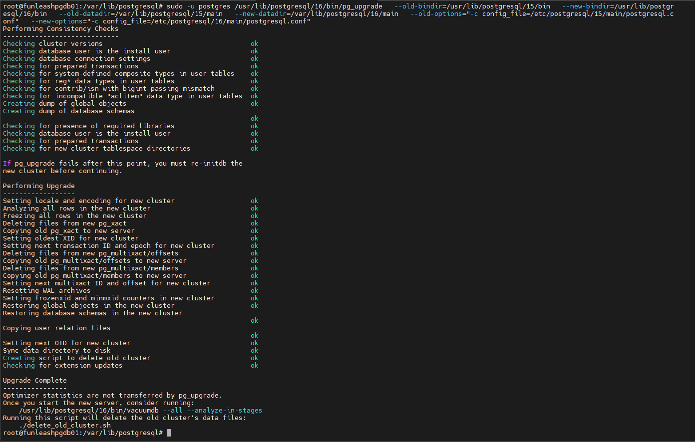

PostgreSQL major version upgrade is simpler than what it might look to some people.

Here we assume that we are upgrading from 15 to 16. For different versions choose appropriate names
 accordingly.

1. Take precautionary backups from your cluster, both logical (pg_dumpall) and physical (pg_basebackup)

### On every node:

2. Stop patroni on all the nodes starting from secondary nodes. For precaution end all use
 sessions before that including those of monitoring and application connections and also
 prevent new connections to ease database system clean shutdown.

```shell
sudo systemctl stop patroni
```
A clean database shutdown is required. Otherwise:


3. Uninstall subsidiary Postgresql packages. We <ins>do not</ins> use `--purge` flag here.

```shell
sudo apt remove -y postgresql-15-repack postgresql-15-plpgsql-check \
	postgresql-15-cron postgresql-15-pgaudit postgresql-15-show-plans postgresql-doc-15 \
	postgresql-contrib-15 postgresql-15-plprofiler postgresql-15-preprepare
```

4. Install new version packages:

```shell
apt update
sudo apt install -y postgresql-16 postgresql-16-repack postgresql-16-plpgsql-check \
	postgresql-16-cron postgresql-16-pgaudit postgresql-16-show-plans postgresql-doc-16 \
	postgresql-contrib-16 postgresql-16-plprofiler postgresql-16-preprepare
```

### On the first node:

5. Create a new cluster but do not run it.

```shell
pg_createcluster 16 main
```

6. Run the following and make sure it is executed without error. After the end of these steps
 you can run the produced shell script to remove the old data directory contents

```shell
sudo -u postgres /usr/lib/postgresql/16/bin/pg_upgrade 
  --old-bindir=/usr/lib/postgresql/15/bin 
  --new-bindir=/usr/lib/postgresql/16/bin 
  --old-datadir=/var/lib/postgresql/15/main 
  --new-datadir=/var/lib/postgresql/16/main 
  --old-options="-c config_file=/etc/postgresql/15/main/postgresql.conf" 
  --new-options="-c config_file=/etc/postgresql/16/main/postgresql.conf"
```

The output is something like below:



7. Alter patroni configuration file on the first node and change the necessary config parameters
 a sample of the parameters that need to be changed can be the list below

```yaml
scope: "15-main"
  data_dir: /var/lib/postgresql/15/main/
  bin_dir: /usr/lib/postgresql/15/bin
  config_dir: /etc/postgresql/15/main
    data_directory: '/var/lib/postgresql/15/main/'
    log_filename: 'postgresql-15-main-%A.log'
```

8. Start Patroni and check service functionality. It must be fully functional

```shell
sudo systemctl start patroni.service
```

### secondary nodes:

9. Alter patroni config file and start it. Now all the nodes should be functional
