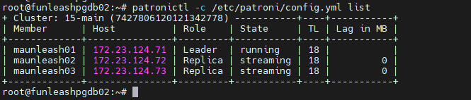
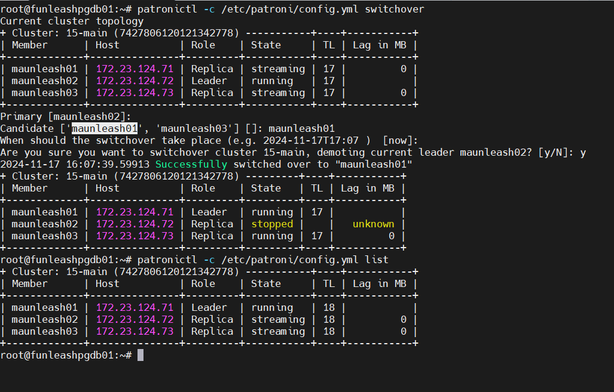
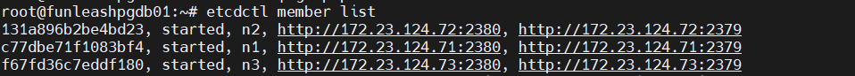
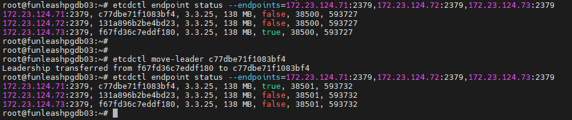
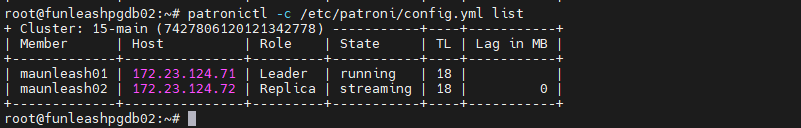
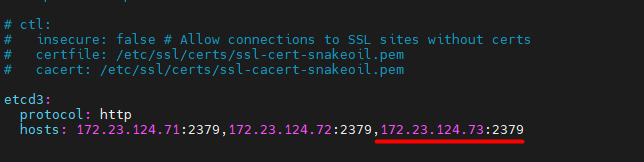
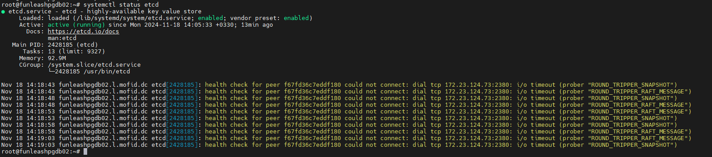
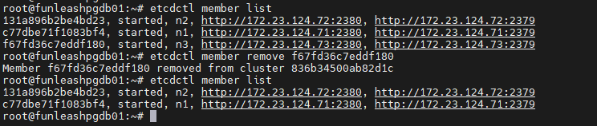

&nbsp;Doc parts:

* [Part I: Setup PostgreSQL, Patroni, and Watchdog ](./Part%20I%20Setup%20PostgreSQL%2C%20Patroni%2C%20and%20Watchdog.md)
* [Part II: Logs Purge &amp; Retention ](./Part%20II%20Logs%20Purge%20%26%20Retention.md)
* [Part III: Evict/Add node from/to the cluster ](./Part%20III%20cluster%20Evict%2DAdd%20node.md)

# Part III: Evict/Add node from/to the cluster

### Part I: Evict:

Initial state of the cluster:

```shell
patronictl -c /etc/patroni/config.yml list
```


For evict process, several configurations must change, incorporating Patroni, etcd, and vip-manager.
 but the process also includes some elaborations and delicacies in terms of the order of the actions
 you take, the Watchdog (etcd) distributed database, bringing services up and down, etc. So you must
 take into consideration that the order of the actions is important

These considerations also hold for adding a node to the cluster.

In this doc we are assuming that we want to evict Node 3 with the following specifications:

| <div align="left">etcd node name: n3<br/>IP: 172.23.124.73<br/>hostname: funleashpgdb03<br/>patroni node name: maunleash03</div> |
| :--------------------------------------------------------------------------------------------------------------------------------------------------: |

#### 1. Manual failover (if needed):

If the node to be evicted is the leader node, a switchover must be performed first in Partroni.
 This typically also incorporates moving the etcd leader node, however, we do perform a check
 to make sure that everything is ok.

```shell
patronictl -c /etc/patroni/config.yml switchover
```

A sample of switchover is as follows:



We also check the watchdog leader as I mentioned:

```shell
etcdctl endpoint status --endpoints=<etcd-endpoints>
```

If it is the node to be evicted, we move the leader by first getting the hash ID of the nodes (endpoints), then
 entering the new leader's hash ID in `etcdctl move-leader <endpoint ID> command:

To get hash ID of the nodes:

```shell
etcdctl member list
# or
etcdctl endpoint status --endpoints=<etcd-endpoints>
```



Now:

```shell
etcdctl move-leader <endpoint ID>
```

A sample of the watchdog leader move process is as follows:



#### 2. Stop and disable Patroni service <ins>on the third (evict) node</ins>:

```shell
systemctl disable --now patroni
```

After some moments, the result for 
```shell
patronictl -c /etc/patroni/config.yml list
```

will be without the evict node like below:



#### 3. Modify Patroni configurations (for Nodes Remaining in the cluster):

```shell
vi /etc/patroni/config.yml
```

Remove the entry in the etcd/etcd3 hosts configuration for the evict node:



#### 4. Reload Patroni configurations (for Nodes Remaining in the cluster):

Reload the Patroni service, instead of restarting, to avoid bringing down PostgreSQL or cause a failover.

```shell
systemctl reload patroni
```

#### 5. Modify etcd configurations (for Nodes Remaining in the cluster):

```shell
vi /etc/default/etcd
```

Remove the node to be evicted from the etcd configuration file on the nodes that are remaining in the cluster
 from ETCD_INITIAL_CLUSTER env variable.


#### 6. Remove the evict node from etcd (on any of the Nodes Remaining in the cluster):

Stop the etcd service on the evict node:

```shell
systemctl disable --now etcd
```

|<div align="left">Note:<br/>For reassurance measures, we remove the etcd data on the third node like below. This is to avoid conflicts should we be willing to return it to this cluster or add it to another cluster at a later time. The data on this node will not be needed anymore anyways:<br/><br/>rm -rf /var/lib/etcd/*<br/>echo > /etc/default/etcd</div>|
|:-:|

Now that the third node's etcd service is gone for whatever reason, the etcd service on the 1st and 2nd nodes shows health check warning like below:

```shell
systemctl status etcd
```



Again get the endpoint hash ID with:

```shell
etcdctl member list
```

Remove the evict node with its hash ID:

```shell
etcdctl member remove <member-ID>
```

Sample:



Check etcd service status on one of the remaining nodes to see of there is no health check warning:

```shell
systemctl status etcd
```