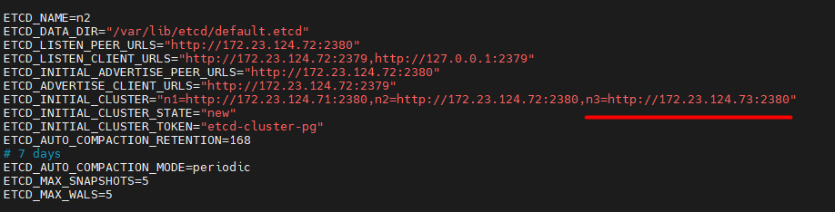

&nbsp;Doc parts:

* [Part I: Setup PostgreSQL, Patroni, and Watchdog ](./Part%20I%20Setup%20PostgreSQL%2C%20Patroni%2C%20and%20Watchdog.md)
* [Part II: Logs Purge &amp; Retention ](./Part%20II%20Logs%20Purge%20%26%20Retention.md)
* [Part III: Evict/Add node from/to the cluster ](./Part%20III%20cluster%20Evict%2DAdd%20node.md)

# Part III: Evict/Add node from/to the cluster

### Part I: Evict:

For evict process, several configurations must change, incorporating Patroni, etcd, and vip-manager.
 but the process also includes some elaborations and delicacies in terms of the order of the actions
 you take, the Watchdog (etcd) distributed database, bringing services up and down, etc. So you must
 take into consideration that the order of the actions is important

These considerations also hold for adding a node to the cluster.

In this doc we are assuming that we want to evict Node 3 with the following specifications:


	etcd node name: n3
	IP: 172.23.124.73
	hostname: funleashpgdb03
	patroni node name: maunleash03


#### Manual failover (if needed):

If the node to be evicted is the leader node, a switchover must be performed first in Partroni.
 This typically also incorporates moving the etcd leader node, however, we do perform a check
 to make sure that everything is ok.

```shell
patronictl -c /etc/patroni/config.yml switchover
```

A sample of switchover is as follows:


We also check the watchdog leader as I mentioned:

```shell
etcdctl endpoint status --endpoints=<etcd-endpoints>
```

If it is the node to be evicted, we move the leader by first getting the hash ID of the nodes (endpoints), then
 entering the new leader's hash ID in `etcdctl move-leader <endpoint ID>` command:

To get hash ID of the nodes:

```shell
etcdctl member list
# or
etcdctl endpoint status --endpoints=<etcd-endpoints>
```


Now:

```shell
etcdctl move-leader <endpoint ID>
```

A sample of the watchdog leader move process is as follows:


#### etcd configurations (e):

```shell
vi /etc/default/etcd
```

remove the node to be evicted 




