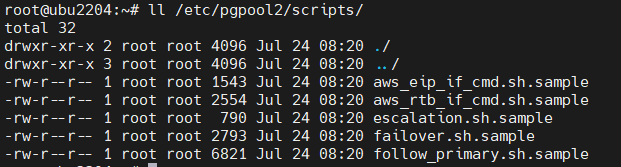

&nbsp;Doc parts:

* [Part I: Install and Configure PostgreSQL for pgPool](./Part%20I%20Install%20and%20Configure%20PostgreSQL%20for%20pgPool.md)
* [Part II: Install and Configure pgPool](./Part%20II%20Install%20and%20Configure%20pgPool.md)
* [Part III: pgPool scripts](./Part%20III%20pgPool%20scripts.md)
* [Part IV: fix some glitches for Ubuntu](./Part%20IV%20fix%20some%20glitches%20for%20Ubuntu.md)
* [Part V: pgpool command, pcp, pgpool admin commands.md ](./Part%20V%20pgpool%20command%2C%20pcp%2C%20pgpool%20admin%20commands.md)
* [Part VI: Finish up, simulations, tests, notes.md ](./Part%20VI%20Finish%20up%2C%20simulations%2C%20tests%2C%20notes.md)


# PGPOOL (Ubuntu) Part III
**pgPool scripts**

Study the scripts thoroughly and try to understand them. Some explanatory comments have been added to the scripts but you should understand all of their contents.

* A support for tablespaces is added to the original script files in the pg_basebackup command.

#### 27. Copy template files (Every Node):

Copy template shell script files from the following directory to a specific directory of your choice, rename and remove .sample from the end of the files. Two such specific directories are suggested here. You have to keep in mind to define the path for these scripts in the `*_command` directives accordingly in the pgpool.conf file, though.

The first group of shell script files are the ones with .sh extension and the second ones are the ones without extension.

```shell
sudo -u postgres mkdir -p /etc/pgpool2/scripts && sudo -u postgres cp /usr/share/doc/pgpool2/examples/*.sh* /etc/pgpool2/scripts

```

here is the result:



The files with aws at the beginning are for the Amazon Web Services which are irrelevant for us.

```shell
sudo -u postgres rm -f /etc/pgpool2/scripts/aws*
```

Now remove .sample from the end of the file names.

Next, we copy the shell scripts which have no extension to the $PGDATA directory.

```shell
sudo -u postgres cp /usr/share/doc/pgpool2/examples/{replication_mode_recovery_2nd_stage.sample,replication_mode_recovery_1st_stage.sample,recovery_1st_stage.sample,pgpool_remote_start.sample} \
$PGDATA/
```

Remove .sample from the end of these file names too. Later we modify these files to work in our environment. On RHEL, the script files in general do not need much modification, but on Ubuntu, there is more work to do.

Finally, the scripts **must** be made **executable** for the user that runs pgpool scripts (postgres in our case, which also owns the scripts).

```
sudo -u postgres chmod -R 750 $PGDATA
sudo -u chmod -R 750 /etc/pgpool2/scripts
```

#### 28. Create script.conf (Every Node)

I have added a script.conf file. This file helps with logging the script execution messages by defining some parameters such as log_level and log_destination for the script files

```conf
# manually created script configuration amomen

log_level='info'
				## options:
				# info
				# error verbose
				# error

log_destination='pgpool_log'
				## options:
				# pgpool_log
				# stderr
				# journal

```

---

* Now, modify the scripts like below. Logging to pgPool log files has also been added.

### Customizing the shell script files (with .sh extension) (Ubuntu) (Every Node):

* **Location:** `/etc/pgpool2/scripts`


First of all, make sure that the scripts are executable
```
sudo -u postgres chmod +x <all scripts>
```

We copied the script files with .sh extension to the /etc/pgpool2/scripts directory. Now we customize the shell script files that we have copied. As it was mentioned earlier, on RHEL, the script files in general do not need much modification, but on Ubuntu, because pg_ctlcluster is used instead of pg_ctl and some other factors, we modify these files as follows.

I have also added logging of the echo commands' output to the pgpool log files themselves manually. You can compare the following scripts with the original ones:


#### 29. failover.sh (Every Node):

This script is executed right after a failover occurs first. Then in the event of a manual failover, the follow_primary.sh script will also be executed.

After preparing, editing, and carrying out the necessary modifications on this script, you can run the following **to test its functionality**:

```shell
# Failover to a standby node
sudo -E -u postgres sh -c '/etc/pgpool2/scripts/failover.sh 0 funleashpgdb01 5432 $PGDATA 1 funleashpgdb02 0 0 5432 $PGDATA funleashpgdb01 5432'
```

Here is a breakdown of the arguments:

|<div align="right">FAILED_NODE_ID="$1"<br/>FAILED_NODE_HOST="$2"<br/>FAILED_NODE_PORT="$3"<br/>FAILED_NODE_PGDATA="$4"<br/>NEW_MAIN_NODE_ID="$5"<br/>NEW_MAIN_NODE_HOST="$6"<br/>OLD_MAIN_NODE_ID="$7"<br/>OLD_PRIMARY_NODE_ID="$8"<br/>NEW_MAIN_NODE_PORT="$9"<br/>NEW_MAIN_NODE_PGDATA="${10}"<br/>OLD_PRIMARY_NODE_HOST="${11}"<br/>OLD_PRIMARY_NODE_PORT="${12}"</div>|
|:---------:|


<details>
<summary>(click to expand) failover.sh </summary>

```shell
#!/bin/bash
# This script is run by failover_command.

set -o xtrace

# Special values:
# 1)  %d = failed node id
# 2)  %h = failed node hostname
# 3)  %p = failed node port number
# 4)  %D = failed node database cluster path
# 5)  %m = new main node id
# 6)  %H = new main node hostname
# 7)  %M = old main node id
# 8)  %P = old primary node id
# 9)  %r = new main port number
# 10) %R = new main database cluster path
# 11) %N = old primary node hostname
# 12) %S = old primary node port number
# 13) %% = '%' character

FAILED_NODE_ID="$1"
FAILED_NODE_HOST="$2"
FAILED_NODE_PORT="$3"
FAILED_NODE_PGDATA="$4"
NEW_MAIN_NODE_ID="$5"
NEW_MAIN_NODE_HOST="$6"
OLD_MAIN_NODE_ID="$7"
OLD_PRIMARY_NODE_ID="$8"
NEW_MAIN_NODE_PORT="$9"
NEW_MAIN_NODE_PGDATA="${10}"
OLD_PRIMARY_NODE_HOST="${11}"
OLD_PRIMARY_NODE_PORT="${12}"


# PGHOME=/usr/pgsql-15
PGHOME=$(which psql | rev | cut -d"/" -f3- | rev)
PGMAJVER=$((`psql -tc "show server_version_num"` / 10000))
PGCLU=main
# REPL_SLOT_NAME=$(echo ${FAILED_NODE_HOST,,} | tr -- -. _)
REPL_SLOT_RAW_NAME=$(echo ${FAILED_NODE_HOST} | cut -c 2-)
REPL_SLOT_NAME=$(echo ${REPL_SLOT_RAW_NAME,,} | tr -- -. _)

POSTGRESQL_STARTUP_USER=postgres
SSH_KEY_FILE=id_rsa_pgpool
SSH_OPTIONS="-o StrictHostKeyChecking=no -o ConnectTimeout=2 -i ~/.ssh/${SSH_KEY_FILE}"


COMMAND_PLACE_HOLDER=""
LOG_LEVEL=$(cat script.conf | grep log_level | cut -d'=' -f2 | tr -d "'")
LOG_OUTPUT=$(cat script.conf | grep log_destination | cut -d'=' -f2 | tr -d "'")
PGCONF_PATH=$(echo /etc/postgresql/${PGMAJVER}/${PGCLU}/postgresql.conf)
PGPOOLCONF_PATH=$(echo /etc/pgpool2/pgpool.conf)
LOG_ROOT="/"$(cat ${PGPOOLCONF_PATH} | grep ^log_directory | cut -d "/" -f2- | tr -d "'")
ERROR_LEVEL=""

##### end variables ####################################################

#---------------------------
ERROR_LEVEL="info"
COMMAND_PLACE_HOLDER="
echo $(date '+%Y-%m-%d %H:%M:%S.%3N: ') script_log: $(hostname) ${ERROR_LEVEL}::: failover.sh: start: failed_node_id=\$FAILED_NODE_ID failed_host=\$FAILED_NODE_HOST \
old_primary_node_id=\$OLD_PRIMARY_NODE_ID new_main_node_id=\$NEW_MAIN_NODE_ID new_main_host=\$NEW_MAIN_NODE_HOST"
if [ $LOG_OUTPUT = "pgpool_log" ]; then
	COMMAND_PLACE_HOLDER=$COMMAND_PLACE_HOLDER">> $(find ${LOG_ROOT} -type f -printf '%T+ %p\n' | sort -r | head -n 1 | cut -d ' ' -f2-)"
fi 
set +o xtrace; eval $COMMAND_PLACE_HOLDER; set -o xtrace;
echo failover.sh: start: failed_node_id=$FAILED_NODE_ID failed_host=$FAILED_NODE_HOST \
    old_primary_node_id=$OLD_PRIMARY_NODE_ID new_main_node_id=$NEW_MAIN_NODE_ID new_main_host=$NEW_MAIN_NODE_HOST

#---------------------------

# determine recovery conf file name
if [ $PGVERSION -ge 12 ]; then
    RECOVERYCONF=${NODE_PGDATA}/myrecovery.conf
else
    RECOVERYCONF=${NODE_PGDATA}/recovery.conf
fi


## If there's no main node anymore, skip failover.
if [ $NEW_MAIN_NODE_ID -lt 0 ]; then
  
	#---------------------------
	ERROR_LEVEL="error 2"
	COMMAND_PLACE_HOLDER="
	echo $(date '+%Y-%m-%d %H:%M:%S.%3N: ') script_log: $(hostname) ${ERROR_LEVEL}::: failover.sh: All nodes are down. Skipping failover."
	if [ $LOG_OUTPUT = "pgpool_log" ]; then
		COMMAND_PLACE_HOLDER=$COMMAND_PLACE_HOLDER">> $(find ${LOG_ROOT} -type f -printf '%T+ %p\n' | sort -r | head -n 1 | cut -d ' ' -f2-)"
	fi 
	set +o xtrace; eval $COMMAND_PLACE_HOLDER; set -o xtrace;
    echo failover.sh: All nodes are down. Skipping failover.

	#---------------------------

    exit 2
fi

## Test passwordless SSH
ssh -T ${SSH_OPTIONS} ${POSTGRESQL_STARTUP_USER}@${NEW_MAIN_NODE_HOST} ls /tmp > /dev/null

if [ $? -ne 0 ]; then
	#---------------------------
	ERROR_LEVEL="error 1"
	COMMAND_PLACE_HOLDER="
	echo $(date '+%Y-%m-%d %H:%M:%S.%3N: ') script_log: $(hostname) ${ERROR_LEVEL}::: failover.sh: passwordless SSH to ${POSTGRESQL_STARTUP_USER}@${NEW_MAIN_NODE_HOST} failed. Please setup passwordless SSH."
	if [ $LOG_OUTPUT = "pgpool_log" ]; then
		COMMAND_PLACE_HOLDER=$COMMAND_PLACE_HOLDER">> $(find ${LOG_ROOT} -type f -printf '%T+ %p\n' | sort -r | head -n 1 | cut -d ' ' -f2-)"
	fi 
	set +o xtrace; eval $COMMAND_PLACE_HOLDER; set -o xtrace;
    echo failover.sh: passwordless SSH to ${POSTGRESQL_STARTUP_USER}@${NEW_MAIN_NODE_HOST} failed. Please setup passwordless SSH.

	#---------------------------

  
    exit 1
fi

## If Standby node is down, skip failover.
COMMAND_PLACE_HOLDER="echo $(date '+%Y-%m-%d %H:%M:%S.%3N: '): $(hostname): script_log: OLD_PRIMARY_NODE_ID=${OLD_PRIMARY_NODE_ID}, FAILED_NODE_ID=${FAILED_NODE_ID} >> $(find ${LOG_ROOT} -type f -printf '%T+ %p\n' | sort -r | head -n 1 | cut -d ' ' -f2-)"
eval $COMMAND_PLACE_HOLDER
if [ $OLD_PRIMARY_NODE_ID != "-1" -a $FAILED_NODE_ID != $OLD_PRIMARY_NODE_ID ]; then

    # If Standby node is down, drop replication slot.
    ${PGHOME}/bin/psql -h ${OLD_PRIMARY_NODE_HOST} -p ${OLD_PRIMARY_NODE_PORT} postgres \
        -c "SELECT pg_drop_replication_slot('${REPL_SLOT_NAME}');"  >/dev/null 2>&1

    if [ $? -ne 0 ]; then
		#---------------------------
		ERROR_LEVEL="info"
		COMMAND_PLACE_HOLDER="
		echo $(date '+%Y-%m-%d %H:%M:%S.%3N: ') script_log: $(hostname) ${ERROR_LEVEL}::: failover.sh: drop replication slot '\"${REPL_SLOT_NAME}\"' failed. You may need to drop replication slot manually."
		if [ $LOG_OUTPUT = "pgpool_log" ]; then
			COMMAND_PLACE_HOLDER=$COMMAND_PLACE_HOLDER">> $(find ${LOG_ROOT} -type f -printf '%T+ %p\n' | sort -r | head -n 1 | cut -d ' ' -f2-)"
		fi 
		set +o xtrace; eval $COMMAND_PLACE_HOLDER; set -o xtrace;
        echo ERROR: failover.sh: drop replication slot \"${REPL_SLOT_NAME}\" failed. You may need to drop replication slot manually.

		#---------------------------
  
    fi
	#---------------------------
	ERROR_LEVEL="error 2"
	COMMAND_PLACE_HOLDER="
	echo $(date '+%Y-%m-%d %H:%M:%S.%3N: ') script_log: $(hostname) ${ERROR_LEVEL}::: failover.sh: end: standby node '\"${NEW_MAIN_NODE_HOST}\"' is down. Skipping failover."
	if [ $LOG_OUTPUT = "pgpool_log" ]; then
		COMMAND_PLACE_HOLDER=$COMMAND_PLACE_HOLDER">> $(find ${LOG_ROOT} -type f -printf '%T+ %p\n' | sort -r | head -n 1 | cut -d ' ' -f2-)"
	fi 
	set +o xtrace; eval $COMMAND_PLACE_HOLDER; set -o xtrace;
    echo failover.sh: end: standby node is down. Skipping failover.

	#---------------------------
  
    exit 2
fi

## Promote Standby node.
#---------------------------
ERROR_LEVEL="info"
COMMAND_PLACE_HOLDER="
echo $(date '+%Y-%m-%d %H:%M:%S.%3N: ') script_log: $(hostname) ${ERROR_LEVEL}::: failover.sh: primary node is down or a manual failover has been requsted, promote new_main_node_id=$NEW_MAIN_NODE_ID on ${NEW_MAIN_NODE_HOST}."
if [ $LOG_OUTPUT = "pgpool_log" ]; then
	COMMAND_PLACE_HOLDER=$COMMAND_PLACE_HOLDER">> $(find ${LOG_ROOT} -type f -printf '%T+ %p\n' | sort -r | head -n 1 | cut -d ' ' -f2-)"
fi 
set +o xtrace; eval $COMMAND_PLACE_HOLDER; set -o xtrace;
echo failover.sh: primary node is down, promote new_main_node_id=$NEW_MAIN_NODE_ID on ${NEW_MAIN_NODE_HOST}.

#---------------------------


#ssh -T ${SSH_OPTIONS} ${POSTGRESQL_STARTUP_USER}@${NEW_MAIN_NODE_HOST} ${PGHOME}/bin/pg_ctl -D ${NEW_MAIN_NODE_PGDATA} -w promote
ssh -T ${SSH_OPTIONS} ${POSTGRESQL_STARTUP_USER}@${NEW_MAIN_NODE_HOST} ${PGHOME}/bin/pg_ctlcluster $PGMAJVER $PGCLU promote -- -w -D ${NEW_MAIN_NODE_PGDATA}

if [ $? -ne 0 ]; then
	#---------------------------
	ERROR_LEVEL="error 1"
	COMMAND_PLACE_HOLDER="
	echo $(date '+%Y-%m-%d %H:%M:%S.%3N: ') script_log: $(hostname) ${ERROR_LEVEL}::: ERROR: failover.sh: promote '\"${NEW_MAIN_NODE_HOST}\"' failed"
	if [ $LOG_OUTPUT = "pgpool_log" ]; then
		COMMAND_PLACE_HOLDER=$COMMAND_PLACE_HOLDER">> $(find ${LOG_ROOT} -type f -printf '%T+ %p\n' | sort -r | head -n 1 | cut -d ' ' -f2-)"
	fi 
	set +o xtrace; eval $COMMAND_PLACE_HOLDER; set -o xtrace;
    echo ERROR: failover.sh: promote failed

	#---------------------------
  
    exit 1
else
	# Remove standby.signal on the new primary and restart the pg service (RECOVERYCONF may or may not be removed) amomen
	ssh -T ${SSH_OPTIONS} ${POSTGRESQL_STARTUP_USER}@${NEW_MAIN_NODE_HOST} rm -f $NEW_MAIN_NODE_PGDATA/standby.signal
	#---------------------------
	ERROR_LEVEL="error 2"
	COMMAND_PLACE_HOLDER="
	echo $(date '+%Y-%m-%d %H:%M:%S.%3N: ') script_log: $(hostname) ${ERROR_LEVEL}::: ERROR: failover.sh: removing standby.signal and RECOVERYCONF files on the new primary '\"${NEW_MAIN_NODE_HOST}\"' failed. Remove them manually and restart the pg service."
	if [ $LOG_OUTPUT = "pgpool_log" ]; then
		COMMAND_PLACE_HOLDER=$COMMAND_PLACE_HOLDER">> $(find ${LOG_ROOT} -type f -printf '%T+ %p\n' | sort -r | head -n 1 | cut -d ' ' -f2-)"
	fi 
	set +o xtrace; eval $COMMAND_PLACE_HOLDER; set -o xtrace;
	# needs not echo
	#---------------------------
	if [ $? -ne 0 ]; then
		# Restart pg service on the new primary to take promotion into effect
		ssh -T ${SSH_OPTIONS} ${POSTGRESQL_STARTUP_USER}@${NEW_MAIN_NODE_HOST} ${PGHOME}/bin/pg_ctlcluster $PGMAJVER $PGCLU restart -m immediate
		#---------------------------
		ERROR_LEVEL="error 1"
		COMMAND_PLACE_HOLDER="
		echo $(date '+%Y-%m-%d %H:%M:%S.%3N: ') script_log: $(hostname) ${ERROR_LEVEL}::: ERROR: failover.sh: restarting pg service on the new primary '\"${NEW_MAIN_NODE_HOST}\"' failed. Critical! cluster is down"
		if [ $LOG_OUTPUT = "pgpool_log" ]; then
			COMMAND_PLACE_HOLDER=$COMMAND_PLACE_HOLDER">> $(find ${LOG_ROOT} -type f -printf '%T+ %p\n' | sort -r | head -n 1 | cut -d ' ' -f2-)"
		fi 
		set +o xtrace; eval $COMMAND_PLACE_HOLDER; set -o xtrace;
		# needs not echo
		#---------------------------
	fi
fi
#---------------------------
ERROR_LEVEL="info"
COMMAND_PLACE_HOLDER="
echo $(date '+%Y-%m-%d %H:%M:%S.%3N: ') script_log: $(hostname) ${ERROR_LEVEL}::: ERROR: failover.sh: end: new_main_node_id=$NEW_MAIN_NODE_ID on ${NEW_MAIN_NODE_HOST} was successfully promoted to primary"
if [ $LOG_OUTPUT = "pgpool_log" ]; then
	COMMAND_PLACE_HOLDER=$COMMAND_PLACE_HOLDER">> $(find ${LOG_ROOT} -type f -printf '%T+ %p\n' | sort -r | head -n 1 | cut -d ' ' -f2-)"
fi 
set +o xtrace; eval $COMMAND_PLACE_HOLDER; set -o xtrace;
echo failover.sh: end: new_main_node_id=$NEW_MAIN_NODE_ID on ${NEW_MAIN_NODE_HOST} was successfully promoted to primary

#---------------------------

exit 0

```


</details>

#### 30. follow_primary.sh (Every Node)

Just like we said in failover.sh, in the event of a manual failover, the follow_primary.sh script will also be executed subsequently.

One of the commands that is used in this script is `pg_rewind` which has a different path on Ubuntu than RHEL. Therefore, one of the measures you should 
 implement on Ubuntu is creating a `symbolic link` for `pg_rewind` to work in this script. pw_rewind is used to return the old primary to 
 a common point of recovery with the new primary. pg_rewind is the first attempt for this purpose. If failed, pgpool will try to reconstruct
 the old primary from a full backup of the new primary. This approach is common between some HA solutions of PostgreSQL. 
 The path that this script uses for pg_rewind is "${PGHOME}/bin/pg_rewind". the place of this binary on Ubuntu is 
 "/usr/lib/postgresql/<pg major version>/bin/pg_rewind". So, we create a symbolic link to fix that:
 
```shell
sudo ln -s /usr/lib/postgresql/<pg major version>/bin/pg_rewind /usr/bin/pg_rewind
```


After preparing, editing, and carrying out all the other necessary modifications on this script, as well, you can run the following line **to test its functionality**:

```shell
# Get the old primary back to synchronization with the new primary node.
sudo -E -u postgres sh -c '/etc/pgpool2/scripts/follow_primary.sh 0 funleashpgdb01 5432 $PGDATA 1 funleashpgdb02 0 0 5432 $PGDATA'
```

Here is a breakdown of the arguments:

|<div align="right">NODE_ID="$1"<br/>NODE_HOST="$2"<br/>NODE_PORT="$3"<br/>NODE_PGDATA="$4"<br/>NEW_PRIMARY_NODE_ID="$5"<br/>NEW_PRIMARY_NODE_HOST="$6"<br/>OLD_MAIN_NODE_ID="$7"<br/>OLD_PRIMARY_NODE_ID="$8"<br/>NEW_PRIMARY_NODE_PORT="$9"<br/>NEW_PRIMARY_NODE_PGDATA="${10}"</div>|
|:---------:|


<details>
<summary>(click to expand) follow_primary.sh </summary>


```shell
#!/bin/bash
# This script is run after failover_command to synchronize the Standby with the new Primary.
# First try pg_rewind. If pg_rewind failed, use pg_basebackup.

set -o xtrace

# Special values:
# 1)  %d = node id
# 2)  %h = hostname
# 3)  %p = port number
# 4)  %D = node database cluster path
# 5)  %m = new primary node id
# 6)  %H = new primary node hostname
# 7)  %M = old main node id
# 8)  %P = old primary node id
# 9)  %r = new primary port number
# 10) %R = new primary database cluster path
# 11) %N = old primary node hostname
# 12) %S = old primary node port number
# 13) %% = '%' character

NODE_ID="$1"
NODE_HOST="$2"
NODE_PORT="$3"
NODE_PGDATA="$4"
NEW_PRIMARY_NODE_ID="$5"
NEW_PRIMARY_NODE_HOST="$6"
OLD_MAIN_NODE_ID="$7"
OLD_PRIMARY_NODE_ID="$8"
NEW_PRIMARY_NODE_PORT="$9"
NEW_PRIMARY_NODE_PGDATA="${10}"

#PGHOME=/usr/pgsql-15
PGHOME=$(which psql | rev | cut -d"/" -f3- | rev)
PGMAJVER=$((`psql -tc "show server_version_num"` / 10000))
PGCLU=main
ARCHIVEDIR=/var/postgresql/pg-wal-archive
REPLUSER=repl
PCP_USER=pgpool
#PGPOOL_PATH=/usr/bin
PGPOOL_PATH=/usr/sbin
PCP_PORT=9898
REPL_SLOT_RAW_NAME=$(echo ${NODE_HOST} | cut -c 2-)
# | awk -F'db' '{print $1}'
#REPL_SLOT_NAME=$(echo ${NODE_HOST,,} | tr -- -. _)
REPL_SLOT_NAME=$(echo ${REPL_SLOT_RAW_NAME,,} | tr -- -. _)
POSTGRESQL_STARTUP_USER=postgres
SSH_KEY_FILE=id_rsa_pgpool
SSH_OPTIONS="-o StrictHostKeyChecking=no -o ConnectTimeout=2 -i ~/.ssh/${SSH_KEY_FILE}"

TBSP_DIR=/data/postgresql/$PGMAJVER/$PGCLU/tablespaces
PGCONFDIR=/etc/postgresql/$PGMAJVER/$PGCLU

COMMAND_PLACE_HOLDER=""
LOG_LEVEL=$(cat script.conf | grep log_level | cut -d'=' -f2 | tr -d "'")
LOG_OUTPUT=$(cat script.conf | grep log_destination | cut -d'=' -f2 | tr -d "'")
PGCONF_PATH=$(echo /etc/postgresql/${PGMAJVER}/${PGCLU}/postgresql.conf)
PGPOOLCONF_PATH=$(echo /etc/pgpool2/pgpool.conf)
LOG_ROOT="/"$(cat ${PGPOOLCONF_PATH} | grep ^log_directory | cut -d "/" -f2- | tr -d "'")
ERROR_LEVEL=""

##### end variables ####################################################

#---------------------------
ERROR_LEVEL="info"
COMMAND_PLACE_HOLDER="
echo $(date '+%Y-%m-%d %H:%M:%S.%3N:') $(hostname): script_log: ${ERROR_LEVEL}::: follow_primary.sh: start: Standby node ${NODE_ID}"
if [ $LOG_OUTPUT = "pgpool_log" ]; then
	COMMAND_PLACE_HOLDER=$COMMAND_PLACE_HOLDER">> $(find ${LOG_ROOT} -type f -printf '%T+ %p\n' | sort -r | head -n 1 | cut -d ' ' -f2-)"
fi 
set +o xtrace; eval $COMMAND_PLACE_HOLDER; set -o xtrace;
echo follow_primary.sh: start: Standby node ${NODE_ID}

#---------------------------


# Check the connection status of Standby
${PGHOME}/bin/pg_isready -h ${NODE_HOST} -p ${NODE_PORT} > /dev/null 2>&1

if [ $? -ne 0 ]; then
	#---------------------------
	ERROR_LEVEL="error 1"
	COMMAND_PLACE_HOLDER="
	echo $(date '+%Y-%m-%d %H:%M:%S.%3N: ') script_log: $(hostname) ${ERROR_LEVEL}::: follow_primary.sh: node_id=${NODE_ID} is not running. skipping follow primary command"
	if [ $LOG_OUTPUT = "pgpool_log" ]; then
		COMMAND_PLACE_HOLDER=$COMMAND_PLACE_HOLDER">> $(find ${LOG_ROOT} -type f -printf '%T+ %p\n' | sort -r | head -n 1 | cut -d ' ' -f2-)"
	fi 

	set +o xtrace; eval $COMMAND_PLACE_HOLDER; set -o xtrace;
    echo follow_primary.sh: node_id=${NODE_ID} is not running. skipping follow primary command
	#---------------------------

  
    exit 1
fi

# Test passwordless SSH
ssh -T ${SSH_OPTIONS} ${POSTGRESQL_STARTUP_USER}@${NEW_PRIMARY_NODE_HOST} ls /tmp > /dev/null

if [ $? -ne 0 ]; then
	#---------------------------
	ERROR_LEVEL="error 1"
	COMMAND_PLACE_HOLDER="
	echo $(date '+%Y-%m-%d %H:%M:%S.%3N: ') script_log: $(hostname) ${ERROR_LEVEL}::: follow_main.sh: passwordless SSH to ${POSTGRESQL_STARTUP_USER}@${NEW_PRIMARY_NODE_HOST} failed. Please setup passwordless SSH."
	if [ $LOG_OUTPUT = "pgpool_log" ]; then
		COMMAND_PLACE_HOLDER=$COMMAND_PLACE_HOLDER">> $(find ${LOG_ROOT} -type f -printf '%T+ %p\n' | sort -r | head -n 1 | cut -d ' ' -f2-)"
	fi 

	set +o xtrace; eval $COMMAND_PLACE_HOLDER; set -o xtrace;
    echo follow_main.sh: passwordless SSH to ${POSTGRESQL_STARTUP_USER}@${NEW_PRIMARY_NODE_HOST} failed. Please setup passwordless SSH.
	#---------------------------

    exit 1
fi

# Get PostgreSQL major version
#PGVERSION=`${PGHOME}/bin/initdb -V | awk '{print $3}' | sed 's/\..*//' | sed 's/\([0-9]*\)[a-zA-Z].*/\1/'`
PGVERSION=$PGMAJVER

if [ $PGVERSION -ge 12 ]; then
    RECOVERYCONF=${NODE_PGDATA}/myrecovery.conf
else
    RECOVERYCONF=${NODE_PGDATA}/recovery.conf
fi

# Synchronize Standby with the new Primary.
#---------------------------
ERROR_LEVEL="info"
COMMAND_PLACE_HOLDER="
echo $(date '+%Y-%m-%d %H:%M:%S.%3N: ') script_log: $(hostname) ${ERROR_LEVEL}::: follow_primary.sh: pg_rewind for node ${NODE_ID}"
if [ $LOG_OUTPUT = "pgpool_log" ]; then
	COMMAND_PLACE_HOLDER=$COMMAND_PLACE_HOLDER">> $(find ${LOG_ROOT} -type f -printf '%T+ %p\n' | sort -r | head -n 1 | cut -d ' ' -f2-)"
fi 
set +o xtrace; eval $COMMAND_PLACE_HOLDER; set -o xtrace;
echo follow_primary.sh: pg_rewind for node ${NODE_ID}
#---------------------------


# Run checkpoint command to update control file before running pg_rewind
${PGHOME}/bin/psql -h ${NEW_PRIMARY_NODE_HOST} -p ${NEW_PRIMARY_NODE_PORT} postgres -c "checkpoint;"

# Create replication slot "${REPL_SLOT_NAME}"
${PGHOME}/bin/psql -h ${NEW_PRIMARY_NODE_HOST} -p ${NEW_PRIMARY_NODE_PORT} postgres \
    -c "SELECT pg_create_physical_replication_slot('${REPL_SLOT_NAME}');"  >/dev/null 2>&1

if [ $? -ne 0 ]; then
	#---------------------------
	ERROR_LEVEL="info"
	COMMAND_PLACE_HOLDER="
	echo $(date '+%Y-%m-%d %H:%M:%S.%3N: ') script_log: $(hostname) ${ERROR_LEVEL}::: follow_primary.sh: create replication slot '\"${REPL_SLOT_NAME}\"' failed. You may need to create replication slot manually."
	if [ $LOG_OUTPUT = "pgpool_log" ]; then
		COMMAND_PLACE_HOLDER=$COMMAND_PLACE_HOLDER">> $(find ${LOG_ROOT} -type f -printf '%T+ %p\n' | sort -r | head -n 1 | cut -d ' ' -f2-)"
	fi 
	set +o xtrace; eval $COMMAND_PLACE_HOLDER; set -o xtrace;
	echo follow_primary.sh: create replication slot \"${REPL_SLOT_NAME}\" failed. You may need to create replication slot manually.
	#---------------------------
fi

ssh -T ${SSH_OPTIONS} ${POSTGRESQL_STARTUP_USER}@${NODE_HOST} "

    set -o errexit

    #${PGHOME}/bin/pg_ctl -w -m f -D ${NODE_PGDATA} stop
    ${PGHOME}/bin/pg_ctlcluster $PGMAJVER $PGCLU -m fast -f stop -- -D ${NODE_PGDATA}

    ${PGHOME}/bin/pg_rewind -D ${NODE_PGDATA} --source-server=\"user=${POSTGRESQL_STARTUP_USER} host=${NEW_PRIMARY_NODE_HOST} port=${NEW_PRIMARY_NODE_PORT} dbname=postgres\"

    [ -d \"${NODE_PGDATA}\" ] && rm -rf ${NODE_PGDATA}/pg_replslot/*

    cat > ${RECOVERYCONF} << EOT
primary_conninfo = 'host=${NEW_PRIMARY_NODE_HOST} port=${NEW_PRIMARY_NODE_PORT} user=${REPLUSER} application_name=${NODE_HOST} passfile=''/var/lib/postgresql/.pgpass'''

recovery_target_timeline = 'latest'
restore_command = 'scp ${SSH_OPTIONS} ${NEW_PRIMARY_NODE_HOST}:${ARCHIVEDIR}/%f %p'
primary_slot_name = '${REPL_SLOT_NAME}'
EOT

    if [ ${PGVERSION} -ge 12 ]; then
        sed -i -e \"\\\$ainclude_if_exists = '$(echo ${RECOVERYCONF} | sed -e 's/\//\\\//g')'\" \
               -e \"/^include_if_exists = '$(echo ${RECOVERYCONF} | sed -e 's/\//\\\//g')'/d\" ${PGCONFDIR}/postgresql.conf
        touch ${NODE_PGDATA}/standby.signal
    else
        echo \"standby_mode = 'on'\" >> ${RECOVERYCONF}
    fi

    #${PGHOME}/bin/pg_ctl -l /dev/null -w -D ${NODE_PGDATA} start
    ${PGHOME}/bin/pg_ctlcluster $PGMAJVER $PGCLU start

"

# If pg_rewind failed, try pg_basebackup 
if [ $? -ne 0 ]; then
	#---------------------------
	ERROR_LEVEL="info"
	COMMAND_PLACE_HOLDER="
	echo $(date '+%Y-%m-%d %H:%M:%S.%3N: ') script_log: $(hostname) ${ERROR_LEVEL}::: follow_primary.sh: end: pg_rewind failed. Try pg_basebackup."
	if [ $LOG_OUTPUT = "pgpool_log" ]; then
		COMMAND_PLACE_HOLDER=$COMMAND_PLACE_HOLDER">> $(find ${LOG_ROOT} -type f -printf '%T+ %p\n' | sort -r | head -n 1 | cut -d ' ' -f2-)"
	fi 
	set +o xtrace; eval $COMMAND_PLACE_HOLDER; set -o xtrace;
    echo follow_primary.sh: end: pg_rewind failed. Try pg_basebackup.
	#---------------------------


    ssh -T ${SSH_OPTIONS} ${POSTGRESQL_STARTUP_USER}@${NODE_HOST} "

        set -o errexit

        [ -d \"${NODE_PGDATA}\" ] && rm -rf ${NODE_PGDATA}/*
		[ -d \"${TBSP_DIR}\" ] && rm -rf ${TBSP_DIR}/*
        #[ -d \"${ARCHIVEDIR}\" ] && rm -rf ${ARCHIVEDIR}/*
        ${PGHOME}/bin/pg_basebackup -h ${NEW_PRIMARY_NODE_HOST} -U $REPLUSER -p ${NEW_PRIMARY_NODE_PORT} -D ${NODE_PGDATA} -T $TBSP_DIR=$TBSP_DIR -X stream

        cat > ${RECOVERYCONF} << EOT
primary_conninfo = 'host=${NEW_PRIMARY_NODE_HOST} port=${NEW_PRIMARY_NODE_PORT} user=${REPLUSER} application_name=${NODE_HOST} passfile=''/var/lib/postgresql/.pgpass'''

recovery_target_timeline = 'latest'
restore_command = 'scp ${SSH_OPTIONS} ${NEW_PRIMARY_NODE_HOST}:${ARCHIVEDIR}/%f %p'
primary_slot_name = '${REPL_SLOT_NAME}'
EOT

        if [ ${PGVERSION} -ge 12 ]; then
            sed -i -e \"\\\$ainclude_if_exists = '$(echo ${RECOVERYCONF} | sed -e 's/\//\\\//g')'\" \
                   -e \"/^include_if_exists = '$(echo ${RECOVERYCONF} | sed -e 's/\//\\\//g')'/d\" ${PGCONFDIR}/postgresql.conf
            touch ${NODE_PGDATA}/standby.signal
        else
            echo \"standby_mode = 'on'\" >> ${RECOVERYCONF}
        fi
        sed -i \
            -e \"s/#*port = .*/port = ${NODE_PORT}/\" \
            -e \"s@#*archive_command = .*@archive_command = 'cp \\\"%p\\\" \\\"${ARCHIVEDIR}/%f\\\"'@\" \
            ${PGCONFDIR}/postgresql.conf
            #${NODE_PGDATA}/postgresql.conf
    "

    if [ $? -ne 0 ]; then

        # drop replication slot
        ${PGHOME}/bin/psql -h ${NEW_PRIMARY_NODE_HOST} -p ${NEW_PRIMARY_NODE_PORT} postgres \
            -c "SELECT pg_drop_replication_slot('${REPL_SLOT_NAME}');"  >/dev/null 2>&1

        if [ $? -ne 0 ]; then
			#---------------------------
			ERROR_LEVEL="info"
			COMMAND_PLACE_HOLDER="
			echo $(date '+%Y-%m-%d %H:%M:%S.%3N: ') script_log: $(hostname) ${ERROR_LEVEL}::: ERROR: follow_primary.sh: drop replication slot \"${REPL_SLOT_NAME}\" failed. You may need to drop replication slot manually."
			if [ $LOG_OUTPUT = "pgpool_log" ]; then
				COMMAND_PLACE_HOLDER=$COMMAND_PLACE_HOLDER">> $(find ${LOG_ROOT} -type f -printf '%T+ %p\n' | sort -r | head -n 1 | cut -d ' ' -f2-)"
			fi 
			set +o xtrace; eval $COMMAND_PLACE_HOLDER; set -o xtrace;
            echo ERROR: follow_primary.sh: drop replication slot \"${REPL_SLOT_NAME}\" failed. You may need to drop replication slot manually.
			#---------------------------
        fi
		#---------------------------
		ERROR_LEVEL="error 1"
		COMMAND_PLACE_HOLDER="
		echo $(date '+%Y-%m-%d %H:%M:%S.%3N: ') script_log: $(hostname) ${ERROR_LEVEL}::: ERROR: follow_primary.sh: end: pg_basebackup failed"
		if [ $LOG_OUTPUT = "pgpool_log" ]; then
			COMMAND_PLACE_HOLDER=$COMMAND_PLACE_HOLDER">> $(find ${LOG_ROOT} -type f -printf '%T+ %p\n' | sort -r | head -n 1 | cut -d ' ' -f2-)"
		fi 
		set +o xtrace; eval $COMMAND_PLACE_HOLDER; set -o xtrace;
        echo follow_primary.sh: end: pg_basebackup failed

		#---------------------------

        exit 1
    fi

    # start Standby node on ${NODE_HOST}
    #ssh -T ${SSH_OPTIONS} ${POSTGRESQL_STARTUP_USER}@${NODE_HOST} $PGHOME/bin/pg_ctl -l /dev/null -w -D ${NODE_PGDATA} start
    ssh -T ${SSH_OPTIONS} ${POSTGRESQL_STARTUP_USER}@${NODE_HOST} $PGHOME/bin/pg_ctlcluster $PGMAJVER $PGCLU start

fi

# If start Standby successfully, attach this node
if [ $? -eq 0 ]; then

    # Run pcp_attact_node to attach Standby node to Pgpool-II.
    ${PGPOOL_PATH}/pcp_attach_node -w -h localhost -U $PCP_USER -p ${PCP_PORT} -n ${NODE_ID}

    if [ $? -ne 0 ]; then
		#---------------------------
		ERROR_LEVEL="error 1"
		COMMAND_PLACE_HOLDER="
		echo $(date '+%Y-%m-%d %H:%M:%S.%3N: ') script_log: $(hostname) ${ERROR_LEVEL}::: ERROR: follow_primary.sh: end: pcp_attach_node failed. The old primary is not part of the pgpool cluster."
		if [ $LOG_OUTPUT = "pgpool_log" ]; then
			COMMAND_PLACE_HOLDER=$COMMAND_PLACE_HOLDER">> $(find ${LOG_ROOT} -type f -printf '%T+ %p\n' | sort -r | head -n 1 | cut -d ' ' -f2-)"
		fi 
		set +o xtrace; eval $COMMAND_PLACE_HOLDER; set -o xtrace;
        echo ERROR: follow_primary.sh: end: pcp_attach_node failed. The old primary is not part of the pgpool cluster.

		#---------------------------

        exit 1
    fi

else

    # If start Standby failed, drop replication slot "${REPL_SLOT_NAME}"
    ${PGHOME}/bin/psql -h ${NEW_PRIMARY_NODE_HOST} -p ${NEW_PRIMARY_NODE_PORT} postgres \
        -c "SELECT pg_drop_replication_slot('${REPL_SLOT_NAME}');"  >/dev/null 2>&1

    if [ $? -ne 0 ]; then
		#---------------------------
		ERROR_LEVEL="info"
		COMMAND_PLACE_HOLDER="
		echo $(date '+%Y-%m-%d %H:%M:%S.%3N: ') script_log: $(hostname) ${ERROR_LEVEL}::: ERROR: follow_primary.sh: drop replication slot \"${REPL_SLOT_NAME}\" failed. You may need to drop replication slot manually."
		if [ $LOG_OUTPUT = "pgpool_log" ]; then
			COMMAND_PLACE_HOLDER=$COMMAND_PLACE_HOLDER">> $(find ${LOG_ROOT} -type f -printf '%T+ %p\n' | sort -r | head -n 1 | cut -d ' ' -f2-)"
		fi 
		set +o xtrace; eval $COMMAND_PLACE_HOLDER; set -o xtrace;
        echo ERROR: follow_primary.sh: drop replication slot \"${REPL_SLOT_NAME}\" failed. You may need to drop replication slot manually.
		#---------------------------

    fi
	#---------------------------
	ERROR_LEVEL="error 1"
	COMMAND_PLACE_HOLDER="
	echo $(date '+%Y-%m-%d %H:%M:%S.%3N: ') script_log: $(hostname) ${ERROR_LEVEL}::: ERROR: follow_primary.sh: end: follow primary command failed. The old primary is not within reach"
	if [ $LOG_OUTPUT = "pgpool_log" ]; then
		COMMAND_PLACE_HOLDER=$COMMAND_PLACE_HOLDER">> $(find ${LOG_ROOT} -type f -printf '%T+ %p\n' | sort -r | head -n 1 | cut -d ' ' -f2-)"
	fi 
	set +o xtrace; eval $COMMAND_PLACE_HOLDER; set -o xtrace;
    echo ERROR: follow_primary.sh: end: follow primary command failed
	#---------------------------

    exit 1
fi
#---------------------------
ERROR_LEVEL="info"
COMMAND_PLACE_HOLDER="
echo $(date '+%Y-%m-%d %H:%M:%S.%3N: ') script_log: $(hostname) ${ERROR_LEVEL}::: follow_primary.sh: end: follow primary command is completed successfully"
if [ $LOG_OUTPUT = "pgpool_log" ]; then
	COMMAND_PLACE_HOLDER=$COMMAND_PLACE_HOLDER">> $(find ${LOG_ROOT} -type f -printf '%T+ %p\n' | sort -r | head -n 1 | cut -d ' ' -f2-)"
fi 
set +o xtrace; eval $COMMAND_PLACE_HOLDER; set -o xtrace;
echo follow_primary.sh: end: follow primary command is completed successfully
#---------------------------

exit 0

```


</details>

#### 31. escalation.sh (Every Node)

This file is executed in the event that the VIP is changed from one node to another. In such event, the IP must be removed from the old replica and assigned to the interface of the new replica which is to host the virtual IP. This script is executed on the new host to remove VIP from the other nodes using ssh command.

* Change the variable **DEVICE** value to your interface name.

<details>
<summary>(click to expand) escalation.sh </summary>


```shell
#!/bin/bash
# This script is run by wd_escalation_command to bring down the virtual IP on other pgpool nodes
# before bringing up the virtual IP on the new active pgpool node.

if [ $1 -eq 0 ]; then
	echo escalation.sh triggered by the cluster_vip.sh script
else
	set -o xtrace
fi

# POSTGRESQL_STARTUP_USER=postgres
POSTGRESQL_STARTUP_USER=$(whoami)
SSH_KEY_FILE=id_rsa_pgpool
SSH_OPTIONS="-o StrictHostKeyChecking=no -o ConnectTimeout=2 -i ~/.ssh/${SSH_KEY_FILE}"
SSH_TIMEOUT=2
# PGPOOLS=(server1 server2 server3)
PGPOOLS=(funleashpgdb01 funleashpgdb02 funleashpgdb03)

VIP=172.23.124.74
DEVICE=ens160

for pgpool in "${PGPOOLS[@]}"; do
    [ "$HOSTNAME" = "${pgpool}" ] && continue

    timeout ${SSH_TIMEOUT} ssh -T ${SSH_OPTIONS} ${POSTGRESQL_STARTUP_USER}@${pgpool} "
		if ip -4 addr show | grep -q ${VIP}; then
			/usr/bin/sudo /sbin/ip addr del ${VIP}/24 dev ${DEVICE}
		else
			echo 'IP address ${VIP} not found on any interface.'
		fi
	"
    if [ $? -ne 0 ]; then
		#---------------------------
		ERROR_LEVEL="error 2"
		COMMAND_PLACE_HOLDER="
		echo $(date '+%Y-%m-%d %H:%M:%S.%3N: ') script_log: $(hostname) ${ERROR_LEVEL}::: ERROR: escalation.sh: failed to release VIP on ${pgpool}."
		if [ $LOG_OUTPUT = "pgpool_log" ]; then
			COMMAND_PLACE_HOLDER=$COMMAND_PLACE_HOLDER">> $(find ${LOG_ROOT} -type f -printf '%T+ %p\n' | sort -r | head -n 1 | cut -d ' ' -f2-)"
		fi 
		set +o xtrace; eval $COMMAND_PLACE_HOLDER; set -o xtrace;
		echo ERROR: escalation.sh: failed to release VIP on ${pgpool}.

		#---------------------------

    fi
done
exit 0

```


</details>


### Customizing the shell script files (without extension) (Ubuntu) (Every Node):

* **Location:** `$PGDATA`


First of all, make sure that the scripts are executable
```
sudo -u postgres chmod +x <all scripts>
```

#### 32. recovery_1st_stage (Every Node)

This script is executed upon execution of the `pcp_recovery_node` command to restore the pg data directory of a node from another node (usually the primary node). The <b>pcp commands</b> will be explained later. After this script, the `pcp_recovery_node` command will trigger the `pgpool_remote_start` script to start the recovered node remotely.

After preparing, editing, and carrying out the necessary modifications on this script, you can run the following **to test its functionality**:


```shell
# Recover node 1 from the primary node, no matter which node is primary.
# If you try to recover the primary node, you will get an error:
sudo -E -u postgres sh -c '$PGDATA/recovery_1st_stage $PGDATA funleashpgdb02 $PGDATA 5432 1 5432 $HOSTNAME'
```

Here is a breakdown of the arguments:

|<div align="right">PRIMARY_NODE_PGDATA="$1"<br/>DEST_NODE_HOST="$2"<br/>DEST_NODE_PGDATA="$3"<br/>PRIMARY_NODE_PORT="$4"<br/>DEST_NODE_ID="$5"<br/>DEST_NODE_PORT="$6"<br/>PRIMARY_NODE_HOST="$7"</div>|
|:---------:|

<details>
<summary>(click to expand) recovery_1st_stage </summary>

```shell
#!/bin/bash
# This script is executed by "recovery_1st_stage" to recovery a Standby node.

set -o xtrace

PRIMARY_NODE_PGDATA="$1"
DEST_NODE_HOST="$2"
DEST_NODE_PGDATA="$3"
PRIMARY_NODE_PORT="$4"
DEST_NODE_ID="$5"
DEST_NODE_PORT="$6"
PRIMARY_NODE_HOST="$7"

#PGHOME=/usr/pgsql-15
PGHOME=$(which psql | rev | cut -d"/" -f3- | rev)
PGMAJVER=$((`psql -tc "show server_version_num"` / 10000))
PGCLU=main
ARCHIVEDIR=/var/postgresql/pg-wal-archive
REPLUSER=repl
REPL_SLOT_RAW_NAME=$(echo ${DEST_NODE_HOST} | cut -c 2-)
# | awk -F'db' '{print $1}'
REPL_SLOT_NAME=$(echo ${REPL_SLOT_RAW_NAME,,} | tr -- -. _)
#REPL_SLOT_NAME=$(echo ${DEST_NODE_HOST,,} | tr -- -. _)
POSTGRESQL_STARTUP_USER=postgres
SSH_KEY_FILE=id_rsa_pgpool
SSH_OPTIONS="-o StrictHostKeyChecking=no -o ConnectTimeout=2 -i ~/.ssh/${SSH_KEY_FILE}"

TBSP_DIR=/data/postgresql/$PGMAJVER/main/tablespaces
PGCONFDIR=/etc/postgresql/$PGMAJVER/$PGCLU


echo recovery_1st_stage: start: pg_basebackup for Standby node $DEST_NODE_ID

## Test passwordless SSH
ssh -T ${SSH_OPTIONS} ${POSTGRESQL_STARTUP_USER}@${DEST_NODE_HOST} ls /tmp > /dev/null

if [ $? -ne 0 ]; then
    echo recovery_1st_stage: passwordless SSH to ${POSTGRESQL_STARTUP_USER}@${DEST_NODE_HOST} failed. Please setup passwordless SSH.
    exit 1
fi

## Get PostgreSQL major version
#PGVERSION=`${PGHOME}/bin/initdb -V | awk '{print $3}' | sed 's/\..*//' | sed 's/\([0-9]*\)[a-zA-Z].*/\1/'`
PGVERSION=$PGMAJVER

if [ $PGVERSION -ge 12 ]; then
    RECOVERYCONF=${DEST_NODE_PGDATA}/myrecovery.conf
else
    RECOVERYCONF=${DEST_NODE_PGDATA}/recovery.conf
fi

## Create replication slot "${REPL_SLOT_NAME}"
${PGHOME}/bin/psql -h ${PRIMARY_NODE_HOST} -p ${PRIMARY_NODE_PORT} postgres \
    -c "SELECT pg_create_physical_replication_slot('${REPL_SLOT_NAME}');"  >/dev/null 2>&1

if [ $? -ne 0 ]; then
    echo ERROR: recovery_1st_stage: create replication slot \"${REPL_SLOT_NAME}\" failed. You may need to create replication slot manually.
fi

## Execute pg_basebackup to recovery Standby node
ssh -T ${SSH_OPTIONS} ${POSTGRESQL_STARTUP_USER}@$DEST_NODE_HOST "

    set -o errexit

    [ -d \"${DEST_NODE_PGDATA}\" ] && rm -rf ${DEST_NODE_PGDATA}/*
    [ -d \"${TBSP_DIR}\" ] && rm -rf ${TBSP_DIR}/*
    #[ -d \"${ARCHIVEDIR}\" ] && rm -rf ${ARCHIVEDIR}/*

    ${PGHOME}/bin/pg_basebackup -h $PRIMARY_NODE_HOST -U $REPLUSER -p $PRIMARY_NODE_PORT -D $DEST_NODE_PGDATA -T $TBSP_DIR=$TBSP_DIR -X stream

    cat > ${RECOVERYCONF} << EOT
primary_conninfo = 'host=${PRIMARY_NODE_HOST} port=${PRIMARY_NODE_PORT} user=${REPLUSER} application_name=${DEST_NODE_HOST} passfile=''/var/lib/postgresql/.pgpass'''

recovery_target_timeline = 'latest'
restore_command = 'scp ${SSH_OPTIONS} ${PRIMARY_NODE_HOST}:${ARCHIVEDIR}/%f %p'
primary_slot_name = '${REPL_SLOT_NAME}'
EOT

    if [ ${PGVERSION} -ge 12 ]; then
        sed -i -e \"\\\$ainclude_if_exists = '$(echo ${RECOVERYCONF} | sed -e 's/\//\\\//g')'\" \
               -e \"/^include_if_exists = '$(echo ${RECOVERYCONF} | sed -e 's/\//\\\//g')'/d\" ${PGCONFDIR}/postgresql.conf
        touch ${DEST_NODE_PGDATA}/standby.signal
    else
        echo \"standby_mode = 'on'\" >> ${RECOVERYCONF}
    fi

    sed -i \
        -e \"s/#*port = .*/port = ${DEST_NODE_PORT}/\" \
        -e \"s@#*archive_command = .*@archive_command = 'cp \\\"%p\\\" \\\"${ARCHIVEDIR}/%f\\\"'@\" \
        ${PGCONFDIR}/postgresql.conf
"

if [ $? -ne 0 ]; then

    ${PGHOME}/bin/psql -h ${PRIMARY_NODE_HOST} -p ${PRIMARY_NODE_PORT} postgres \
        -c "SELECT pg_drop_replication_slot('${REPL_SLOT_NAME}');"  >/dev/null 2>&1

    if [ $? -ne 0 ]; then
        echo ERROR: recovery_1st_stage: drop replication slot \"${REPL_SLOT_NAME}\" failed. You may need to drop replication slot manually.
    fi

    echo ERROR: recovery_1st_stage: end: pg_basebackup failed. online recovery failed
    exit 1
fi

echo recovery_1st_stage: end: recovery_1st_stage is completed successfully
exit 0

```

</details>

#### 33. pgpool_remote_start (Every Node)
Like what was said for the recovery_1st_stage script, subsequently, the `pcp_recovery_node` command will trigger the `pgpool_remote_start` script to start the recovered node remotely. Note that inside the following script the pg_ctlcluster command is used to start the remote pg database cluster. It bypasses systemd mechanism to start the pg service. That is why although the pg service is functional, the `systemctl status postgresql@15-main.service` shows the pg service status as failed but all is well.

After preparing, editing, and carrying out the necessary modifications on this script, you can run the following **to test its functionality**:


```shell
# Start node 1 from the current node:
sudo -E -u postgres sh -c '$PGDATA/pgpool_remote_start funleashpgdb02 $PGDATA'
```

Here is a breakdown of the arguments:

|<div align="right">DEST_NODE_HOST="$1"<br/>DEST_NODE_PGDATA="$2"</div>|
|:---------:|

<details>
<summary>(click to expand) pgpool_remote_start </summary>

```shell
#!/bin/bash
# This script is run after recovery_1st_stage to start Standby node.

set -o xtrace

DEST_NODE_HOST="$1"
DEST_NODE_PGDATA="$2"

#PGHOME=/usr/pgsql-15
PGHOME=$(which psql | rev | cut -d"/" -f3- | rev)
PGMAJVER=$((`psql -tc "show server_version_num"` / 10000))
PGCLU=main
POSTGRESQL_STARTUP_USER=postgres
SSH_KEY_FILE=id_rsa_pgpool
SSH_OPTIONS="-o StrictHostKeyChecking=no -o ConnectTimeout=2 -i ~/.ssh/${SSH_KEY_FILE}"

echo pgpool_remote_start: start: remote start Standby node $DEST_NODE_HOST

## Test passwordless SSH
ssh -T ${SSH_OPTIONS} ${POSTGRESQL_STARTUP_USER}@${DEST_NODE_HOST} ls /tmp > /dev/null

if [ $? -ne 0 ]; then
    echo ERROR: pgpool_remote_start: passwordless SSH to ${POSTGRESQL_STARTUP_USER}@${DEST_NODE_HOST} failed. Please setup passwordless SSH.
    exit 1
fi

## Start Standby node
ssh -T ${SSH_OPTIONS} ${POSTGRESQL_STARTUP_USER}@${DEST_NODE_HOST} "
    #$PGHOME/bin/pg_ctl -l /dev/null -w -D ${DEST_NODE_PGDATA} status
    $PGHOME/bin/pg_ctlcluster $PGMAJVER $PGCLU status

    if [ \$? -eq 0 ]; then
        exit 0
    fi

    #$PGHOME/bin/pg_ctl -l /dev/null -w -D ${DEST_NODE_PGDATA} start
    $PGHOME/bin/pg_ctlcluster $PGMAJVER $PGCLU start 
"

if [ $? -ne 0 ]; then
    echo ERROR: pgpool_remote_start: ${DEST_NODE_HOST} PostgreSQL start failed.
    exit 1
fi

echo pgpool_remote_start: end: PostgreSQL on ${DEST_NODE_HOST} is started successfully.
exit 0

```

</details>


# [Next: Part IV: fix some glitches for Ubuntu](./Part%20IV%20fix%20some%20glitches%20for%20Ubuntu.md)
