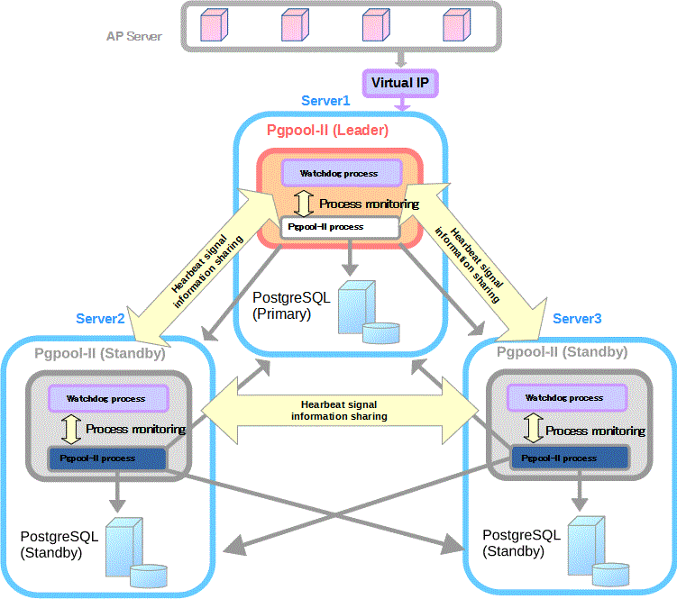

# PGPOOL (Ubuntu)

### References

pgpool explanation and sample setup:

[https://www.pgpool.net/docs/latest/en/html/example-cluster.html](https://www.pgpool.net/docs/latest/en/html/example-cluster.html)

For more, follow [this link](./pgpool%20references.md).

---

**Note:**

1. PostgreSQL major version specified here is 15. However, this manual also complies with most of the pg versions in use, including 13, 14, 15, and 16.
2. pgpool version is 4.5.2
3. There are some glitches for pgpool on Ubuntu, which do not exist on the RHEL. That is because EnterpriseDB is rather Redhat oriented than other Linux distros. I have tried to make up for them and included the solutions in this document. The tests have shown a satisfactory result for myself but the solutions are offered **without a guarantee**.
4. Like many of the watchdog solutions for DBMS HA solutions, the watchdog can be installed on a highly available server, even a separate one. Here we setup the watchdog on all the nodes.
5. The following are the node details used in this documentation:

**Schematic of the sample pgpool replication topology setup (source: [pgpool.net](https://www.pgpool.net/docs/latest/en/html/example-cluster.html)):**

<div style="text-align:center;">

<br/>
</div>

<br/>
The replication topology is composed of:
<br/>

| row |   Node hostname   | IP Add        | Description            |
| --- | :---------------: | ------------- | ---------------------- |
| 1   |  funleashpgdb01  | 172.23.124.71 | Node 1 (synchronous)   |
| 2   |  funleashpgdb02  | 172.23.124.72 | Node 2 (synchronous)  |
| 3   |  funleashpgdb03  | 172.23.124.73 | Node 3 (asynchronous) |
| 4   | vip (delegate_ip) | 172.23.124.74 | floating virtual IP    |

### Installation:

Add the pg official repository and install PostgreSQL on all the nodes. After adding the PostgreSQL's official repository, you can find pgpool and its related packages in that repository.

#### 1. **Install required packages:**

```shell
sudo apt-get update
sudo apt-get install pgpool2 libpgpool2 postgresql-15-pgpool2
```

postgresql-15-pgpool2 contains extensions for pgpool and is mandatory too. They will be mentioned later. Choose the version of this package which corresponds with your pg major version.

#### 1. **Copy template files:**

copy template script files from the following directory to a specific directory, rename and remove .sample from the end of the files.

```shell
cp /usr/share/doc/pgpool2/examples/scripts/* /data/postgresql/15/main/
```

#### 1. **Create pgpool_node_id file**

create the pgpool_node_id file with the node id (ex 0) below on every node:
Write the following inside shell. The node id starts from 0 for Node 1, 1 for Node 2, and so on.

```
cat << /etc/pgpool2/pgpool_node_id >> EOT
0
EOT
```

#### 2. **Create the backend status file.**

It will be explained later.

```
mkdir -p /var/log/pgpool
touch /var/log/pgpool/pgpool_status		# Backend status file
chown -R postgres /var/log/pgpool		# Log location
```

#### 1. **Assign a password to the user postgres in Linux**

```shell
sudo passwd postgres
```

#### 1. **Create Replication, Health Check, and Recovery users with required privileges on every node.**

```pgsql
-- inside pg engine, create pg users and assign a password to the postgres user in the database cluster engine too, and set up pg_hba.conf file accordingly. A sample of the pg_hba.conf file was given. We take all the passwords to be the same for simplicity.
CREATE USER repl REPLICATION PASSWORD 'Pa$svvord';

-- If you want to show "replication_state" and "replication_sync_state" column in SHOW POOL NODES command result,
-- role pgpool needs to be PostgreSQL super user or in pg_monitor group. This also applies to detach_false_primary feature
-- you can run the following to grant pg_monitor
-- GRANT pg_monitor TO pgpool;
CREATE USER pgpool SUPERUSER PASSWORD 'Pa$svvord';

-- inside psql:
SET password_encryption = 'scram-sha-256';

\password pgpool
\password repl
\password postgres
```

#### 1. **postgresql configuration files: pg_hba.conf**

replication must be enabled for streaming replication and also pg_basebackup to work.

pg_hba.conf sample for every node:

```
local   all             postgres                                peer
local   all             test                                	scram-sha-256
local   all             postgres                                scram-sha-256

# TYPE  DATABASE        USER            ADDRESS                 METHOD

# "local" is for Unix domain socket connections only
local   replication     all                                     scram-sha-256
local   all             all                                     scram-sha-256

# IPv4 local connections:
host    all             all             127.0.0.1/32            scram-sha-256
host    replication     all             172.23.124.0/24         scram-sha-256
host    all             all             0.0.0.0/0             	scram-sha-256
host    replication     all             0.0.0.0/0             	scram-sha-256
host    all             all             172.23.124.0/24         scram-sha-256
host    all             all             127.0.0.1/32            scram-sha-256

# IPv6 local connections:
host    all             all             ::1/128                 scram-sha-256
```

#### 1. **pgpool configuration files: pgpool.conf**

The major configuration file for pgpool is pgpool.conf. Now we dive into this file. This is the default configuration file of pgpool 4.5.2. The parts that are commented out show the default value in effect for that directive. We have added some extra explainations for some parts. Furthermore, the only default directive that is not commented out by default is the following:

| backend_clustering_mode = 'streaming_replication' |
| :------------------------------------------------ |

The complete default pgpool.conf file that I have added additional explanations for some directives of it is as follows:

<details>
<summary style="text-decoration-line: underline; text-decoration-style: wavy; text-decoration-color: blue; text-decoration-thickness: 2px;">(click to expand) The complete default <b>pgpool.conf</b> file with added explanations:</summary>

```conf
# ----------------------------
# pgPool-II configuration file
# ----------------------------
#
# This file consists of lines of the form:
#
#   name = value
#
# Whitespace may be used.  Comments are introduced with "#" anywhere on a line.
# The complete list of parameter names and allowed values can be found in the
# pgPool-II documentation.
#
# This file is read on server startup and when the server receives a SIGHUP
# signal.  If you edit the file on a running system, you have to SIGHUP the
# server for the changes to take effect, or use "pgpool reload".  Some
# parameters, which are marked below, require a server shutdown and restart to
# take effect.
#

#------------------------------------------------------------------------------

# BACKEND CLUSTERING MODE

# Choose one of: 'streaming_replication', 'native_replication',

# 'logical_replication', 'slony', 'raw' or 'snapshot_isolation'

# (change requires restart)

#------------------------------------------------------------------------------

backend_clustering_mode = 'streaming_replication'

#------------------------------------------------------------------------------

# CONNECTIONS

#------------------------------------------------------------------------------

# - pgpool Connection Settings -

#listen_addresses = 'localhost'
                                   # what host name(s) or IP address(es) to listen on;
                                   # comma-separated list of addresses;
                                   # defaults to 'localhost'; use '*' for all
                                   # (change requires restart)
#port = 9999
                                   # Port number
                                   # (change requires restart)
#unix_socket_directories = '/var/run/postgresql'
                                   # Unix domain socket path(s)
                                   # The Debian package defaults to
                                   # /var/run/postgresql
                                   # (change requires restart)
#unix_socket_group = ''
                                   # The Owner group of Unix domain socket(s)
                                   # (change requires restart)
#unix_socket_permissions = 0777
                                   # Permissions of Unix domain socket(s)
                                   # (change requires restart)
#reserved_connections = 0
                                   # Number of reserved connections.
                                   # Pgpool-II does not accept connections if over
                                   # num_init_children - reserved_connections.

# When this parameter is set to 1 or greater, incoming connections from clients are not accepted with

# error message "Sorry, too many clients already", rather than blocked if the number of current

# connections from clients is more than (num_init_children - reserved_connections). For example, if

# reserved_connections = 1 and num_init_children = 32, then the 32th connection from a client will be refused.

# - pgpool Communication Manager Connection Settings -

# for pcp commands

#pcp_listen_addresses = 'localhost'
                                   # what host name(s) or IP address(es) for pcp process to listen on;
                                   # comma-separated list of addresses;
                                   # defaults to 'localhost'; use '*' for all
                                   # (change requires restart)
#pcp_port = 9898
                                   # Port number for pcp
                                   # (change requires restart)
#pcp_socket_dir = '/var/run/postgresql'
                                   # Unix domain socket path(s) for pcp
                                   # The Debian package defaults to
                                   # /var/run/postgresql
                                   # (change requires restart)
#listen_backlog_multiplier = 2
                                   # Set the backlog parameter of listen(2) to
                                   # num_init_children * listen_backlog_multiplier.
                                   # (change requires restart)

# Specifies the length of connection queue from frontend to Pgpool-II. Meaning the number of connections that are waiting in queue

# to be served by the pgpool proxy service.

#serialize_accept = off
                                   # whether to serialize accept() call to avoid thundering herd problem
                                   # (change requires restart)

# - Backend Connection Settings -

# Backends are the pg replicas

#backend_hostname0 = 'host1'
                                   # Host name or IP address to connect to for backend 0
#backend_port0 = 5432
                                   # Port number for backend 0
#backend_weight0 = 1
                                   # Weight for backend 0 (only in load balancing mode)
#backend_data_directory0 = '/data'
                                   # Data directory for backend 0
#backend_flag0 = 'ALLOW_TO_FAILOVER'
                                   # Controls various backend behavior
                                   # ALLOW_TO_FAILOVER, DISALLOW_TO_FAILOVER
                                   # or ALWAYS_PRIMARY
#backend_application_name0 = 'server0'
                                   # walsender's application_name, used for "show pool_nodes" command
#backend_hostname1 = 'host2'
#backend_port1 = 5433
#backend_weight1 = 1
#backend_data_directory1 = '/data1'
#backend_flag1 = 'ALLOW_TO_FAILOVER'
#backend_application_name1 = 'server1'

# - Authentication -

#enable_pool_hba = off
                                   # Use pool_hba.conf for client authentication
#pool_passwd = 'pool_passwd'
                                   # File name of pool_passwd for md5 authentication.
                                   # "" disables pool_passwd.
                                   # (change requires restart)
#authentication_timeout = 1min
                                   # Delay in seconds to complete client authentication
                                   # 0 means no timeout.

#allow_clear_text_frontend_auth = off
                                   # Allow Pgpool-II to use clear text password authentication
                                   # with clients, when pool_passwd does not
                                   # contain the user password

# Not recommended unless ssl connection is activated.

# - SSL Connections -

#ssl = off
                                   # Enable SSL support
                                   # (change requires restart)
#ssl_key = 'server.key'
                                   # SSL private key file
                                   # (change requires restart)
#ssl_cert = 'server.crt'
                                   # SSL public certificate file
                                   # (change requires restart)
#ssl_ca_cert = ''
                                   # Single PEM format file containing
                                   # CA root certificate(s)
                                   # (change requires restart)
#ssl_ca_cert_dir = ''
                                   # Directory containing CA root certificate(s)
                                   # (change requires restart)
#ssl_crl_file = ''
                                   # SSL certificate revocation list file
                                   # (change requires restart)

#ssl_ciphers = 'HIGH:MEDIUM:+3DES:!aNULL'
                                   # Allowed SSL ciphers
                                   # (change requires restart)
#ssl_prefer_server_ciphers = off
                                   # Use server's SSL cipher preferences,
                                   # rather than the client's
                                   # (change requires restart)
#ssl_ecdh_curve = 'prime256v1'
                                   # Name of the curve to use in ECDH key exchange
#ssl_dh_params_file = ''
                                   # Name of the file containing Diffie-Hellman parameters used
                                   # for so-called ephemeral DH family of SSL cipher.
#ssl_passphrase_command=''
                                   # Sets an external command to be invoked when a passphrase
                                   # for decrypting an SSL file needs to be obtained
                                   # (change requires restart)

#------------------------------------------------------------------------------

# POOLS

#------------------------------------------------------------------------------

# - Concurrent session and pool size -

#process_management_mode = static
                                   # process management mode for child processes
                                   # Valid options:
                                   # static: all children are pre-forked at startup
                                   # dynamic: child processes are spawned on demand.
                                   #      number of idle child processes at any time are
                                   #      configured by min_spare_children and max_spare_children

#process_management_strategy = gentle
                                   # process management strategy to satisfy spare processes
                                   # Valid options:
                                   #
                                   #    lazy: In this mode, the scale-down is performed gradually
                                   #     and only gets triggered when excessive spare processes count
                                   #     remains high for more than 5 mins
                                   #
                                   #    gentle: In this mode, the scale-down is performed gradually
                                   #     and only gets triggered when excessive spare processes count
                                   #     remains high for more than 2 mins
                                   #
                                   #    aggressive: In this mode, the scale-down is performed aggressively
                                   #     and gets triggered more frequently in case of higher spare processes.
                                   #     This mode uses faster and slightly less smart process selection criteria
                                   #     to identify the child processes that can be serviced to satisfy
                                   #     max_spare_children
                                   #
                                   # (Only applicable for dynamic process management mode)

#num_init_children = 32
                                   # Maximum Number of concurrent sessions allowed
                                   # (change requires restart)
#min_spare_children = 5
                                   # Minimum number of spare child processes waiting for connection
                                   # (Only applicable for dynamic process management mode)

#max_spare_children = 10
                                   # Maximum number of idle child processes waiting for connection
                                   # (Only applicable for dynamic process management mode)

#max_pool = 4
                                   # Number of connection pool caches per connection
                                   # (change requires restart)

# - Life time -

#child_life_time = 5min
                                   # Pool exits after being idle for this many seconds
#child_max_connections = 0
                                   # Pool exits after receiving that many connections
                                   # 0 means no exit
#connection_life_time = 0
                                   # Connection to backend closes after being idle for this many seconds
                                   # 0 means no close
#client_idle_limit = 0
                                   # Client is disconnected after being idle for that many seconds
                                   # (even inside an explicit transactions!)
                                   # 0 means no disconnection

#------------------------------------------------------------------------------

# LOGS

#------------------------------------------------------------------------------

# - Where to log -

#log_destination = 'stderr'
                                   # Where to log
                                   # Valid values are combinations of stderr,
                                   # and syslog. Default to stderr.

# - What to log -

#log_line_prefix = '%m: %a pid %p: '   # printf-style string to output at beginning of each log line.

#log_connections = off
                                   # Log connections
#log_disconnections = off
                                   # Log disconnections
#log_pcp_processes = on
                                   # Log PCP Processes
#log_hostname = off
                                   # Hostname will be shown in ps status
                                   # and in logs if connections are logged
#log_statement = off
                                   # Log all statements
#log_per_node_statement = off
                                   # Log all statements
                                   # with node and backend informations
#notice_per_node_statement = off
                                   # logs notice message for per node detailed SQL statements
#log_client_messages = off
                                   # Log any client messages

# Log messages that are returned to the client

#log_standby_delay = 'if_over_threshold'
                                   # Log standby delay
                                   # Valid values are combinations of always,
                                   # if_over_threshold, none

# - Syslog specific -

#syslog_facility = 'LOCAL0'
                                   # Syslog local facility. Default to LOCAL0
#syslog_ident = 'pgpool'
                                   # Syslog program identification string
                                   # Default to 'pgpool'

# - Debug -

#log_error_verbosity = default          # terse, default, or verbose messages

#client_min_messages = notice           # values in order of decreasing detail:
                                        #   debug5
                                        #   debug4
                                        #   debug3
                                        #   debug2
                                        #   debug1
                                        #   log
                                        #   notice
                                        #   warning
                                        #   error

# message levels that are returned to the client

#log_min_messages = warning             # values in order of decreasing detail:
                                        #   debug5
                                        #   debug4
                                        #   debug3
                                        #   debug2
                                        #   debug1
                                        #   info
                                        #   notice
                                        #   warning
                                        #   error
                                        #   log
                                        #   fatal
                                        #   panic

# This is used when logging to stderr:

#logging_collector = off
                                        # Enable capturing of stderr
                                        # into log files.
                                        # (change requires restart)

# -- Only used if logging_collector is on ---

#log_directory = '/tmp/pgpool_logs'
                                        # directory where log files are written,
                                        # can be absolute
#log_filename = 'pgpool-%Y-%m-%d_%H%M%S.log'
                                        # log file name pattern,
                                        # can include strftime() escapes

#log_file_mode = 0600
                                        # creation mode for log files,
                                        # begin with 0 to use octal notation

#log_truncate_on_rotation = off
                                        # If on, an existing log file with the
                                        # same name as the new log file will be
                                        # truncated rather than appended to.
                                        # But such truncation only occurs on
                                        # time-driven rotation, not on restarts
                                        # or size-driven rotation.  Default is
                                        # off, meaning append to existing files
                                        # in all cases.

#log_rotation_age = 1d
                                        # Automatic rotation of logfiles will
                                        # happen after that (minutes)time.
                                        # 0 disables time based rotation.
#log_rotation_size = 10MB
                                        # Automatic rotation of logfiles will
                                        # happen after that much (KB) log output.
                                        # 0 disables size based rotation.
#------------------------------------------------------------------------------

# FILE LOCATIONS

#------------------------------------------------------------------------------

#pid_file_name = '/var/run/postgresql/pgpool.pid'
                                   # PID file name
                                   # Can be specified as relative to the"
                                   # location of pgpool.conf file or
                                   # as an absolute path
                                   # (change requires restart)
#logdir = '/var/log/postgresql'
                                   # Directory of pgPool status file
                                   # (change requires restart)

#------------------------------------------------------------------------------

# CONNECTION POOLING

#------------------------------------------------------------------------------

#connection_cache = on
                                   # Activate connection pools
                                   # (change requires restart)

    # Semicolon separated list of queries
                                   # to be issued at the end of a session
                                   # The default is for 8.3 and later
#reset_query_list = 'ABORT; DISCARD ALL'
                                   # The following one is for 8.2 and before
#reset_query_list = 'ABORT; RESET ALL; SET SESSION AUTHORIZATION DEFAULT'

#------------------------------------------------------------------------------

# REPLICATION MODE

#------------------------------------------------------------------------------

#replicate_select = off
                                   # Replicate SELECT statements
                                   # when in replication mode
                                   # replicate_select is higher priority than
                                   # load_balance_mode.

# For data consistency purposes to see if the result sets differ

#insert_lock = on
                                   # Automatically locks a dummy row or a table
                                   # with INSERT statements to keep SERIAL data
                                   # consistency
                                   # Without SERIAL, no lock will be issued
#lobj_lock_table = ''
                                   # When rewriting lo_creat command in
                                   # replication mode, specify table name to
                                   # lock

# - Degenerate handling -

#replication_stop_on_mismatch = off
                                   # On disagreement with the packet kind
                                   # sent from backend, degenerate the node
                                   # which is most likely "minority"
                                   # If off, just force to exit this session

#failover_if_affected_tuples_mismatch = off
                                   # On disagreement with the number of affected
                                   # tuples in UPDATE/DELETE queries, then
                                   # degenerate the node which is most likely
                                   # "minority".
                                   # If off, just abort the transaction to
                                   # keep the consistency

#------------------------------------------------------------------------------

# LOAD BALANCING MODE

#------------------------------------------------------------------------------
# Some parameters depend on wether the other nodes are synchronous or not

#load_balance_mode = on
                                   # Activate load balancing mode
                                   # (change requires restart)
#ignore_leading_white_space = on
                                   # Ignore leading white spaces of each query
#read_only_function_list = ''
                                   # Comma separated list of function names
                                   # that don't write to database
                                   # Regexp are accepted
#write_function_list = ''
                                   # Comma separated list of function names
                                   # that write to database
                                   # Regexp are accepted
                                   # If both read_only_function_list and write_function_list
                                   # is empty, function's volatile property is checked.
                                   # If it's volatile, the function is regarded as a
                                   # writing function.

#primary_routing_query_pattern_list = ''
                                   # Semicolon separated list of query patterns
                                   # that should be sent to primary node
                                   # Regexp are accepted
                                   # valid for streaming replication mode only.

#user_redirect_preference_list = ''
                                   # comma separated list of pairs of user name and node id.
                                   # example: postgres:primary,user[0-4]:1,user[5-9]:2'
                                   # valid for streaming replication mode only.

#database_redirect_preference_list = ''
                                   # comma separated list of pairs of database and node id.
                                   # example: postgres:primary,mydb[0-4]:1,mydb[5-9]:2'
                                   # valid for streaming replication mode only.

#app_name_redirect_preference_list = ''
                                   # comma separated list of pairs of app name and node id.
                                   # example: 'psql:primary,myapp[0-4]:1,myapp[5-9]:standby'
                                   # valid for streaming replication mode only.

#allow_sql_comments = off
                                   # if on, ignore SQL comments when judging if load balance or
                                   # query cache is possible.
                                   # If off, SQL comments effectively prevent the judgment
                                   # (pre 3.4 behavior).
# Tell pgpool whether it should take account of SQL comments inside the incomming SQL Statements

#disable_load_balance_on_write = 'transaction'
                                   # Load balance behavior when write query is issued
                                   # in an explicit transaction.
                                   #
                                   # Valid values:
                                   #
                                   # 'transaction' (default):
                                   #     if a write query is issued, subsequent
                                   #     read queries will not be load balanced
                                   #     until the transaction ends.
                                   #
                                   # 'trans_transaction':
                                   #     if a write query is issued, subsequent
                                   #     read queries in an explicit transaction
                                   #     will not be load balanced until the session ends.
                                   #
                                   # 'dml_adaptive':
                                   #     Queries on the tables that have already been
                                   #     modified within the current explicit transaction will
                                   #     not be load balanced until the end of the transaction.
                                   #
                                   # 'always':
                                   #     if a write query is issued, read queries will
                                   #     not be load balanced until the session ends.
                                   #
                                   # Note that any query not in an explicit transaction
                                   # is not affected by the parameter except 'always'.
#Queries on the tables that have already been
#modified within the current explicit transaction will
#not be load balanced until the end of the transaction.

#dml_adaptive_object_relationship_list= ''
                                   # comma separated list of object pairs
                                   # [object]:[dependent-object], to disable load balancing
                                   # of dependent objects within the explicit transaction
                                   # after WRITE statement is issued on (depending-on) object.
                                   #
                                   # example: 'tb_t1:tb_t2,insert_tb_f_func():tb_f,tb_v:my_view'
                                   # Note: function name in this list must also be present in
                                   # the write_function_list
                                   # only valid for disable_load_balance_on_write = 'dml_adaptive'.

#statement_level_load_balance = off
                                   # Enables statement level load balancing

#------------------------------------------------------------------------------

# STREAMING REPLICATION MODE

#------------------------------------------------------------------------------

# - Streaming -

#sr_check_period = 10
                                   # Streaming replication check period
                                   # Default is 10s.
#sr_check_user = 'nobody'
                                   # Streaming replication check user
                                   # This is necessary even if you disable streaming
                                   # replication delay check by sr_check_period = 0
#sr_check_password = ''
                                   # Password for streaming replication check user
                                   # Leaving it empty will make Pgpool-II to first look for the
                                   # Password in pool_passwd file before using the empty password

#sr_check_database = 'postgres'
                                   # Database name for streaming replication check
#delay_threshold = 0
                                   # Threshold before not dispatching query to standby node
                                   # Unit is in bytes
                                   # Disabled (0) by default
# Specifies the maximum tolerance level of replication delay in WAL bytes on the standby server against the primary server
# If the delay exceeds this configured level, Pgpool-II stops sending the SELECT queries to the standby server and starts 
# routing everything to the primary server even if load_balance_mode is enabled, until the standby catches-up with the primary

#delay_threshold_by_time = 0
                                   # Threshold before not dispatching query to standby node
                                   # The default unit is in millisecond(s)
                                   # Disabled (0) by default

#prefer_lower_delay_standby = off
                                   # If delay_threshold is set larger than 0, Pgpool-II send to
                                   # the primary when selected node is delayed over delay_threshold.
                                   # If this is set to on, Pgpool-II send query to other standby
                                   # delayed lower.

# - Special commands -

#follow_primary_command = ''
                                   # Executes this command after main node failover
                                   # Special values:
                                   #   %d = failed node id
                                   #   %h = failed node host name
                                   #   %p = failed node port number
                                   #   %D = failed node database cluster path
                                   #   %m = new main node id
                                   #   %H = new main node hostname
                                   #   %M = old main node id
                                   #   %P = old primary node id
                                   #   %r = new main port number
                                   #   %R = new main database cluster path
                                   #   %N = old primary node hostname
                                   #   %S = old primary node port number
                                   #   %% = '%' character

# a shell command which is usually the path of a script file which is executed on an special event

# for this specific directive, this script has a suggested template by pgpool and is executed after

# a manual failover for the old primary to arrive to a common point of recovery with the new primary

# usually follow_primary.sh

#------------------------------------------------------------------------------

# HEALTH CHECK GLOBAL PARAMETERS

#------------------------------------------------------------------------------

#health_check_period = 0
                                   # Health check period
                                   # Disabled (0) by default
#health_check_timeout = 20
                                   # Health check timeout
                                   # 0 means no timeout
#health_check_user = 'nobody'
                                   # Health check user
#health_check_password = ''
                                   # Password for health check user
                                   # Leaving it empty will make Pgpool-II to first look for the
                                   # Password in pool_passwd file before using the empty password

#health_check_database = ''
                                   # Database name for health check. If '', tries 'postgres' frist,
#health_check_max_retries = 0
                                   # Maximum number of times to retry a failed health check before giving up.
#health_check_retry_delay = 1
                                   # Amount of time to wait (in seconds) between retries.
#connect_timeout = 10000
                                   # Timeout value in milliseconds before giving up to connect to backend.
                                   # Default is 10000 ms (10 second). Flaky network user may want to increase
                                   # the value. 0 means no timeout.
                                   # Note that this value is not only used for health check,
                                   # but also for ordinary connection to backend.

#------------------------------------------------------------------------------

# HEALTH CHECK PER NODE PARAMETERS (OPTIONAL)

#------------------------------------------------------------------------------

# You can specify configurations for specific nodes if you want them to differ

# from others

#health_check_period0 = 0
#health_check_timeout0 = 20
#health_check_user0 = 'nobody'
#health_check_password0 = ''
#health_check_database0 = ''
#health_check_max_retries0 = 0
#health_check_retry_delay0 = 1
#connect_timeout0 = 10000

#------------------------------------------------------------------------------

# FAILOVER AND FAILBACK

#------------------------------------------------------------------------------

#failover_command = ''
                                   # Executes this command at failover
                                   # Special values:
                                   #   %d = failed node id
                                   #   %h = failed node host name
                                   #   %p = failed node port number
                                   #   %D = failed node database cluster path
                                   #   %m = new main node id
                                   #   %H = new main node hostname
                                   #   %M = old main node id
                                   #   %P = old primary node id
                                   #   %r = new main port number
                                   #   %R = new main database cluster path
                                   #   %N = old primary node hostname
                                   #   %S = old primary node port number
                                   #   %% = '%' character

# executed when a failover is triggered. Either through a primary server crash or a manual failover.

# usually failover.sh

#failback_command = ''
                                   # Executes this command at failback.
                                   # Special values:
                                   #   %d = failed node id
                                   #   %h = failed node host name
                                   #   %p = failed node port number
                                   #   %D = failed node database cluster path
                                   #   %m = new main node id
                                   #   %H = new main node hostname
                                   #   %M = old main node id
                                   #   %P = old primary node id
                                   #   %r = new main port number
                                   #   %R = new main database cluster path
                                   #   %N = old primary node hostname
                                   #   %S = old primary node port number
                                   #   %% = '%' character

#failover_on_backend_error = on
                                   # Initiates failover when reading/writing to the
                                   # backend communication socket fails
                                   # If set to off, pgpool will report an
                                   # error and disconnect the session.

#failover_on_backend_shutdown = off
                                   # Initiates failover when backend is shutdown,
                                   # or backend process is killed.
                                   # If set to off, pgpool will report an
                                   # error and disconnect the session.

#detach_false_primary = off
                                   # Detach false primary if on. Only
                                   # valid in streaming replication
                                   # mode and with PostgreSQL 9.6 or
                                   # after.

#search_primary_node_timeout = 5min
                                   # Timeout in seconds to search for the
                                   # primary node when a failover occurs.
                                   # 0 means no timeout, keep searching
                                   # for a primary node forever.

#------------------------------------------------------------------------------

# ONLINE RECOVERY

#------------------------------------------------------------------------------

# used for recovering a node from another node (primary is preferable).

#recovery_user = 'nobody'
                                   # Online recovery user
#recovery_password = ''
                                   # Online recovery password
                                   # Leaving it empty will make Pgpool-II to first look for the
                                   # Password in pool_passwd file before using the empty password

#recovery_1st_stage_command = ''
                                   # Executes a command in first stage

# Usually recovery_1st_stage script file

#recovery_2nd_stage_command = ''
                                   # Executes a command in second stage
#recovery_timeout = 90
                                   # Timeout in seconds to wait for the
                                   # recovering node's postmaster to start up
                                   # 0 means no wait
#client_idle_limit_in_recovery = 0
                                   # Client is disconnected after being idle
                                   # for that many seconds in the second stage
                                   # of online recovery
                                   # 0 means no disconnection
                                   # -1 means immediate disconnection

#auto_failback = off
                                   # Detached backend node reattach automatically
                                   # if replicatiotate is 'streaming'.
#auto_failback_interval = 1min
                                   # Min interval of executing auto_failback in
                                   # seconds.

#------------------------------------------------------------------------------

# WATCHDOG

#------------------------------------------------------------------------------

# - Enabling -

#use_watchdog = off
                                    # Activates watchdog
                                    # (change requires restart)

# -Connection to upstream servers -

#trusted_servers = ''
                                    # trusted server list which are used
                                    # to confirm network connection
                                    # (hostA,hostB,hostC,...)
                                    # (change requires restart)

#trusted_server_command = 'ping -q -c3 %h'
                                    # Command to execute when communicate trusted server.
                                    # Special values:
                                    #   %h = host name specified by trusted_servers

# - Watchdog communication Settings -

#hostname0 = ''
                                    # Host name or IP address of pgpool node
                                    # for watchdog connection
                                    # (change requires restart)
#wd_port0 = 9000
                                    # Port number for watchdog service
                                    # (change requires restart)
#pgpool_port0 = 9999
                                    # Port number for pgpool
                                    # (change requires restart)

#hostname1 = ''
#wd_port1 = 9000
#pgpool_port1 = 9999

#hostname2 = ''
#wd_port2 = 9000
#pgpool_port2 = 9999

#wd_priority = 1
                                    # priority of this watchdog in leader election
                                    # (change requires restart)

#wd_authkey = ''
                                    # Authentication key for watchdog communication
                                    # (change requires restart)

#wd_ipc_socket_dir = '/tmp'
                                    # Unix domain socket path for watchdog IPC socket
                                    # The Debian package defaults to
                                    # /var/run/postgresql
                                    # (change requires restart)

# - Virtual IP control Setting -

#delegate_ip = ''
                                    # delegate IP address
                                    # If this is empty, virtual IP never bring up.
                                    # (change requires restart)
#if_cmd_path = '/sbin'
                                    # path to the directory where if_up/down_cmd exists
                                    # If if_up/down_cmd starts with "/", if_cmd_path will be ignored.
                                    # (change requires restart)
#if_up_cmd = '/usr/bin/sudo /sbin/ip addr add $_IP_$/24 dev eth0 label eth0:0'
                                    # startup delegate IP command
                                    # (change requires restart)

# Command to bring up the floating IP

#if_down_cmd = '/usr/bin/sudo /sbin/ip addr del $_IP_$/24 dev eth0'
                                    # shutdown delegate IP command
                                    # (change requires restart)

# Command to bring down the floating IP

#arping_path = '/usr/sbin'
                                    # arping command path
                                    # If arping_cmd starts with "/", if_cmd_path will be ignored.
                                    # (change requires restart)
# Note: requires iputils-arping to be installed on Ubuntu

#arping_cmd = '/usr/bin/sudo /usr/sbin/arping -U $_IP_$ -w 1 -I eth0'
                                    # arping command
                                    # (change requires restart)

#ping_path = '/bin'
                                    # ping command path
                                    # (change requires restart)

# - Behaivor on escalation Setting -

#clear_memqcache_on_escalation = on
                                    # Clear all the query cache on shared memory
                                    # when standby pgpool escalate to active pgpool
                                    # (= virtual IP holder).
                                    # This should be off if client connects to pgpool
                                    # not using virtual IP.
                                    # (change requires restart)
#wd_escalation_command = ''
                                    # Executes this command at escalation on new active pgpool.
                                    # (change requires restart)

# executes escalation.sh

#wd_de_escalation_command = ''
                                    # Executes this command when leader pgpool resigns from being leader.
                                    # (change requires restart)

# - Watchdog consensus settings for failover -

#failover_when_quorum_exists = on
                                    # Only perform backend node failover
                                    # when the watchdog cluster holds the quorum
                                    # (change requires restart)

#failover_require_consensus = on
                                    # Perform failover when majority of Pgpool-II nodes
                                    # aggrees on the backend node status change
                                    # (change requires restart)

#allow_multiple_failover_requests_from_node = off
                                    # A Pgpool-II node can cast multiple votes
                                    # for building the consensus on failover
                                    # (change requires restart)

#enable_consensus_with_half_votes = off
                                    # apply majority rule for consensus and quorum computation
                                    # at 50% of votes in a cluster with even number of nodes.
                                    # when enabled the existence of quorum and consensus
                                    # on failover is resolved after receiving half of the
                                    # total votes in the cluster, otherwise both these
                                    # decisions require at least one more vote than
                                    # half of the total votes.
                                    # (change requires restart)

# - Watchdog cluster membership settings for quorum computation -

#wd_remove_shutdown_nodes = off
                                    # when enabled cluster membership of properly shutdown
                                    # watchdog nodes gets revoked, After that the node does
                                    # not count towards the quorum and consensus computations

#wd_lost_node_removal_timeout = 0s
                                    # Timeout after which the cluster membership of LOST watchdog
                                    # nodes gets revoked. After that the node node does not
                                    # count towards the quorum and consensus computations
                                    # setting timeout to 0 will never revoke the membership
                                    # of LOST nodes

#wd_no_show_node_removal_timeout = 0s
                                    # Time to wait for Watchdog node to connect to the cluster.
                                    # After that time the cluster membership of NO-SHOW node gets
                                    # revoked and it does not count towards the quorum and
                                    # consensus computations
                                    # setting timeout to 0 will not revoke the membership
                                    # of NO-SHOW nodes

# - Lifecheck Setting -

# -- common --

#wd_monitoring_interfaces_list = ''
                                    # Comma separated list of interfaces names to monitor.
                                    # if any interface from the list is active the watchdog will
                                    # consider the network is fine
                                    # 'any' to enable monitoring on all interfaces except loopback
                                    # '' to disable monitoring
                                    # (change requires restart)

#wd_lifecheck_method = 'heartbeat'
                                    # Method of watchdog lifecheck ('heartbeat' or 'query' or 'external')
                                    # (change requires restart)
#wd_interval = 10
                                    # lifecheck interval (sec) > 0
                                    # (change requires restart)

# -- heartbeat mode --

# if heartbeat mode has been chosen in wd_lifecheck_method

#heartbeat_hostname0 = ''
                                    # Host name or IP address used
                                    # for sending heartbeat signal.
                                    # (change requires restart)
#heartbeat_port0 = 9694
                                    # Port number used for receiving/sending heartbeat signal
                                    # Usually this is the same as heartbeat_portX.
                                    # (change requires restart)
#heartbeat_device0 = ''
                                    # Name of NIC device (such like 'eth0')
                                    # used for sending/receiving heartbeat
                                    # signal to/from destination 0.
                                    # This works only when this is not empty
                                    # and pgpool has root privilege.
                                    # (change requires restart)

#heartbeat_hostname1 = ''
#heartbeat_port1 = 9694
#heartbeat_device1 = ''
#heartbeat_hostname2 = ''
#heartbeat_port2 = 9694
#heartbeat_device2 = ''

#wd_heartbeat_keepalive = 2
                                    # Interval time of sending heartbeat signal (sec)
                                    # (change requires restart)
#wd_heartbeat_deadtime = 30
                                    # Deadtime interval for heartbeat signal (sec)
                                    # (change requires restart)

# -- query mode --

#wd_life_point = 3
                                    # lifecheck retry times
                                    # (change requires restart)
#wd_lifecheck_query = 'SELECT 1'
                                    # lifecheck query to pgpool from watchdog
                                    # (change requires restart)
#wd_lifecheck_dbname = 'template1'
                                    # Database name connected for lifecheck
                                    # (change requires restart)
#wd_lifecheck_user = 'nobody'
                                    # watchdog user monitoring pgpools in lifecheck
                                    # (change requires restart)
#wd_lifecheck_password = ''
                                    # Password for watchdog user in lifecheck
                                    # Leaving it empty will make Pgpool-II to first look for the
                                    # Password in pool_passwd file before using the empty password
                                    # (change requires restart)

#------------------------------------------------------------------------------

# OTHERS

#------------------------------------------------------------------------------
#relcache_expire = 0
                                   # Life time of relation cache in seconds.
                                   # 0 means no cache expiration(the default).
                                   # The relation cache is used for cache the
                                   # query result against PostgreSQL system
                                   # catalog to obtain various information
                                   # including table structures or if it's a
                                   # temporary table or not. The cache is
                                   # maintained in a pgpool child local memory
                                   # and being kept as long as it survives.
                                   # If someone modify the table by using
                                   # ALTER TABLE or some such, the relcache is
                                   # not consistent anymore.
                                   # For this purpose, cache_expiration
                                   # controls the life time of the cache.
#relcache_size = 256
                                   # Number of relation cache
                                   # entry. If you see frequently:
                                   # "pool_search_relcache: cache replacement happened"
                                   # in the pgpool log, you might want to increate this number.

#check_temp_table = catalog
                                   # Temporary table check method. catalog, trace or none.
                                   # Default is catalog.

# Setting to catalog or trace, enables the temporary table check in the SELECT statements. To

# check the temporary table Pgpool-II queries the system catalog of primary/main PostgreSQL

# backend if catalog is specified, which increases the load on the primary/main server.

# If trace is set, Pgpool-II traces temporary table creation and dropping to obtain temporary

# table info. So no need to access system catalogs. However, if temporary table creation is

# invisible to Pgpool-II (done in functions or triggers, for example), Pgpool-II cannot recognize

# the creation of temporary tables.

#check_unlogged_table = on
                                   # If on, enable unlogged table check in SELECT statements.
                                   # This initiates queries against system catalog of primary/main
                                   # thus increases load of primary.
                                   # If you are absolutely sure that your system never uses unlogged tables
                                   # and you want to save access to primary/main, you could turn this off.
                                   # Default is on.
#enable_shared_relcache = on
                                   # If on, relation cache stored in memory cache,
                                   # the cache is shared among child process.
                                   # Default is on.
                                   # (change requires restart)

# By setting to on, relation cache is shared among Pgpool-II child processes using the in memory query cache (see

# Section 5.12.1 for more details). Default is on. Each child process needs to access to the system catalog from

# PostgreSQL. By enabling this feature, other process can extract the catalog lookup result from the query cache

# and it should reduce the frequency of the query. Cache invalidation is not happen even if the system catalog is

# modified. So it is strongly recommend to set time out base cache invalidation by using relcache_expire parameter.

#relcache_query_target = primary
                                   # Target node to send relcache queries. Default is primary node.
                                   # If load_balance_node is specified, queries will be sent to load balance node.
#------------------------------------------------------------------------------

# IN MEMORY QUERY MEMORY CACHE

#------------------------------------------------------------------------------
#memory_cache_enabled = off
                                   # If on, use the memory cache functionality, off by default
                                   # (change requires restart)
#memqcache_method = 'shmem'
                                   # Cache storage method. either 'shmem'(shared memory) or
                                   # 'memcached'. 'shmem' by default
                                   # (change requires restart)
#memqcache_memcached_host = 'localhost'
                                   # Memcached host name or IP address. Mandatory if
                                   # memqcache_method = 'memcached'.
                                   # Defaults to localhost.
                                   # (change requires restart)
#memqcache_memcached_port = 11211
                                   # Memcached port number. Mondatory if memqcache_method = 'memcached'.
                                   # Defaults to 11211.
                                   # (change requires restart)
#memqcache_total_size = 64MB
                                   # Total memory size in bytes for storing memory cache.
                                   # Mandatory if memqcache_method = 'shmem'.
                                   # Defaults to 64MB.
                                   # (change requires restart)
#memqcache_max_num_cache = 1000000
                                   # Total number of cache entries. Mandatory
                                   # if memqcache_method = 'shmem'.
                                   # Each cache entry consumes 48 bytes on shared memory.
                                   # Defaults to 1,000,000(45.8MB).
                                   # (change requires restart)
#memqcache_expire = 0
                                   # Memory cache entry life time specified in seconds.
                                   # 0 means infinite life time. 0 by default.
                                   # (change requires restart)
#memqcache_auto_cache_invalidation = on
                                   # If on, invalidation of query cache is triggered by corresponding
                                   # DDL/DML/DCL(and memqcache_expire).  If off, it is only triggered
                                   # by memqcache_expire.  on by default.
                                   # (change requires restart)
#memqcache_maxcache = 400kB
                                   # Maximum SELECT result size in bytes.
                                   # Must be smaller than memqcache_cache_block_size. Defaults to 400KB.
                                   # (change requires restart)
#memqcache_cache_block_size = 1MB
                                   # Cache block size in bytes. Mandatory if memqcache_method = 'shmem'.
                                   # Defaults to 1MB.
                                   # (change requires restart)
#memqcache_oiddir = '/var/log/pgpool/oiddir'
                                   # Temporary work directory to record table oids
                                   # (change requires restart)
#cache_safe_memqcache_table_list = ''
                                   # Comma separated list of table names to memcache
                                   # that don't write to database
                                   # Regexp are accepted
#cache_unsafe_memqcache_table_list = ''
                                   # Comma separated list of table names not to memcache
                                   # that don't write to database
                                   # Regexp are accepted

# list of tables that their records frequently change.
```

</details>

* **Note:**

When password directives are left empty, pgpool will first examine the pool_passwd file, then try to use empty password.

* Now, this is the pgpool.conf file summarized for our production env specific needs. Some directives are picked, the others are not included to be left with their default values. Some values are default, but they are included anyway for future manipulation and attention. The ckeck parameters are specified with the assumption that all our nodes are on the same fast and stably connected network. Though for a disaster node which is in a far location and on a relatively slowly connected network, different "PER NODE PARAMETERS" options should be specified. We use the pgpool's pool_hba, CONNECTION POOLING, LOAD BALANCING, FAILOVER AND FAILBACK, ONLINE RECOVERY, WATCHDOG, RELCACHE, and IN MEMORY QUERY MEMORY CACHE features:

<details>
<summary style="text-decoration-line: underline; text-decoration-style: wavy; text-decoration-color: blue; text-decoration-thickness: 2px;">(click to expand) pgpool.conf summary:</summary>

```conf
######################### Optimized for our case-specific Production ############################

#------------------------------------------------------------------------------
# BACKEND CLUSTERING MODE
#------------------------------------------------------------------------------
backend_clustering_mode = 'streaming_replication'

#------------------------------------------------------------------------------
# CONNECTIONS
#------------------------------------------------------------------------------

listen_addresses = '*'
port = 9999
socket_dir = '/var/run/postgresql'
#socket_dir = '/tmp'


pcp_listen_addresses = '*'
pcp_port = 9898
pcp_socket_dir = '/var/run/postgresql'
#pcp_socket_dir = '/tmp'

listen_backlog_multiplier = 2

# Replica Configurations

enable_pool_hba = on

#------------------------------------------------------------------------------
# POOLS
#------------------------------------------------------------------------------

#------------------------------------------------------------------------------
# LOGS
#------------------------------------------------------------------------------

log_connections = on
log_hostname = on
log_statement = off
log_per_node_statement = off
logging_collector = on
log_error_verbosity = default
log_client_messages = off
syslog_ident = 'pgpool'
client_min_messages = notice
log_min_messages = warning
log_truncate_on_rotation = on
log_rotation_age = 7d
log_rotation_size = 512MB
log_directory = '/tmp/pgpool_logs'

#------------------------------------------------------------------------------
# FILE LOCATIONS
#------------------------------------------------------------------------------

# pgpool_status file location
logdir = '/var/log/pgpool/'

#------------------------------------------------------------------------------
# CONNECTION POOLING
#------------------------------------------------------------------------------

#------------------------------------------------------------------------------
# REPLICATION MODE
#------------------------------------------------------------------------------

#------------------------------------------------------------------------------
# LOAD BALANCING MODE
#------------------------------------------------------------------------------
# Some parameters depend on wether the other nodes are synchronous or not

load_balance_mode = on
allow_sql_comments = on
disable_load_balance_on_write = 'transaction'
statement_level_load_balance = off

#------------------------------------------------------------------------------
# STREAMING REPLICATION MODE
#------------------------------------------------------------------------------

sr_check_period = 10
sr_check_user = 'repl'
sr_check_password = ''
delay_threshold = 10001
follow_primary_command = '/etc/pgpool2/scripts/follow_primary.sh %d %h %p %D %m %H %M %P %r %R'

#------------------------------------------------------------------------------
# HEALTH CHECK GLOBAL PARAMETERS
#------------------------------------------------------------------------------

health_check_period = 5
health_check_timeout = 2
health_check_user = 'pgpool'
health_check_password = ''
health_check_database = 'postgres'
health_check_max_retries = 1
health_check_retry_delay = 1
connect_timeout = 2000

#------------------------------------------------------------------------------
# HEALTH CHECK PER NODE PARAMETERS (OPTIONAL)
#------------------------------------------------------------------------------

#------------------------------------------------------------------------------
# FAILOVER AND FAILBACK
#------------------------------------------------------------------------------

failover_on_backend_shutdown = on
failover_on_backend_error = on
detach_false_primary = on
failover_command = '/etc/pgpool2/scripts/failover.sh %d %h %p %D %m %H %M %P %r %R %N %S'
failback_command = ''

#------------------------------------------------------------------------------
# ONLINE RECOVERY
#------------------------------------------------------------------------------

recovery_user = 'postgres'
recovery_password = ''
recovery_1st_stage_command = '/etc/pgpool2/scripts/recovery_1st_stage'
recovery_2nd_stage_command = ''

#------------------------------------------------------------------------------
# WATCHDOG
#------------------------------------------------------------------------------


use_watchdog = on

# -Connection to upstream servers -
trusted_servers = 'funleashpgdb01,funleashpgdb02,funleashpgdb03'
trusted_server_command = 'ping -q -c3 %h'

# - Watchdog communication Settings -
hostname0 = 'funleashpgdb01'
wd_port0 = 9000
pgpool_port0 = 9999
hostname1 = 'funleashpgdb02'
wd_port1 = 9000
pgpool_port1 = 9999
hostname2 = 'funleashpgdb03'
wd_port2 = 9000
pgpool_port2 = 9999
wd_ipc_socket_dir = '/var/run/postgresql'

# - Virtual IP control Setting -
ping_path = '/usr/bin'
delegate_ip = '172.23.124.74'
if_cmd_path = '/usr/sbin'
if_up_cmd = '/usr/bin/sudo /usr/sbin/ip addr add $_IP_$/24 dev ens160 label ens160:0'
if_down_cmd = '/usr/bin/sudo /usr/sbin/ip addr del $_IP_$/24 dev ens160'
arping_path = '/usr/bin'
arping_cmd = '/usr/bin/sudo /usr/sbin/arping -U $_IP_$ -w 1 -I ens160'

# - Behaivor on escalation Setting -
clear_memqcache_on_escalation = off
wd_escalation_command = '/etc/pgpool2/scripts/escalation.sh'
enable_consensus_with_half_votes = off
wd_de_escalation_command = ''

# - Watchdog consensus settings for failover -
failover_when_quorum_exists = on
failover_require_consensus = on

# - Watchdog cluster membership settings for quorum computation -
wd_remove_shutdown_nodes = off

# - Lifecheck Setting -
wd_lifecheck_method = 'heartbeat'
wd_interval = 3

# -- heartbeat mode --
heartbeat_hostname0 = 'funleashpgdb01'
heartbeat_port0 = 9999
heartbeat_device0 = ''
heartbeat_hostname1 = 'funleashpgdb02'
heartbeat_port1 = 9999
heartbeat_device1 = ''
heartbeat_hostname2 = 'funleashpgdb03'
heartbeat_port2 = 9999
heartbeat_device2 = ''
wd_heartbeat_keepalive = 2
wd_heartbeat_deadtime = 3

backend_hostname0 = 'funleashpgdb01'
backend_port0 = 5432
backend_weight0 = 1
backend_data_directory0 = '/data/postgresql/15/main/data'
backend_flag0 = 'ALLOW_TO_FAILOVER'
backend_application_name0 = 'funleashpgdb01'

backend_hostname1 = 'funleashpgdb02'
backend_port1 = 5432
backend_weight1 = 1
backend_data_directory1 = '/data/postgresql/15/main/data'
backend_flag1 = 'ALLOW_TO_FAILOVER'
backend_application_name1 = 'funleashpgdb02'

backend_hostname2 = 'funleashpgdb03'
backend_port2 = 5432
backend_weight2 = 1
backend_data_directory2 = '/data/postgresql/15/main/data'
backend_flag2 = 'ALLOW_TO_FAILOVER'
backend_application_name2 = 'funleashpgdb03'


#------------------------------------------------------------------------------
# OTHERS
#------------------------------------------------------------------------------

relcache_expire = 0
relcache_size = 256
relcache_query_target = load_balance_node

#------------------------------------------------------------------------------
# IN MEMORY QUERY MEMORY CACHE
#------------------------------------------------------------------------------
# https://www.pgpool.net/docs/latest/en/html/runtime-in-memory-query-cache.html

memory_cache_enabled = on
memqcache_total_size = 256MB
memqcache_max_num_cache = 2796202
memqcache_cache_block_size = 2638400
memqcache_maxcache = 1638400
memqcache_oiddir = '/var/log/pgpool/oiddir'
memqcache_auto_cache_invalidation = on

```

</details>

On Ubuntu, heartbeat port appears to be glitchy and sometimes will not open. In such case, pgpool will send the signal to 9999 port instead automatically, that's why I have directly assigned the 9999 port to heartbeat instead of 9694.

#### 1. Correct environment variables for Ubuntu
On Ubuntu, pg environment variables are missing which are needed by scripts execution. They are available in RHEL distributions. So we create them on Ubuntu. For that matter, we add them to the postgres' .bashrc file. The .bashrc and .profile files do not exist, so we do the following:

```shell
sudo cp /etc/skel/{.bashrc,.bash_logout,.profile}
sudo chown -R postgres:postgres ~postgres
```

Then add the required env variables:

```shell
vi ~postgres/.bashrc
```

These are the env entries. Add them to the end of .bashrc file. The `| cut -d '.' -f1` part is to remove the FQDN part from the hostname command output, if any:

```shell
declare -x PGDATA=/data/postgresql/15/main/data
declare -x HOSTNAME=$(hostname | cut -d '.' -f1)
declare -x HOME=~
declare -x LOGNAME=$(whoami)
declare -x PWD=~
declare -x USER=$(whoami)
declare -x PGCONNECT_TIMEOUT=1
declare -x HOSTNAME_VAR=$(hostname)
declare -x PGPOOLHOST=$(hostname)
declare -x PGPASSFILE="$(echo ~postgres)/.pgpass"
```

#### Setup passwordless-ssh
For the scripts' execution, some commands have to execute on other replicas using passwordless ssh. Thus, we need to set it up on all the nodes. According to our configurations, the scripts and pgpool itself are run using the postgres user. Therefore, we set passwordless ssh for this user. We must know that the private key and authorized_keys files must be exclusive to the current user for read/write permissions. So, we make sure that they have the mode 0600. They are also placed under .ssh directory in the user's home directory. If .ssh does not exist, we have to create it first:

```shell
mkdir -p ~postgres/.ssh
```

The file name for private and public key files conventionally includes id_rsa_pgpool. We do that using `ssh-keygen` command:

```shell
ssh-keygen 
```


#### 1. Customizing the bash script files (Ubuntu):
Now we customize the bash script files that we have copied to the /etc/pgpool2/scripts directory. On RHEL, they do not need much modification, but on Ubuntu, because pg_ctlcluster is used instead of pg_ctl and some other factors, we modify these files as follows. I also have added logging of the echo commands' output to the pgpool log files themselves. You can compare the following scripts with the original ones:

##### -script.conf
I have added a script.conf file to define some parameters such as log_level and log_destination for the script files

```conf
# manually created script configuration amomen

log_level='info'
				## options:
				# info
				# error verbose
				# error
				
log_destination='pgpool_log'
				## options:
				# pgpool_log
				# stderr
				# journal

```

##### -failover.sh:

This script is executed right after a failover occurs first. Then in the event of a manual failover, the follow_primary.sh script will also be executed.

<details>
<summary style="text-decoration-line: underline; text-decoration-style: wavy; text-decoration-color: blue; text-decoration-thickness: 2px;">(click to expand) failover.sh </summary>

```shell
#!/bin/bash
# This script is run by failover_command.

set -o xtrace

# Special values:
# 1)  %d = failed node id
# 2)  %h = failed node hostname
# 3)  %p = failed node port number
# 4)  %D = failed node database cluster path
# 5)  %m = new main node id
# 6)  %H = new main node hostname
# 7)  %M = old main node id
# 8)  %P = old primary node id
# 9)  %r = new main port number
# 10) %R = new main database cluster path
# 11) %N = old primary node hostname
# 12) %S = old primary node port number
# 13) %% = '%' character

FAILED_NODE_ID="$1"
FAILED_NODE_HOST="$2"
FAILED_NODE_PORT="$3"
FAILED_NODE_PGDATA="$4"
NEW_MAIN_NODE_ID="$5"
NEW_MAIN_NODE_HOST="$6"
OLD_MAIN_NODE_ID="$7"
OLD_PRIMARY_NODE_ID="$8"
NEW_MAIN_NODE_PORT="$9"
NEW_MAIN_NODE_PGDATA="${10}"
OLD_PRIMARY_NODE_HOST="${11}"
OLD_PRIMARY_NODE_PORT="${12}"


# PGHOME=/usr/pgsql-15
PGHOME=$(sudo -iu postgres which psql | rev | cut -d"/" -f3- | rev)
PGMAJVER=$((`sudo -iu postgres psql -tc "show server_version_num"` / 10000))
PGCLU=main
# REPL_SLOT_NAME=$(echo ${FAILED_NODE_HOST,,} | tr -- -. _)
REPL_SLOT_RAW_NAME=$(echo ${FAILED_NODE_HOST} | cut -c 2-)
REPL_SLOT_NAME=$(echo ${REPL_SLOT_RAW_NAME,,} | tr -- -. _)

POSTGRESQL_STARTUP_USER=postgres
SSH_KEY_FILE=id_rsa_pgpool
SSH_OPTIONS="-o StrictHostKeyChecking=no -o UserKnownHostsFile=/dev/null -o ConnectTimeout=2 -i ~/.ssh/${SSH_KEY_FILE}"


COMMAND_PLACE_HOLDER=""
LOG_LEVEL=$(cat script.conf | grep log_level | cut -d'=' -f2 | tr -d "'")
LOG_OUTPUT=$(cat script.conf | grep log_destination | cut -d'=' -f2 | tr -d "'")
PGCONF_PATH=$(echo /etc/postgresql/${PGMAJVER}/${PGCLU}/postgresql.conf)
PGPOOLCONF_PATH=$(echo /etc/pgpool2/pgpool.conf)
LOG_ROOT="/"$(cat ${PGPOOLCONF_PATH} | grep ^log_directory | cut -d "/" -f2- | tr -d "'")
ERROR_LEVEL=""

##### end variables ####################################################

#---------------------------
ERROR_LEVEL="info"
COMMAND_PLACE_HOLDER="
echo $(date '+%Y-%m-%d %H:%M:%S.%3N: ') script_log: $(hostname) ${ERROR_LEVEL}::: failover.sh: start: failed_node_id=\$FAILED_NODE_ID failed_host=\$FAILED_NODE_HOST \
old_primary_node_id=\$OLD_PRIMARY_NODE_ID new_main_node_id=\$NEW_MAIN_NODE_ID new_main_host=\$NEW_MAIN_NODE_HOST"
if [ $LOG_OUTPUT = "pgpool_log" ]; then
	COMMAND_PLACE_HOLDER=$COMMAND_PLACE_HOLDER">> $(find ${LOG_ROOT} -type f -printf '%T+ %p\n' | sort -r | head -n 1 | cut -d ' ' -f2-)"
fi 
set +o xtrace; eval $COMMAND_PLACE_HOLDER; set -o xtrace;
echo failover.sh: start: failed_node_id=$FAILED_NODE_ID failed_host=$FAILED_NODE_HOST \
    old_primary_node_id=$OLD_PRIMARY_NODE_ID new_main_node_id=$NEW_MAIN_NODE_ID new_main_host=$NEW_MAIN_NODE_HOST

#---------------------------

# determine recovery conf file name
if [ $PGVERSION -ge 12 ]; then
    RECOVERYCONF=${NODE_PGDATA}/myrecovery.conf
else
    RECOVERYCONF=${NODE_PGDATA}/recovery.conf
fi


## If there's no main node anymore, skip failover.
if [ $NEW_MAIN_NODE_ID -lt 0 ]; then
    
	#---------------------------
	ERROR_LEVEL="error 2"
	COMMAND_PLACE_HOLDER="
	echo $(date '+%Y-%m-%d %H:%M:%S.%3N: ') script_log: $(hostname) ${ERROR_LEVEL}::: failover.sh: All nodes are down. Skipping failover."
	if [ $LOG_OUTPUT = "pgpool_log" ]; then
		COMMAND_PLACE_HOLDER=$COMMAND_PLACE_HOLDER">> $(find ${LOG_ROOT} -type f -printf '%T+ %p\n' | sort -r | head -n 1 | cut -d ' ' -f2-)"
	fi 
	set +o xtrace; eval $COMMAND_PLACE_HOLDER; set -o xtrace;
    echo failover.sh: All nodes are down. Skipping failover.

	#---------------------------

    exit 2
fi

## Test passwordless SSH
ssh -T ${SSH_OPTIONS} ${POSTGRESQL_STARTUP_USER}@${NEW_MAIN_NODE_HOST} ls /tmp > /dev/null

if [ $? -ne 0 ]; then
	#---------------------------
	ERROR_LEVEL="error 1"
	COMMAND_PLACE_HOLDER="
	echo $(date '+%Y-%m-%d %H:%M:%S.%3N: ') script_log: $(hostname) ${ERROR_LEVEL}::: failover.sh: passwordless SSH to ${POSTGRESQL_STARTUP_USER}@${NEW_MAIN_NODE_HOST} failed. Please setup passwordless SSH."
	if [ $LOG_OUTPUT = "pgpool_log" ]; then
		COMMAND_PLACE_HOLDER=$COMMAND_PLACE_HOLDER">> $(find ${LOG_ROOT} -type f -printf '%T+ %p\n' | sort -r | head -n 1 | cut -d ' ' -f2-)"
	fi 
	set +o xtrace; eval $COMMAND_PLACE_HOLDER; set -o xtrace;
    echo failover.sh: passwordless SSH to ${POSTGRESQL_STARTUP_USER}@${NEW_MAIN_NODE_HOST} failed. Please setup passwordless SSH.

	#---------------------------

    
    exit 1
fi

## If Standby node is down, skip failover.
COMMAND_PLACE_HOLDER="echo $(date '+%Y-%m-%d %H:%M:%S.%3N: '): $(hostname): script_log: OLD_PRIMARY_NODE_ID=${OLD_PRIMARY_NODE_ID}, FAILED_NODE_ID=${FAILED_NODE_ID} >> $(find ${LOG_ROOT} -type f -printf '%T+ %p\n' | sort -r | head -n 1 | cut -d ' ' -f2-)"
eval $COMMAND_PLACE_HOLDER
if [ $OLD_PRIMARY_NODE_ID != "-1" -a $FAILED_NODE_ID != $OLD_PRIMARY_NODE_ID ]; then
	
    # If Standby node is down, drop replication slot.
    ${PGHOME}/bin/psql -h ${OLD_PRIMARY_NODE_HOST} -p ${OLD_PRIMARY_NODE_PORT} postgres \
        -c "SELECT pg_drop_replication_slot('${REPL_SLOT_NAME}');"  >/dev/null 2>&1

    if [ $? -ne 0 ]; then
		#---------------------------
		ERROR_LEVEL="info"
		COMMAND_PLACE_HOLDER="
		echo $(date '+%Y-%m-%d %H:%M:%S.%3N: ') script_log: $(hostname) ${ERROR_LEVEL}::: failover.sh: drop replication slot '\"${REPL_SLOT_NAME}\"' failed. You may need to drop replication slot manually."
		if [ $LOG_OUTPUT = "pgpool_log" ]; then
			COMMAND_PLACE_HOLDER=$COMMAND_PLACE_HOLDER">> $(find ${LOG_ROOT} -type f -printf '%T+ %p\n' | sort -r | head -n 1 | cut -d ' ' -f2-)"
		fi 
		set +o xtrace; eval $COMMAND_PLACE_HOLDER; set -o xtrace;
        echo ERROR: failover.sh: drop replication slot \"${REPL_SLOT_NAME}\" failed. You may need to drop replication slot manually.
		
		#---------------------------
        
    fi
	#---------------------------
	ERROR_LEVEL="error 2"
	COMMAND_PLACE_HOLDER="
	echo $(date '+%Y-%m-%d %H:%M:%S.%3N: ') script_log: $(hostname) ${ERROR_LEVEL}::: failover.sh: end: standby node '\"${NEW_MAIN_NODE_HOST}\"' is down. Skipping failover."
	if [ $LOG_OUTPUT = "pgpool_log" ]; then
		COMMAND_PLACE_HOLDER=$COMMAND_PLACE_HOLDER">> $(find ${LOG_ROOT} -type f -printf '%T+ %p\n' | sort -r | head -n 1 | cut -d ' ' -f2-)"
	fi 
	set +o xtrace; eval $COMMAND_PLACE_HOLDER; set -o xtrace;
    echo failover.sh: end: standby node is down. Skipping failover.

	#---------------------------
    
    exit 2
fi

## Promote Standby node.
#---------------------------
ERROR_LEVEL="info"
COMMAND_PLACE_HOLDER="
echo $(date '+%Y-%m-%d %H:%M:%S.%3N: ') script_log: $(hostname) ${ERROR_LEVEL}::: failover.sh: primary node is down or a manual failover has been requsted, promote new_main_node_id=$NEW_MAIN_NODE_ID on ${NEW_MAIN_NODE_HOST}."
if [ $LOG_OUTPUT = "pgpool_log" ]; then
	COMMAND_PLACE_HOLDER=$COMMAND_PLACE_HOLDER">> $(find ${LOG_ROOT} -type f -printf '%T+ %p\n' | sort -r | head -n 1 | cut -d ' ' -f2-)"
fi 
set +o xtrace; eval $COMMAND_PLACE_HOLDER; set -o xtrace;
echo failover.sh: primary node is down, promote new_main_node_id=$NEW_MAIN_NODE_ID on ${NEW_MAIN_NODE_HOST}.

#---------------------------


#ssh -T ${SSH_OPTIONS} ${POSTGRESQL_STARTUP_USER}@${NEW_MAIN_NODE_HOST} ${PGHOME}/bin/pg_ctl -D ${NEW_MAIN_NODE_PGDATA} -w promote
ssh -T ${SSH_OPTIONS} ${POSTGRESQL_STARTUP_USER}@${NEW_MAIN_NODE_HOST} ${PGHOME}/bin/pg_ctlcluster $PGMAJVER $PGCLU promote -- -w -D ${NEW_MAIN_NODE_PGDATA}

if [ $? -ne 0 ]; then
	#---------------------------
	ERROR_LEVEL="error 1"
	COMMAND_PLACE_HOLDER="
	echo $(date '+%Y-%m-%d %H:%M:%S.%3N: ') script_log: $(hostname) ${ERROR_LEVEL}::: ERROR: failover.sh: promote '\"${NEW_MAIN_NODE_HOST}\"' failed"
	if [ $LOG_OUTPUT = "pgpool_log" ]; then
		COMMAND_PLACE_HOLDER=$COMMAND_PLACE_HOLDER">> $(find ${LOG_ROOT} -type f -printf '%T+ %p\n' | sort -r | head -n 1 | cut -d ' ' -f2-)"
	fi 
	set +o xtrace; eval $COMMAND_PLACE_HOLDER; set -o xtrace;
    echo ERROR: failover.sh: promote failed

	#---------------------------
    
    exit 1
else
	# Remove standby.signal on the new primary and restart the pg service (RECOVERYCONF may or may not be removed) amomen
	ssh -T ${SSH_OPTIONS} ${POSTGRESQL_STARTUP_USER}@${NEW_MAIN_NODE_HOST} rm -f $NEW_MAIN_NODE_PGDATA/standby.signal
	#---------------------------
	ERROR_LEVEL="error 2"
	COMMAND_PLACE_HOLDER="
	echo $(date '+%Y-%m-%d %H:%M:%S.%3N: ') script_log: $(hostname) ${ERROR_LEVEL}::: ERROR: failover.sh: removing standby.signal and RECOVERYCONF files on the new primary '\"${NEW_MAIN_NODE_HOST}\"' failed. Remove them manually and restart the pg service."
	if [ $LOG_OUTPUT = "pgpool_log" ]; then
		COMMAND_PLACE_HOLDER=$COMMAND_PLACE_HOLDER">> $(find ${LOG_ROOT} -type f -printf '%T+ %p\n' | sort -r | head -n 1 | cut -d ' ' -f2-)"
	fi 
	set +o xtrace; eval $COMMAND_PLACE_HOLDER; set -o xtrace;
	# needs not echo
	#---------------------------
	if [ $? -ne 0 ]; then
		# Restart pg service on the new primary to take promotion into effect
		ssh -T ${SSH_OPTIONS} ${POSTGRESQL_STARTUP_USER}@${NEW_MAIN_NODE_HOST} ${PGHOME}/bin/pg_ctlcluster $PGMAJVER $PGCLU restart -m immediate
		#---------------------------
		ERROR_LEVEL="error 1"
		COMMAND_PLACE_HOLDER="
		echo $(date '+%Y-%m-%d %H:%M:%S.%3N: ') script_log: $(hostname) ${ERROR_LEVEL}::: ERROR: failover.sh: restarting pg service on the new primary '\"${NEW_MAIN_NODE_HOST}\"' failed. Critical! cluster is down"
		if [ $LOG_OUTPUT = "pgpool_log" ]; then
			COMMAND_PLACE_HOLDER=$COMMAND_PLACE_HOLDER">> $(find ${LOG_ROOT} -type f -printf '%T+ %p\n' | sort -r | head -n 1 | cut -d ' ' -f2-)"
		fi 
		set +o xtrace; eval $COMMAND_PLACE_HOLDER; set -o xtrace;
		# needs not echo
		#---------------------------
	fi
fi
#---------------------------
ERROR_LEVEL="info"
COMMAND_PLACE_HOLDER="
echo $(date '+%Y-%m-%d %H:%M:%S.%3N: ') script_log: $(hostname) ${ERROR_LEVEL}::: ERROR: failover.sh: end: new_main_node_id=$NEW_MAIN_NODE_ID on ${NEW_MAIN_NODE_HOST} was successfully promoted to primary"
if [ $LOG_OUTPUT = "pgpool_log" ]; then
	COMMAND_PLACE_HOLDER=$COMMAND_PLACE_HOLDER">> $(find ${LOG_ROOT} -type f -printf '%T+ %p\n' | sort -r | head -n 1 | cut -d ' ' -f2-)"
fi 
set +o xtrace; eval $COMMAND_PLACE_HOLDER; set -o xtrace;
echo failover.sh: end: new_main_node_id=$NEW_MAIN_NODE_ID on ${NEW_MAIN_NODE_HOST} was successfully promoted to primary

#---------------------------

exit 0

```

</details>


##### -follow_primary.sh
Just like we said in failover.sh, in the event of a manual failover, the follow_primary.sh script will also be executed subsequently:

<details>
<summary style="text-decoration-line: underline; text-decoration-style: wavy; text-decoration-color: blue; text-decoration-thickness: 2px;">(click to expand) follow_primary.sh </summary>

```shell
#!/bin/bash
# This script is run after failover_command to synchronize the Standby with the new Primary.
# First try pg_rewind. If pg_rewind failed, use pg_basebackup.

set -o xtrace

# Special values:
# 1)  %d = node id
# 2)  %h = hostname
# 3)  %p = port number
# 4)  %D = node database cluster path
# 5)  %m = new primary node id
# 6)  %H = new primary node hostname
# 7)  %M = old main node id
# 8)  %P = old primary node id
# 9)  %r = new primary port number
# 10) %R = new primary database cluster path
# 11) %N = old primary node hostname
# 12) %S = old primary node port number
# 13) %% = '%' character

NODE_ID="$1"
NODE_HOST="$2"
NODE_PORT="$3"
NODE_PGDATA="$4"
NEW_PRIMARY_NODE_ID="$5"
NEW_PRIMARY_NODE_HOST="$6"
OLD_MAIN_NODE_ID="$7"
OLD_PRIMARY_NODE_ID="$8"
NEW_PRIMARY_NODE_PORT="$9"
NEW_PRIMARY_NODE_PGDATA="${10}"

#PGHOME=/usr/pgsql-15
PGHOME=$(sudo -iu postgres which psql | rev | cut -d"/" -f3- | rev)
PGMAJVER=$((`sudo -iu postgres psql -tc "show server_version_num"` / 10000))
PGCLU=main
ARCHIVEDIR=/backup/wal
REPLUSER=repl
PCP_USER=pgpool
#PGPOOL_PATH=/usr/bin
PGPOOL_PATH=/usr/sbin
PCP_PORT=9898
REPL_SLOT_RAW_NAME=$(echo ${NODE_HOST} | cut -c 2-)
# | awk -F'db' '{print $1}'
#REPL_SLOT_NAME=$(echo ${NODE_HOST,,} | tr -- -. _)
REPL_SLOT_NAME=$(echo ${REPL_SLOT_RAW_NAME,,} | tr -- -. _)
POSTGRESQL_STARTUP_USER=postgres
SSH_KEY_FILE=id_rsa_pgpool
SSH_OPTIONS="-o StrictHostKeyChecking=no -o UserKnownHostsFile=/dev/null -o ConnectTimeout=2 -i ~/.ssh/${SSH_KEY_FILE}"

TBSP_DIR=/data/postgresql/$PGMAJVER/$PGCLU/tablespaces
PGCONFDIR=/etc/postgresql/$PGMAJVER/$PGCLU

COMMAND_PLACE_HOLDER=""
LOG_LEVEL=$(cat script.conf | grep log_level | cut -d'=' -f2 | tr -d "'")
LOG_OUTPUT=$(cat script.conf | grep log_destination | cut -d'=' -f2 | tr -d "'")
PGCONF_PATH=$(echo /etc/postgresql/${PGMAJVER}/${PGCLU}/postgresql.conf)
PGPOOLCONF_PATH=$(echo /etc/pgpool2/pgpool.conf)
LOG_ROOT="/"$(cat ${PGPOOLCONF_PATH} | grep ^log_directory | cut -d "/" -f2- | tr -d "'")
ERROR_LEVEL=""

##### end variables ####################################################

#---------------------------
ERROR_LEVEL="info"
COMMAND_PLACE_HOLDER="
echo $(date '+%Y-%m-%d %H:%M:%S.%3N:') $(hostname): script_log: ${ERROR_LEVEL}::: follow_primary.sh: start: Standby node ${NODE_ID}"
if [ $LOG_OUTPUT = "pgpool_log" ]; then
	COMMAND_PLACE_HOLDER=$COMMAND_PLACE_HOLDER">> $(find ${LOG_ROOT} -type f -printf '%T+ %p\n' | sort -r | head -n 1 | cut -d ' ' -f2-)"
fi 
set +o xtrace; eval $COMMAND_PLACE_HOLDER; set -o xtrace;
echo follow_primary.sh: start: Standby node ${NODE_ID}

#---------------------------


# Check the connection status of Standby
${PGHOME}/bin/pg_isready -h ${NODE_HOST} -p ${NODE_PORT} > /dev/null 2>&1

if [ $? -ne 0 ]; then
	#---------------------------
	ERROR_LEVEL="error 1"
	COMMAND_PLACE_HOLDER="
	echo $(date '+%Y-%m-%d %H:%M:%S.%3N: ') script_log: $(hostname) ${ERROR_LEVEL}::: follow_primary.sh: node_id=${NODE_ID} is not running. skipping follow primary command"
	if [ $LOG_OUTPUT = "pgpool_log" ]; then
		COMMAND_PLACE_HOLDER=$COMMAND_PLACE_HOLDER">> $(find ${LOG_ROOT} -type f -printf '%T+ %p\n' | sort -r | head -n 1 | cut -d ' ' -f2-)"
	fi 
	
	set +o xtrace; eval $COMMAND_PLACE_HOLDER; set -o xtrace;
    echo follow_primary.sh: node_id=${NODE_ID} is not running. skipping follow primary command
	#---------------------------

    
    exit 1
fi

# Test passwordless SSH
ssh -T ${SSH_OPTIONS} ${POSTGRESQL_STARTUP_USER}@${NEW_PRIMARY_NODE_HOST} ls /tmp > /dev/null

if [ $? -ne 0 ]; then
	#---------------------------
	ERROR_LEVEL="error 1"
	COMMAND_PLACE_HOLDER="
	echo $(date '+%Y-%m-%d %H:%M:%S.%3N: ') script_log: $(hostname) ${ERROR_LEVEL}::: follow_main.sh: passwordless SSH to ${POSTGRESQL_STARTUP_USER}@${NEW_PRIMARY_NODE_HOST} failed. Please setup passwordless SSH."
	if [ $LOG_OUTPUT = "pgpool_log" ]; then
		COMMAND_PLACE_HOLDER=$COMMAND_PLACE_HOLDER">> $(find ${LOG_ROOT} -type f -printf '%T+ %p\n' | sort -r | head -n 1 | cut -d ' ' -f2-)"
	fi 
	
	set +o xtrace; eval $COMMAND_PLACE_HOLDER; set -o xtrace;
    echo follow_main.sh: passwordless SSH to ${POSTGRESQL_STARTUP_USER}@${NEW_PRIMARY_NODE_HOST} failed. Please setup passwordless SSH.	
	#---------------------------

    exit 1
fi

# Get PostgreSQL major version
#PGVERSION=`${PGHOME}/bin/initdb -V | awk '{print $3}' | sed 's/\..*//' | sed 's/\([0-9]*\)[a-zA-Z].*/\1/'`
PGVERSION=$PGMAJVER

if [ $PGVERSION -ge 12 ]; then
    RECOVERYCONF=${NODE_PGDATA}/myrecovery.conf
else
    RECOVERYCONF=${NODE_PGDATA}/recovery.conf
fi

# Synchronize Standby with the new Primary.
#---------------------------
ERROR_LEVEL="info"
COMMAND_PLACE_HOLDER="
echo $(date '+%Y-%m-%d %H:%M:%S.%3N: ') script_log: $(hostname) ${ERROR_LEVEL}::: follow_primary.sh: pg_rewind for node ${NODE_ID}"
if [ $LOG_OUTPUT = "pgpool_log" ]; then
	COMMAND_PLACE_HOLDER=$COMMAND_PLACE_HOLDER">> $(find ${LOG_ROOT} -type f -printf '%T+ %p\n' | sort -r | head -n 1 | cut -d ' ' -f2-)"
fi 
set +o xtrace; eval $COMMAND_PLACE_HOLDER; set -o xtrace;
echo follow_primary.sh: pg_rewind for node ${NODE_ID}
#---------------------------


# Run checkpoint command to update control file before running pg_rewind
${PGHOME}/bin/psql -h ${NEW_PRIMARY_NODE_HOST} -p ${NEW_PRIMARY_NODE_PORT} postgres -c "checkpoint;"

# Create replication slot "${REPL_SLOT_NAME}"
${PGHOME}/bin/psql -h ${NEW_PRIMARY_NODE_HOST} -p ${NEW_PRIMARY_NODE_PORT} postgres \
    -c "SELECT pg_create_physical_replication_slot('${REPL_SLOT_NAME}');"  >/dev/null 2>&1

if [ $? -ne 0 ]; then
	#---------------------------
	ERROR_LEVEL="info"
	COMMAND_PLACE_HOLDER="
	echo $(date '+%Y-%m-%d %H:%M:%S.%3N: ') script_log: $(hostname) ${ERROR_LEVEL}::: follow_primary.sh: create replication slot '\"${REPL_SLOT_NAME}\"' failed. You may need to create replication slot manually."
	if [ $LOG_OUTPUT = "pgpool_log" ]; then
		COMMAND_PLACE_HOLDER=$COMMAND_PLACE_HOLDER">> $(find ${LOG_ROOT} -type f -printf '%T+ %p\n' | sort -r | head -n 1 | cut -d ' ' -f2-)"
	fi 
	set +o xtrace; eval $COMMAND_PLACE_HOLDER; set -o xtrace;
	echo follow_primary.sh: create replication slot \"${REPL_SLOT_NAME}\" failed. You may need to create replication slot manually.		
	#---------------------------
fi

ssh -T ${SSH_OPTIONS} ${POSTGRESQL_STARTUP_USER}@${NODE_HOST} "

    set -o errexit

    #${PGHOME}/bin/pg_ctl -w -m f -D ${NODE_PGDATA} stop
    ${PGHOME}/bin/pg_ctlcluster $PGMAJVER $PGCLU -m fast -f stop -- -D ${NODE_PGDATA}

    ${PGHOME}/bin/pg_rewind -D ${NODE_PGDATA} --source-server=\"user=${POSTGRESQL_STARTUP_USER} host=${NEW_PRIMARY_NODE_HOST} port=${NEW_PRIMARY_NODE_PORT} dbname=postgres\"

    [ -d \"${NODE_PGDATA}\" ] && rm -rf ${NODE_PGDATA}/pg_replslot/*

    cat > ${RECOVERYCONF} << EOT
primary_conninfo = 'host=${NEW_PRIMARY_NODE_HOST} port=${NEW_PRIMARY_NODE_PORT} user=${REPLUSER} application_name=${NODE_HOST} passfile=''/var/lib/postgresql/.pgpass'''

recovery_target_timeline = 'latest'
restore_command = 'scp ${SSH_OPTIONS} ${NEW_PRIMARY_NODE_HOST}:${ARCHIVEDIR}/%f %p'
primary_slot_name = '${REPL_SLOT_NAME}'
EOT

    if [ ${PGVERSION} -ge 12 ]; then
        sed -i -e \"\\\$ainclude_if_exists = '$(echo ${RECOVERYCONF} | sed -e 's/\//\\\//g')'\" \
               -e \"/^include_if_exists = '$(echo ${RECOVERYCONF} | sed -e 's/\//\\\//g')'/d\" ${PGCONFDIR}/postgresql.conf
        touch ${NODE_PGDATA}/standby.signal
    else
        echo \"standby_mode = 'on'\" >> ${RECOVERYCONF}
    fi

    #${PGHOME}/bin/pg_ctl -l /dev/null -w -D ${NODE_PGDATA} start
    ${PGHOME}/bin/pg_ctlcluster $PGMAJVER $PGCLU start -- -l /dev/null -w -D ${NODE_PGDATA}

"

# If pg_rewind failed, try pg_basebackup 
if [ $? -ne 0 ]; then
	#---------------------------
	ERROR_LEVEL="info"
	COMMAND_PLACE_HOLDER="
	echo $(date '+%Y-%m-%d %H:%M:%S.%3N: ') script_log: $(hostname) ${ERROR_LEVEL}::: follow_primary.sh: end: pg_rewind failed. Try pg_basebackup."
	if [ $LOG_OUTPUT = "pgpool_log" ]; then
		COMMAND_PLACE_HOLDER=$COMMAND_PLACE_HOLDER">> $(find ${LOG_ROOT} -type f -printf '%T+ %p\n' | sort -r | head -n 1 | cut -d ' ' -f2-)"
	fi 
	set +o xtrace; eval $COMMAND_PLACE_HOLDER; set -o xtrace;
    echo follow_primary.sh: end: pg_rewind failed. Try pg_basebackup.	
	#---------------------------


    ssh -T ${SSH_OPTIONS} ${POSTGRESQL_STARTUP_USER}@${NODE_HOST} "

        set -o errexit

        [ -d \"${NODE_PGDATA}\" ] && rm -rf ${NODE_PGDATA}/*
		[ -d \"${TBSP_DIR}\" ] && rm -rf ${TBSP_DIR}/*
        #[ -d \"${ARCHIVEDIR}\" ] && rm -rf ${ARCHIVEDIR}/*
        ${PGHOME}/bin/pg_basebackup -h ${NEW_PRIMARY_NODE_HOST} -U $REPLUSER -p ${NEW_PRIMARY_NODE_PORT} -D ${NODE_PGDATA} -T $TBSP_DIR=$TBSP_DIR -X stream

        cat > ${RECOVERYCONF} << EOT
primary_conninfo = 'host=${NEW_PRIMARY_NODE_HOST} port=${NEW_PRIMARY_NODE_PORT} user=${REPLUSER} application_name=${NODE_HOST} passfile=''/var/lib/postgresql/.pgpass'''

recovery_target_timeline = 'latest'
restore_command = 'scp ${SSH_OPTIONS} ${NEW_PRIMARY_NODE_HOST}:${ARCHIVEDIR}/%f %p'
primary_slot_name = '${REPL_SLOT_NAME}'
EOT

        if [ ${PGVERSION} -ge 12 ]; then
            sed -i -e \"\\\$ainclude_if_exists = '$(echo ${RECOVERYCONF} | sed -e 's/\//\\\//g')'\" \
                   -e \"/^include_if_exists = '$(echo ${RECOVERYCONF} | sed -e 's/\//\\\//g')'/d\" ${PGCONFDIR}/postgresql.conf
            touch ${NODE_PGDATA}/standby.signal
        else
            echo \"standby_mode = 'on'\" >> ${RECOVERYCONF}
        fi
        sed -i \
            -e \"s/#*port = .*/port = ${NODE_PORT}/\" \
            -e \"s@#*archive_command = .*@archive_command = 'cp \\\"%p\\\" \\\"${ARCHIVEDIR}/%f\\\"'@\" \
            ${PGCONFDIR}/postgresql.conf
            #${NODE_PGDATA}/postgresql.conf
    "

    if [ $? -ne 0 ]; then

        # drop replication slot
        ${PGHOME}/bin/psql -h ${NEW_PRIMARY_NODE_HOST} -p ${NEW_PRIMARY_NODE_PORT} postgres \
            -c "SELECT pg_drop_replication_slot('${REPL_SLOT_NAME}');"  >/dev/null 2>&1

        if [ $? -ne 0 ]; then
			#---------------------------
			ERROR_LEVEL="info"
			COMMAND_PLACE_HOLDER="
			echo $(date '+%Y-%m-%d %H:%M:%S.%3N: ') script_log: $(hostname) ${ERROR_LEVEL}::: ERROR: follow_primary.sh: drop replication slot \"${REPL_SLOT_NAME}\" failed. You may need to drop replication slot manually."
			if [ $LOG_OUTPUT = "pgpool_log" ]; then
				COMMAND_PLACE_HOLDER=$COMMAND_PLACE_HOLDER">> $(find ${LOG_ROOT} -type f -printf '%T+ %p\n' | sort -r | head -n 1 | cut -d ' ' -f2-)"
			fi 
			set +o xtrace; eval $COMMAND_PLACE_HOLDER; set -o xtrace;
            echo ERROR: follow_primary.sh: drop replication slot \"${REPL_SLOT_NAME}\" failed. You may need to drop replication slot manually.			
			#---------------------------	
        fi
		#---------------------------
		ERROR_LEVEL="error 1"
		COMMAND_PLACE_HOLDER="
		echo $(date '+%Y-%m-%d %H:%M:%S.%3N: ') script_log: $(hostname) ${ERROR_LEVEL}::: ERROR: follow_primary.sh: end: pg_basebackup failed"
		if [ $LOG_OUTPUT = "pgpool_log" ]; then
			COMMAND_PLACE_HOLDER=$COMMAND_PLACE_HOLDER">> $(find ${LOG_ROOT} -type f -printf '%T+ %p\n' | sort -r | head -n 1 | cut -d ' ' -f2-)"
		fi 
		set +o xtrace; eval $COMMAND_PLACE_HOLDER; set -o xtrace;
        echo follow_primary.sh: end: pg_basebackup failed
	
		#---------------------------

        exit 1
    fi

    # start Standby node on ${NODE_HOST}
    #ssh -T ${SSH_OPTIONS} ${POSTGRESQL_STARTUP_USER}@${NODE_HOST} $PGHOME/bin/pg_ctl -l /dev/null -w -D ${NODE_PGDATA} start
    ssh -T ${SSH_OPTIONS} ${POSTGRESQL_STARTUP_USER}@${NODE_HOST} $PGHOME/bin/pg_ctlcluster $PGMAJVER $PGCLU start -- -l /dev/null -w -D ${NODE_PGDATA}

fi

# If start Standby successfully, attach this node
if [ $? -eq 0 ]; then

    # Run pcp_attact_node to attach Standby node to Pgpool-II.
    ${PGPOOL_PATH}/pcp_attach_node -w -h localhost -U $PCP_USER -p ${PCP_PORT} -n ${NODE_ID}

    if [ $? -ne 0 ]; then
		#---------------------------
		ERROR_LEVEL="error 1"
		COMMAND_PLACE_HOLDER="
		echo $(date '+%Y-%m-%d %H:%M:%S.%3N: ') script_log: $(hostname) ${ERROR_LEVEL}::: ERROR: follow_primary.sh: end: pcp_attach_node failed. The old primary is not part of the pgpool cluster."
		if [ $LOG_OUTPUT = "pgpool_log" ]; then
			COMMAND_PLACE_HOLDER=$COMMAND_PLACE_HOLDER">> $(find ${LOG_ROOT} -type f -printf '%T+ %p\n' | sort -r | head -n 1 | cut -d ' ' -f2-)"
		fi 
		set +o xtrace; eval $COMMAND_PLACE_HOLDER; set -o xtrace;
        echo ERROR: follow_primary.sh: end: pcp_attach_node failed. The old primary is not part of the pgpool cluster.
	
		#---------------------------

        exit 1
    fi

else

    # If start Standby failed, drop replication slot "${REPL_SLOT_NAME}"
    ${PGHOME}/bin/psql -h ${NEW_PRIMARY_NODE_HOST} -p ${NEW_PRIMARY_NODE_PORT} postgres \
        -c "SELECT pg_drop_replication_slot('${REPL_SLOT_NAME}');"  >/dev/null 2>&1

    if [ $? -ne 0 ]; then
		#---------------------------
		ERROR_LEVEL="info"
		COMMAND_PLACE_HOLDER="
		echo $(date '+%Y-%m-%d %H:%M:%S.%3N: ') script_log: $(hostname) ${ERROR_LEVEL}::: ERROR: follow_primary.sh: drop replication slot \"${REPL_SLOT_NAME}\" failed. You may need to drop replication slot manually."
		if [ $LOG_OUTPUT = "pgpool_log" ]; then
			COMMAND_PLACE_HOLDER=$COMMAND_PLACE_HOLDER">> $(find ${LOG_ROOT} -type f -printf '%T+ %p\n' | sort -r | head -n 1 | cut -d ' ' -f2-)"
		fi 
		set +o xtrace; eval $COMMAND_PLACE_HOLDER; set -o xtrace;
        echo ERROR: follow_primary.sh: drop replication slot \"${REPL_SLOT_NAME}\" failed. You may need to drop replication slot manually.
		#---------------------------

    fi
	#---------------------------
	ERROR_LEVEL="error 1"
	COMMAND_PLACE_HOLDER="
	echo $(date '+%Y-%m-%d %H:%M:%S.%3N: ') script_log: $(hostname) ${ERROR_LEVEL}::: ERROR: follow_primary.sh: end: follow primary command failed. The old primary is not within reach"
	if [ $LOG_OUTPUT = "pgpool_log" ]; then
		COMMAND_PLACE_HOLDER=$COMMAND_PLACE_HOLDER">> $(find ${LOG_ROOT} -type f -printf '%T+ %p\n' | sort -r | head -n 1 | cut -d ' ' -f2-)"
	fi 
	set +o xtrace; eval $COMMAND_PLACE_HOLDER; set -o xtrace;
    echo ERROR: follow_primary.sh: end: follow primary command failed
	#---------------------------

    exit 1
fi
#---------------------------
ERROR_LEVEL="info"
COMMAND_PLACE_HOLDER="
echo $(date '+%Y-%m-%d %H:%M:%S.%3N: ') script_log: $(hostname) ${ERROR_LEVEL}::: follow_primary.sh: end: follow primary command is completed successfully"
if [ $LOG_OUTPUT = "pgpool_log" ]; then
	COMMAND_PLACE_HOLDER=$COMMAND_PLACE_HOLDER">> $(find ${LOG_ROOT} -type f -printf '%T+ %p\n' | sort -r | head -n 1 | cut -d ' ' -f2-)"
fi 
set +o xtrace; eval $COMMAND_PLACE_HOLDER; set -o xtrace;
echo follow_primary.sh: end: follow primary command is completed successfully
#---------------------------

exit 0

```

</details>

##### -escalation.sh
This file is executed in the event that the VIP is changed from one node to another. In such event, the IP must be removed from the old replica and assigned to the interface of the new replica which is to host the virtual IP. This script is executed on the new host to remove VIP from the other nodes using ssh command.

<details>
<summary style="text-decoration-line: underline; text-decoration-style: wavy; text-decoration-color: blue; text-decoration-thickness: 2px;">(click to expand) escalation.sh </summary>

```shell
#!/bin/bash
# This script is run by wd_escalation_command to bring down the virtual IP on other pgpool nodes
# before bringing up the virtual IP on the new active pgpool node.

set -o xtrace

POSTGRESQL_STARTUP_USER=postgres
SSH_KEY_FILE=id_rsa_pgpool
SSH_OPTIONS="-o StrictHostKeyChecking=no -o UserKnownHostsFile=/dev/null -o ConnectTimeout=2 -i ~/.ssh/${SSH_KEY_FILE}"
SSH_TIMEOUT=2
# PGPOOLS=(server1 server2 server3)
PGPOOLS=(funleashpgdb01 funleashpgdb02 funleashpgdb03)

VIP=172.23.124.74
DEVICE=ens160

for pgpool in "${PGPOOLS[@]}"; do
    [ "$HOSTNAME" = "${pgpool}" ] && continue

    timeout ${SSH_TIMEOUT} ssh -T ${SSH_OPTIONS} ${POSTGRESQL_STARTUP_USER}@${pgpool} "
        /usr/bin/sudo /sbin/ip addr del ${VIP}/24 dev ${DEVICE}
    "
    if [ $? -ne 0 ]; then
		#---------------------------
		ERROR_LEVEL="error 2"
		COMMAND_PLACE_HOLDER="
		echo $(date '+%Y-%m-%d %H:%M:%S.%3N: ') script_log: $(hostname) ${ERROR_LEVEL}::: ERROR: escalation.sh: failed to release VIP on ${pgpool}."
		if [ $LOG_OUTPUT = "pgpool_log" ]; then
			COMMAND_PLACE_HOLDER=$COMMAND_PLACE_HOLDER">> $(find ${LOG_ROOT} -type f -printf '%T+ %p\n' | sort -r | head -n 1 | cut -d ' ' -f2-)"
		fi 
		set +o xtrace; eval $COMMAND_PLACE_HOLDER; set -o xtrace;
		echo ERROR: escalation.sh: failed to release VIP on ${pgpool}.

		#---------------------------

    fi
done
exit 0

```

</details>

